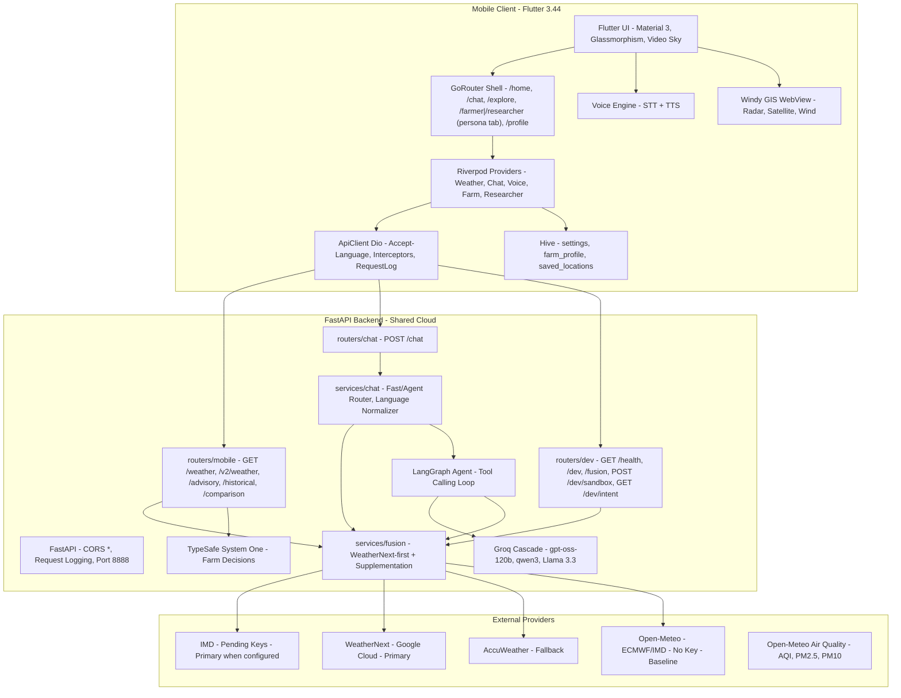
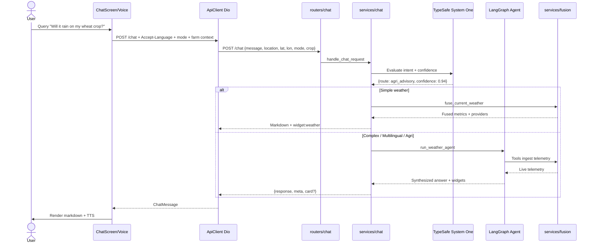
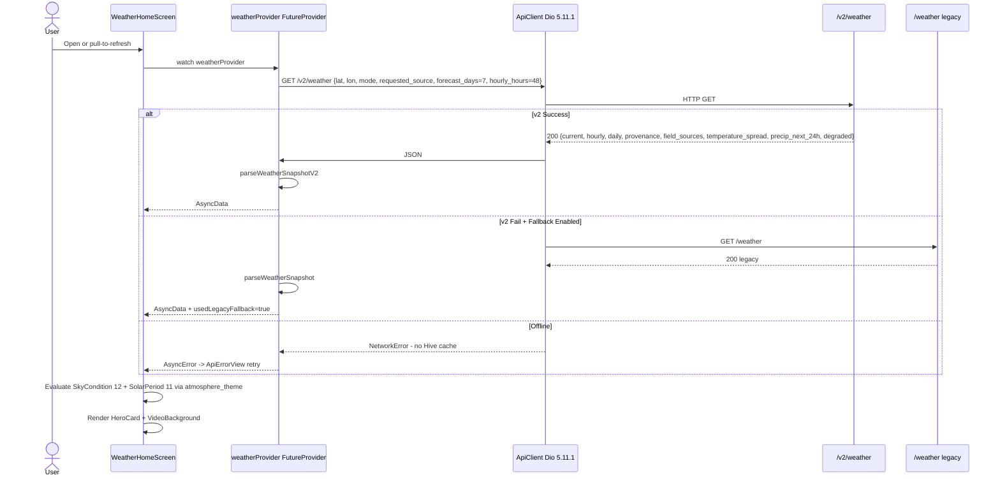
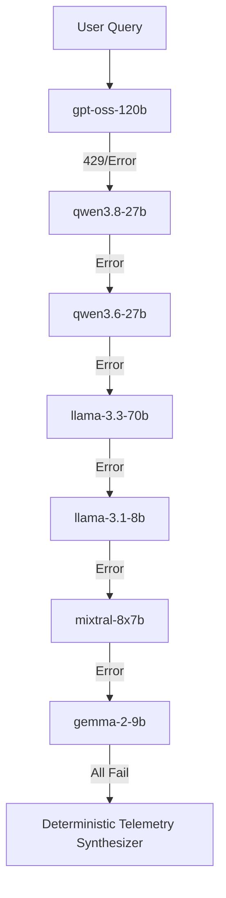
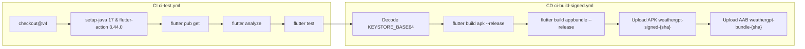
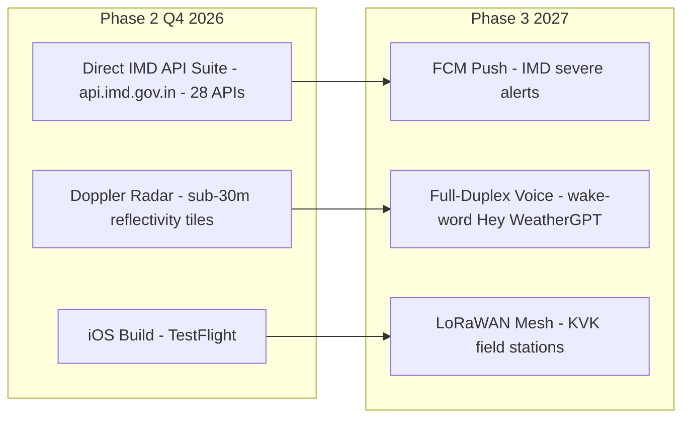

# WeatherGPT Mobile — Technical Architecture

> **Context**: Smart India Hackathon (SIH 2026) Technical Reference  
> **Problem Statement**: **SIH26068** — Disaster Management Theme  
> **Team**: **visionaries_bvm**  
> **Target Audience**: Evaluation Panel, Technical Judges, Systems Architects  
> **Last Updated**: September 2026  
> **Status**: Production Live System + Future Roadmap  
> **Backend**: `https://weathergpt-backend.vercel.app`

---

## Navigation Panel

| # | Section | Status | Key Technologies |
| :--- | :--- | :--- | :--- |
| [1. Executive Summary](#1-executive-summary) | System overview and innovations | Live | Flutter 3.44, Riverpod 2.6.1, Dio 5.11.1 |
| [2. High-Level Architecture](#2-high-level-architecture) | Mobile-to-cloud topology | Live | Mermaid, FastAPI |
| [3. Technology Stack and Design System](#3-technology-stack-and-design-system) | Frameworks and design tokens | Live | Flutter, Material 3, Google Fonts |
| [4. Repository Structure](#4-repository-structure) | Codebase layout | Live | Feature-First Clean Architecture |
| [5. Environment Variables and Secrets](#5-environment-variables-and-secrets) | Config and credential isolation | Live | flutter_dotenv, Gradle Keystore |
| [6. Backend Integration and API Architecture](#6-backend-integration-and-api-architecture) | FastAPI endpoints | Live | FastAPI, /v2/weather, /chat |
| [7. Mobile App Architecture](#7-mobile-app-architecture) | State, routing, persistence | Live | Riverpod, GoRouter 14.8.1, Hive |
| [8. Data Flow and Request Lifecycle](#8-data-flow-and-request-lifecycle) | Request flow and guards | Live | Dio Interceptors, FutureProvider |
| [9. AI Agent Architecture and Conversational Engine](#9-ai-agent-architecture-and-conversational-engine) | LangGraph and Groq | Live | LangGraph, Groq cascade, TypeSafe |
| [10. Multi-Source Ensemble Fusion Engine](#10-multi-source-ensemble-fusion-engine) | WeatherNext-first + supplementation | Live | IMD, WeatherNext, AccuWeather, Open-Meteo |
| [11. API Contract Reference](#11-api-contract-reference) | REST contract | Live | /chat, /weather, /v2/weather, /advisory |
| [12. Widget Protocol and Dynamic UI Cards](#12-widget-protocol-and-dynamic-ui-cards) | Dynamic markdown cards | Live | widget:weather, widget:forecast, VoiceCard |
| [13. Multilingual Engine and Internationalization](#13-multilingual-engine-and-internationalization) | 9 Indian languages + Voice | Live | easy_localization, STT, TTS |
| [14. Risk Assessment and Environmental Hazard Engine](#14-risk-assessment-and-environmental-hazard-engine) | Hazard advisory | Live | Backend-driven thresholds |
| [15. Agricultural Farmer Advisory Mode and TypeSafe System One](#15-agricultural-farmer-advisory-mode-and-typesafe-system-one) | Crop decisions | Live | Jev AI, Farm Action Windows |
| [16. Developer Diagnostics and Debug Suite](#16-developer-diagnostics-and-debug-suite) | 5-tab debug screen | Live | Request log, provider pinning |
| [17. Deployment and Release Architecture](#17-deployment-and-release-architecture) | CI/CD and signing | Live | GitHub Actions, Gradle 8 |
| [18. Problem Statement and SIH Compliance Matrix](#18-problem-statement-and-sih-compliance-matrix) | SIH26068 compliance | Live | 10-domain matrix |
| [19. Future Roadmap and Planned Enhancements](#19-future-roadmap-and-planned-enhancements) | Roadmap | Planned | IMD APIs, radar, iOS, LoRaWAN |

---

## 1. Executive Summary

**WeatherGPT Mobile** is a production-grade, AI-powered weather intelligence app built for **SIH 2026** Disaster Management (SIH26068) by **Team visionaries_bvm**.

It translates multi-source meteorological telemetry into actionable, hyper-local intelligence in **9 live Indian languages** (bn, en, gu, hi, kn, ml, mr, ta, te) with two-way voice (STT + TTS).

- **Framework**: Flutter 3.44, Dart >=3.3.0 (lock >=3.12.0), Feature-First Clean Architecture
- **State**: Riverpod 2.6.1, Routing: GoRouter 14.8.1, Persistence: Hive 2.2.3
- **Backend**: Unified FastAPI at `https://weathergpt-backend.vercel.app` (submodule `omsenjalia/weathergpt`)
- **Fusion**: Production uses **IMD → WeatherNext → AccuWeather → Open-Meteo** selection with per-field supplementation and provenance. Legacy weighted fusion (Open-Meteo 2.0×, AccuWeather 1.5×, WeatherAPI 1.2×, Tomorrow.io 1.2×, OWM 1.1×) remains for `GET /fusion` dev diagnostics.

### Core Innovations

- **Persona-Driven UI**:
  - **Everyone**: Hero weather card, 48h hourly, 7-day forecast, AQI/UV, video skies
  - **Farmer (Krishi)**: TypeSafe System One crop advisories, spray/irrigation windows, soil moisture
  - **Researcher**: Historical archives, anomaly charts (FL Chart), multi-city comparison
- **TypeSafe System One (Jev)**: Server-side calibrated decisions for farm operations with confidence badges (`System One · 88% confident`)
- **Voice-First Indic**: STT `speech_to_text` + TTS `flutter_tts` mapped to `hi-IN, gu-IN, mr-IN, ta-IN, te-IN, kn-IN, ml-IN, bn-IN, en-IN`
- **Atmospheric Sky Engine**: 11 solar periods (midnight, predawn, night, sunrise, morning, midday, afternoon, goldenHour, sunset, dusk, evening) and 12 sky conditions (clear, partlyCloudy, cloudy, overcast, fog, drizzle, rain, heavyRain, thunder, snow, windy, unknown) driving gradients and video backgrounds
- **Zero-Guesswork**: Missing values → `null`, not `0 °C / 0 mm`. WMO code `0` = clear sky, `null` = unknown
- **Debug Suite**: 5 tabs — Snapshot, Sources, Providers, Requests, Health

---

## 2. High-Level Architecture



---

## 3. Technology Stack and Design System

### 3.1 Mobile Client

| Layer | Package | Version (yaml → lock) | Purpose |
| :--- | :--- | :--- | :--- |
| Framework | Flutter SDK | 3.44.0 | Cross-platform UI |
| Language | Dart | >=3.3.0 <4.0.0 → >=3.12.0 (lock) | Typed runtime |
| State | flutter_riverpod | ^2.5.1 → 2.6.1 | Reactive state |
| Routing | go_router | ^14.2.0 → 14.8.1 | ShellRoute navigation |
| HTTP | dio | ^5.4.3 → 5.11.1 | Networking + interceptors |
| Persistence | hive / hive_flutter | 2.2.3 / 1.1.0 | Key-value store |
| i18n | easy_localization | ^3.0.7 → 3.0.8 | 9-language JSON |
| STT | speech_to_text | ^7.4.0 → 6.6.2 | Microphone recognition |
| TTS | flutter_tts | ^4.0.2 → 4.2.5 | Neural speech synthesis |
| Charts | fl_chart | 0.68.0 | Bezier curves, bars |
| GIS | webview_flutter | ^4.10.0 | Windy.com embed |
| Media | video_player | ^2.9.2 | Looping sky videos |
| Fonts | google_fonts | ^6.2.1 → 6.3.3 | Inter, Poppins |
| Animation | flutter_animate | ^4.5.0 → 4.5.2 | Micro-interactions |
| Markdown | gpt_markdown | ^1.3.0 | AI-grade rendering: GFM tables, code blocks with copy, LaTeX, links (replaces the discontinued flutter_markdown) |
| Permissions | permission_handler / geolocator | ^11.3.1 → 11.4.0 / ^12.0.0 | GPS, mic |

### 3.2 Backend

| Layer | Technology | Purpose |
| :--- | :--- | :--- |
| Web Framework | FastAPI | Async REST API |
| ASGI | Uvicorn | Non-blocking server |
| Agent | LangGraph | Stateful AI workflow |
| LLM | LangChain-Groq | Low-latency inference |
| System One | TypeSafe AI (Jev) | Calibrated decisions |
| HTTP | httpx | Telemetry ingestion |
| Validation | Pydantic v2 | Typed contracts |

### 3.3 Design Tokens

| Token | Value | Usage |
| :--- | :--- | :--- |
| bgPrimary | #0B1220 | Base background |
| bgElevated | #101A2C | Modals, bottom bar |
| surfaceCard | #152036 | Glassmorphic card |
| surfaceCardAlt | #1A2740 | Nested card |
| accent | #2DD4BF Teal-400 | Primary actions |
| accentSoft | #5EEAD4 Teal-300 | Glow rims |
| sky / skyDeep | #38BDF8 / #0EA5E9 | Daytime highlights |
| farmerGreen | #34D399 Emerald | Farmer persona |
| researcherBlue | #60A5FA Blue | Researcher persona |
| statusRed | #F87171 Rose | Critical warnings |
| statusAmber | #FBBF24 Amber | Cautions |
| borderSubtle | #243149 | Card stroke |
| textPrimary | #F8FAFC Slate-50 | Hero values |
| textSecondary | #94A3B8 Slate-400 | Subtitles |

---

## 4. Repository Structure

```
weathergpt-app/
├── .github/workflows/
│   ├── ci-test.yml               # flutter pub get, analyze, test (Flutter 3.44.0)
│   └── ci-build-signed.yml       # Signed APK + AAB
├── android/                      # Gradle 8, keystore signing
├── assets/
│   ├── translations/             # 9 JSON: bn, en, gu, hi, kn, ml, mr, ta, te
│   └── videos/                   # sky_*.mp4 looping backgrounds
├── backend/                      # Submodule omsenjalia/weathergpt (FastAPI)
├── backend-integration/          # TypeSafe Jev bundle + patches
├── docs/
│   ├── app_data_contracts.md     # Mobile data contracts, null semantics
│   └── web_app_api_contract.md   # Backend endpoint audit
├── lib/
│   ├── main.dart                 # Hive init (settings, farm_profile, saved_locations), EasyLocalization 9 locales, Riverpod; release ErrorWidget.builder → compact dark pill (never Flutter's gray 400×400 error slab)
│   ├── router/app_router.dart    # GoRouter ShellRoute, 7 routes
│   ├── models/
│   │   ├── location.dart         # AppLocation
│   │   ├── weather.dart          # WeatherSnapshot, HourlyPoint, DayForecast, FieldSources, Provenance
│   │   ├── weather_parser.dart   # Legacy /weather parser
│   │   └── weather_v2_parser.dart# V2 parser with field_sources + UTC offset
│   ├── core/
│   │   ├── constants/
│   │   │   ├── api_endpoints.dart# /chat, /weather, /v2/weather, /advisory, etc.
│   │   │   └── backend_config.dart # resolveBackendUrl() -> https://weathergpt-backend.vercel.app
│   │   ├── errors/app_errors.dart
│   │   ├── localization/localized_formatters.dart
│   │   ├── models/
│   │   │   ├── app_mode.dart     # AppMode everyone|farmer|researcher
│   │   │   ├── data_provenance.dart # WeatherProvenance, FieldSources
│   │   │   ├── json_values.dart  # Safe coercers - null semantics
│   │   │   └── request_context.dart # FarmContext builder
│   │   ├── services/
│   │   │   ├── api_client.dart   # Singleton Dio, Accept-Language, RequestLog
│   │   │   ├── geocoding_service.dart # Open-Meteo geocoding
│   │   │   └── request_log.dart  # Ring buffer 60 entries
│   │   ├── theme/
│   │   │   ├── app_colors.dart
│   │   │   ├── app_theme.dart
│   │   │   └── text_styles.dart
│   │   ├── utils/markdown_utils.dart # Widget sanitization, forSpeech()
│   │   └── widgets/
│   │       ├── api_error_view.dart
│   │       ├── app_card.dart
│   │       ├── atmosphere_background.dart # Blurred live-sky canvas (sun/moon, horizon warmth, drifting glows) driven by atmospherePaletteProvider
│   │       ├── atmosphere_scaffold.dart  # Immersive scaffold wrapper
│   │       ├── glass_card.dart           # Frosted-glass surface primitive
│   │       ├── metric_chip.dart
│   │       ├── navigation_shell.dart # Floating glass pill nav; persona-aware tab set (Farm/Lab tab for farmer/researcher)
│   │       ├── outlined_button_pill.dart
│   │       ├── persona_badge.dart
│   │       ├── primary_button.dart
│   │       └── rich_markdown.dart   # Shared GptMarkdown renderer (tables, code, LaTeX)
│   └── features/
│       ├── home/
│       │   ├── providers/ weatherProvider (FutureProvider, v2→legacy), locationProvider (one-time GPS permission prompt + reverse geocode + visible prompt bar with app-settings deep link), clockTickerProvider + atmospherePaletteProvider (live app-wide sky)
│       │   ├── screens/weather_home_screen.dart
│       │   ├── theme/atmosphere_theme.dart # 11 periods + 12 conditions
│       │   └── widgets/ atmosphere_background, atmosphere_video_background, weather_hero_card, weather_metric_strip, weather_provenance_bar, weather_detail_panels, voice_orb, weather_segment_tabs
│       ├── chat/
│       │   ├── providers/chat_provider.dart # ChatNotifier + generation guard
│       │   └── screens/chat_screen.dart
│       ├── explore/
│       │   ├── providers/map_provider.dart, saved_locations_provider.dart
│       │   └── screens/explore_screen.dart, saved_locations_screen.dart # Windy WebView
│       ├── farmer/
│       │   ├── models/advisory_models.dart, farm_profile_model.dart
│       │   ├── providers/action_windows_provider.dart (generation guard + contextKey), farm_profile_provider.dart
│       │   ├── screens/farmer_hub_screen.dart (Farm tab hub), action_windows_screen.dart, farm_profile_screen.dart
│       │   └── widgets/time_window_bar.dart # 12 buckets
│       ├── researcher/
│       │   ├── providers/historicalDataProvider, comparisonProvider, anomaly_trends_provider
│       │   └── screens/researcher_hub_screen.dart (Lab tab hub), HistoricalDataScreen, ComparisonScreen, AnomalyTrendsScreen
│       ├── voice/
│       │   ├── models/voice_card.dart # VoiceCard, CardTone good/caution/avoid
│       │   ├── mappers/voice_response_mapper.dart
│       │   ├── providers/voice_provider.dart # STT + TTS + generation guard
│       │   └── screens/conversational_result_screen.dart, voice_listening_screen.dart
│       ├── settings/
│       │   ├── providers/settingsProvider, developerOptionsProvider (DevSourcePin, wnModel, hourly 1-168, forecast 1-15)
│       │   └── screens/debug_screen.dart (5 tabs), settings_screen.dart
│       └── onboarding/
│           └── screens/SplashScreen, LanguageSelectScreen, FocusSelectScreen
├── pubspec.yaml
├── pubspec.lock
├── scripts/push-all.sh           # Submodule-aware push
└── test/                         # Parser tests
```

---

## 5. Environment Variables and Secrets

### Mobile `.env` — Bundled as asset, not secret store

| Variable | Required | Value | Purpose |
| :--- | :--- | :--- | :--- |
| BACKEND_URL | Yes | `https://weathergpt-backend.vercel.app` (prod) <br> `http://10.0.2.2:8888` (Android emulator) <br> `http://localhost:8888` (iOS/Desktop) | FastAPI base URL. Resolved via `--dart-define=BACKEND_URL` > `.env` > prod fallback. `resolveBackendUrl()` trims quotes/slashes. |

> **Credential Isolation**: No AccuWeather, Tomorrow.io, OpenWeatherMap, Groq, TypeSafe keys in mobile. Only `BACKEND_URL`. Backend proxies all providers. `ApiClient` only uses `BACKEND_URL` + `Accept-Language` header from Hive `settings.language` (default `en`).

### Android Release Signing

| Secret | Type |
| :--- | :--- |
| KEYSTORE_BASE64 | Base64 keystore |
| KEYSTORE_PASSWORD | Keystore password |
| KEY_ALIAS | Key alias |
| KEY_PASSWORD | Key password |

CI falls back to debug keys if secrets missing, never breaks build.

---

## 6. Backend Integration and API Architecture

### Endpoints

| Path | Method | Used By | Function |
| :--- | :--- | :--- | :--- |
| /chat | POST | Mobile + Web | Conversational AI. Body: message, messages, location, lat, lon, language, mode, crop, growth_stage, soil, irrigation. Returns {response: markdown, meta: {path, client, language, location, intent, intent_engine, intent_confidence}, card?} |
| /weather | GET | Mobile legacy fallback | Home snapshot: current, 48h hourly, 7-day, AQI, UV, sunrise/sunset |
| /v2/weather | GET | Mobile primary | WeatherNext-first: lat, lon, mode, requested_source (auto/weathernext/open_meteo/accuweather/imd), forecast_days, hourly_hours, supplement, model. Returns {current, hourly, daily, provenance, field_sources, temperature_spread, precip_next_24h, degraded} |
| /v2/weather/health | GET | Debug | Health probe |
| /v2/weather/catalog | GET | Future | Catalog |
| /v2/weather/series | GET | Future | Time series |
| /advisory | GET | Farmer | Day-by-day suitability, hourly buckets (irrigation/spraying/field_work), TypeSafe decisions |
| /historical | GET | Researcher | {metric, points: [{year, value}]} |
| /comparison | GET | Researcher | {metric, locations: [{name, points}]} locations=name,lat,lon;... from saved_locations |
| /fusion | GET | Dev only | Legacy weighted inspector: provider values, weights, outlier flags. Not in ApiEndpoints, only backend dev router |
| /health | GET | Mobile | {status: ok} |
| /dev | GET | Debug | {ai_decisions, fusion weights, provider_keys_status, recent_logs} |
| /dev/sandbox | POST | Debug | Single-prompt sandbox with latency |
| /dev/intent | GET | Debug | Intent routing inspector |

### Chat Lifecycle



---

## 7. Mobile App Architecture

```mermaid
graph TD
    VIEWS["Screens - Home, Chat, ActionWindows, Debug"]
    WIDGETS["Components - HeroCard, VideoBackground, TimeWindowBar"]
    NOTIFIERS["Providers - weatherProvider, chatProvider, actionWindowsProvider, settingsProvider"]
    CONTROLLERS["Controllers - VoiceProvider, MapProvider, Historical"]
    PARSERS["Parsers - WeatherParser, WeatherV2Parser, SafeCoercers"]
    MODELS["Models - WeatherSnapshot, DayDecision, VoiceCard, Provenance"]
    SERVICES["Services - ApiClient, GeocodingService, RequestLog"]
    HIVE["Hive - Settings, Locations, FarmProfile"]
    HARDWARE["Device - Geolocator, STT, TTS"]

    VIEWS --> WIDGETS
    VIEWS --> NOTIFIERS
    WIDGETS --> NOTIFIERS
    NOTIFIERS --> CONTROLLERS
    NOTIFIERS --> SERVICES
    CONTROLLERS --> HARDWARE
    SERVICES --> PARSERS
    PARSERS --> MODELS
    SERVICES --> HIVE
```



### State Management (Riverpod 2.6.1)

- **weatherProvider**: `FutureProvider<WeatherSnapshot>` — watches `locationProvider`, `settingsProvider.mode`, `developerOptionsProvider`. Tries `/v2/weather` primary, falls back to `/weather` legacy unless `disableV2Fallback`. Records `lastWeatherRequestProvider` (endpoint, query, usedLegacyFallback, v2Error). No Hive weather cache — on error throws `NetworkError`/`ServerError` → `ApiErrorView`.
- **chatProvider**: `StateNotifier<ChatState>` — history, streaming, intent meta, generation guard
- **actionWindowsProvider**: Farm suitability — watches farm profile (crop, soil, irrigation), location, contextKey = `lat,lon|crop|stage|soil|irrig|UTCdate`, generation guard
- **settingsProvider**: Language, persona, units — persisted to Hive, validates persona
- **developerOptionsProvider**: DevSourcePin (auto/weathernext/open_meteo/accuweather/imd), wnModel, hourly 1-168, forecast 1-15, supplement toggle
- **voiceProvider**: STT + TTS + generation guard
- **mapProvider / saved_locations_provider**: GIS layers, saved locations
- **historicalDataProvider / comparisonProvider / anomaly_trends_provider**: Researcher data

### Null Semantics

- `lib/core/models/json_values.dart`: absent, wrong-typed, blank, NaN, Infinity → `null`
- WMO code `0` = clear sky. Missing code → `null` → `SkyCondition.unknown`, not clear
- Hourly buckets without temperature dropped, not rendered at 0

---

## 8. Data Flow and Request Lifecycle



**Generation Guarding**: Each request increments generation ID; stale responses discarded. Used in `chat_provider`, `voice_provider`, `action_windows_provider`.

---

## 9. AI Agent Architecture and Conversational Engine

- **LangGraph**: Stateful cyclic graph controlling tool calling loop
- **Groq Cascade**: Primary `openai/gpt-oss-120b` → fallbacks `qwen/qwen3.8-27b`, `qwen/qwen3.6-27b`, `llama-3.3-70b-versatile`, `llama-3.1-8b-instant`, `mixtral-8x7b-32768`, `gemma-2-9b-it` → deterministic telemetry synthesizer (0% downtime)
- **TypeSafe System One (Jev) Intent Routing**: Classifies query into `agri_advisory`, `weather_query`, `smalltalk`, `abuse` etc. Returns `intent_engine: system-one|keywords` + confidence. Fast path (simple weather) → direct fusion, no agent. Complex → agent.
- **Indic Extraction**: Regex + prompt heuristics for Hindi/Gujarati/Marathi city phrases: `"delhi me kal barish hogi?"` → Delhi coords.



---

## 10. Multi-Source Ensemble Fusion Engine

### Production Policy (Live)

| Priority | Provider | Key | Role |
| :--- | :--- | :--- | :--- |
| 0 | IMD | IMD_API_KEY / JWT | Official India, when configured |
| 1 | WeatherNext | Google IAM | Primary NWP, no sunrise/UV/AQI |
| 2 | AccuWeather | ACCUWEATHER_KEY | Fallback, RealFeel |
| 3 | Open-Meteo | None | Baseline + supplement (sunrise, UV, AQI, humidity) |

**Flow**:
- App sends `requested_source`: `auto` (backend policy) or pinned (`weathernext`, `open_meteo`, `accuweather`, `imd`) via `DevSourcePin`. Researcher mode pins `weathernext` unless dev override.
- Backend returns `provenance: {selected_source, requested_source, fallback_reasons[], tried_providers[], source, product, run_id, issued_at, degraded}` and `field_sources: {temperature_c: "weathernext", humidity: "open_meteo", uv_index: null, _supplement: {provider, enabled, attempted, filled[], errors[], cache_hit}}`
- `FieldSources` in `lib/models/weather.dart` keeps per-field attribution; UI shows "via Open-Meteo" badge when supplemented
- `degraded` = true only when configured provider failed or stale, not when IMD skipped for missing key
- Enrichments (Everyone mode): `temperature_spread {p10_c, p90_c, source, run_id, valid_from, valid_to, members}` (rejected if inverted/one-sided) and `precip_next_24h {total_mm, start, end, complete}` (partial labelled)

### Legacy Weighted Fusion (Dev Inspector `GET /fusion`)

| Provider | Weight | Key |
| :--- | :--- | :--- |
| Open-Meteo ECMWF/IMD | 2.0× | None |
| AccuWeather | 1.5× | ACCUWEATHER_KEY |
| WeatherAPI | 1.2× | WEATHERAPI_KEY |
| Tomorrow.io | 1.2× | TOMORROW_KEY |
| OpenWeatherMap | 1.1× | OPENWEATHER_KEY |

Formula: `M = sum(M_i * W_i) / sum(W_i)`  
Outlier guard: `|T_i - T_OpenMeteo| > 7°C` → excluded  
Confidence: High ≤1.5°C spread, Medium 1.5-3.5°C, Low >3.5°C, Single-Source

Still exposed via `backend-integration/backend/routers/dev.py` for diagnostics, but mobile home uses WeatherNext-first.

---

## 11. API Contract Reference

### POST /chat

Request:
```json
{
  "message": "Is it safe to spray pesticide on my cotton crop today?",
  "messages": [{"role": "user", "content": "Is it safe to spray pesticide on my cotton crop today?"}],
  "location": "Rajkot, Gujarat",
  "lat": 22.3039,
  "lon": 70.8022,
  "mode": "farmer",
  "farmer_mode": true,
  "crop": "Cotton",
  "growth_stage": "Flowering",
  "soil": "Black cotton soil",
  "irrigation": "Drip"
}
```

Response:
```json
{
  "response": "## Advisory for Cotton in Rajkot\n\n```widget:weather\n{\"city\": \"Rajkot\", \"temp\": 31.2, \"feelsLike\": 34.0, \"condition\": \"Partly Cloudy\", \"humidity\": 62, \"windSpeed\": 11.5, \"advisory\": \"Safe for spraying 7:00-10:30 AM\"}\n```\n\nWind <15 km/h, no heavy rain next 24h.",
  "meta": {
    "path": "agent",
    "client": "mobile",
    "language": "en",
    "location": "Rajkot, Gujarat",
    "intent_engine": "system-one",
    "intent_confidence": 0.92
  }
}
```

### GET /v2/weather (Primary)

Query: `lat, lon, mode=everyone|farmer|researcher, requested_source=auto|weathernext|open_meteo|accuweather|imd, forecast_days=7, hourly_hours=48, supplement, model`

Response includes `current, hourly, daily, provenance, field_sources, temperature_spread, precip_next_24h, degraded`

### GET /weather (Legacy fallback)

Same as v2 but older shape: `temperature_c, feels_like_c, condition, weather_code, high_c, low_c, rain_probability, wind_kmh, humidity, pressure_hpa, precipitation_mm, uv_index, sunrise, sunset, aqi, hourly[], forecast[], source, providers_used, fusion{confidence, temp_spread_c, weights}`

### Other Endpoints

- `/advisory?lat=&lon=&crop=&growth_stage=&soil=&irrigation=&days=&mode=` → `{summary, windows: [{date, suitability, summary, best_window, rain_probability, rain_mm, wind_kmh_max, high_c, hourly: {irrigation, spraying, field_work: [{hour, suitability}]}, ai: {spray, irrigation, fieldwork: {score, confidence, band}, overall: {choice, confidence}}}], advisory_engine, ai: {enabled, applied, model, evaluated_days, mean_confidence, overall_verdict}}`
- `/historical?lat=&lon=&metric=&start_year=&end_year=` → `{metric, points: [{year, value}]}`
- `/comparison?locations=name,lat,lon;...&metric=` → `{metric, locations: [{name, points}]}`
- `/health` → `{status: ok}`
- `/dev` → diagnostics
- `/dev/sandbox` POST `{prompt, location, language}` → `{status, duration_ms, response, model_used}`
- `/dev/intent?text=` → routing inspector

---

## 12. Widget Protocol and Dynamic UI Cards

AI embeds native cards in markdown via code fences. Mobile sanitizes and renders Flutter widgets.

| Tag | Render | Purpose |
| :--- | :--- | :--- |
| ```widget:weather | ChatWeatherWidget | Temp, condition, humidity, wind, advisory |
| ```widget:forecast | ChatForecastWidget | Multi-day strip |

Sanitization: `lib/core/utils/markdown_utils.dart` strips widget blocks for TTS via `forSpeech()` (tables are flattened into spoken prose, LaTeX delimiters removed). Display rendering goes through the shared `RichMarkdown` widget (`lib/core/widgets/rich_markdown.dart`), which wraps `gpt_markdown`'s `GptMarkdown`: GFM tables (bordered, header-tinted, zebra-striped, horizontally scrollable), fenced code blocks with a copy button, inline and display LaTeX, styled blockquotes/lists/links, and `widget:`/`json` fence stripping so native-card instructions never leak into the conversation. Chat, the voice result screen and all AI surfaces share this one renderer.

### VoiceCard (Structured)

When voice query initiated, backend may return:

```json
{
  "response": "Favorable conditions for wheat irrigation this morning.",
  "card": {
    "label": "Irrigation Outlook",
    "verdict": "Favorable for Irrigation",
    "explanation": "Soil moisture 38% and wind calm <10 km/h.",
    "cta_label": "Schedule Drip Irrigation",
    "source": "Open-Meteo (ECMWF)",
    "confidence": 0.88,
    "stats": [
      {"label": "Soil Moisture", "value": "38%", "tone": "good"},
      {"label": "Wind Speed", "value": "8 km/h", "tone": "good"},
      {"label": "Rain Risk", "value": "10%", "tone": "good"}
    ],
    "forecast": [
      {"day": "Today", "temperature": "32°C", "rainfall": "0 mm", "condition": "sunny"}
    ]
  }
}
```

`VoiceResponseMapper` maps to `ConversationalResultScreen`. If no card, renders prose only — no fabricated stats. `CardTone`: `good|caution|avoid` (aliases: safe, favourable, watch, risk, poor).

---

## 13. Multilingual Engine and Internationalization

9 live languages (Punjabi planned):

| Language | ISO | Script | TTS Locale | STT Model | File |
| :--- | :--- | :--- | :--- | :--- | :--- |
| English | en | English | en-US / en-IN | en_US | en.json |
| Hindi | hi | हिंदी | hi-IN | hi_IN | hi.json |
| Gujarati | gu | ગુજરાતી | gu-IN | gu_IN | gu.json |
| Marathi | mr | मराठी | mr-IN | mr_IN | mr.json |
| Tamil | ta | தமிழ் | ta-IN | ta_IN | ta.json |
| Telugu | te | తెలుగు | te-IN | te_IN | te.json |
| Bengali | bn | বাংলা | bn-IN | bn_IN | bn.json |
| Kannada | kn | ಕನ್ನಡ | kn-IN | kn_IN | kn.json |
| Malayalam | ml | മലയാളം | ml-IN | ml_IN | ml.json |

- **Storage**: `assets/translations/<iso>.json` via `easy_localization` 3.0.8
- **Header**: `ApiClient` attaches `Accept-Language: <iso>` from Hive settings
- **Speech Cleanup**: `MarkdownUtils.forSpeech()` strips markdown, emojis, URLs, widget blocks before TTS

---

## 14. Risk Assessment and Environmental Hazard Engine

Hazard handling is **backend-driven**, not a custom in-app RED/YELLOW/GREEN threshold engine.

- **Sources**: IMD CAP alert feed (RSS/XML), advisory Suitability `good|caution|avoid|neutral`, chat markdown warnings
- **Rendering**: Color-coded banners in `WeatherHeroCard`, `WeatherDetailPanels` via `statusRed #F87171`, `statusAmber #FBBF24`
- **No hardcoded 44°C/50mm/50km/h thresholds in `lib/`** — thresholds evaluated server-side via fusion + Jev + CAP
- **Future**: Direct IMD API integration will bring structured district warnings, cyclone tracks

---

## 15. Agricultural Farmer Advisory Mode and TypeSafe System One

### TypeSafe System One (Jev)

- **Server**: `backend-integration/backend/services/typesafe.py` (httpx client), `advisory.py` hourly bands, `chat.py` intent routing, `dev.py` `ai_decisions`
- **Per-Day Decision**: Each day at `windows[i].ai.overall = {choice, confidence}` — UI renders that day's decision, not global aggregate
- **Badge**: When shaped by System One, shows `System One · 88% confident`. Without credentials, falls back to rule-based thresholds
- **No Bundled Offline Advisory**: Backend unreachable → explicit unavailable state, never empty neutral bars. Cache keyed on `lat,lon|crop|stage|soil|irrig|UTCdate`, discarded on move/profile edit/midnight

### Farm Action Windows

3 tracks × 12 two-hour buckets:

```
[00:00-04:00] Avoid   (Heavy Dew / High Humidity)
[04:00-08:00] Good    (Low Wind <8 km/h) <- Optimal Spray
[08:00-12:00] Caution (Rising Thermal)
[12:00-16:00] Avoid   (Peak Solar / Evaporation)
[16:00-20:00] Good    (Calm Evening)
[20:00-24:00] Neutral (Night Rest)
```

### Supported Crops

| Crop | Vulnerability | Focus |
| :--- | :--- | :--- |
| Cotton | Bollworm, water-logging | Spray windows, drainage, dry picking |
| Wheat | Heat stress, lodging | Irrigation milestones, heading protection |
| Rice / Paddy | Water depth, blast fungus | Water level, fertilizer timing |
| Sugarcane | Stem lodging | Irrigation cycling, propping during gusts |
| Groundnut | Tikka leaf spot, pod rot | Moisture balance, drying windows |
| Mustard | Aphid during overcast | Spray timing, cold snap warnings |
| Vegetables | Blight, desiccation | Drip scheduling, shade management |

### Farm Profile Configuration & Onboarding Flow

- **Welcome Onboarding Prompt**: When a user selects the **Farmer** persona during initial onboarding (`/onboarding/focus`), an inline setup form prompts for key farm parameters:
  - Farm Location (city/region)
  - Farm Size (acres)
  - Primary Crop (Cotton, Wheat, Rice, Sugarcane, Groundnut, Mustard, Maize, Vegetables)
  - Growth Stage (Sowing, Vegetative, Flowering, Fruiting, Harvest)
  - Irrigation Type (Borewell, Canal, Drip, Rainfed, Sprinkler)
  - Soil Type (Loamy, Clay, Sandy, Silty, Black / Regur, Red)
- **Settings Farm Profile Management**: Whenever Farmer mode is active, **Settings** surfaces a dedicated **Farm Profile** section detailing all current farm attributes. Tapping "Edit Farm Profile" opens `FarmProfileEditor` to modify any field.
- **Synchronous Downstream Propagation**: Updates saved via `FarmProfileEditor` notify `farmProfileProvider` and persist to Hive (`farm_profile` box), immediately invalidating and refreshing `actionWindowsProvider`, contextualizing LangGraph AI `chatProvider`, and tuning voice recommendations.

---

## 16. Developer Diagnostics and Debug Suite

### Data Source Visibility & Dev-Mode Boundary

To maintain a clean consumer-facing UI while providing rich diagnostic transparency for engineers:
- **Production / Consumer Mode (`dev.enabled == false`)**:
  - Raw backend data source names (IMD, WeatherNext, AccuWeather, Open-Meteo) are omitted from the UI.
  - Home screen status bar displays clean freshness / update time (`run HH:mm`) and honest degraded/stale alerts without leaking internal provider names.
  - Overview metric tiles omit secondary contributor badges (`via Open-Meteo`).
  - Metric and forecast detail bottom sheets omit internal source attribution lines (`home.source`) and secondary provider footers.
- **Developer Mode (`dev.enabled == true`)**:
  - Home status bar displays the active provider name alongside run timestamps and a direct shortcut to the Debug suite.
  - Overview tiles render `SourceBadge` pills indicating secondary provider contributions when `dev.showFieldSourceBadges` is enabled.
  - Metric and forecast detail sheets display full source attribution lines, run identifiers, and per-field source attributions.
  - Developers can optionally enable the persistent `WeatherProvenanceBar` directly on the Home screen via `dev.showProvenanceOnHome`.

Enable via **Settings → Developer → Enable developer options → Debug & state** (`/debug`) — 5 tabs:

| Tab | Capability | Details |
| :--- | :--- | :--- |
| 1. Snapshot | Raw JSON inspector | Parsed fields, highs/lows, rain prob, solar timings |
| 2. Sources | Per-field attribution | `via Open-Meteo`, supplemented values highlighted |
| 3. Providers | Chain & degradation | Skipped providers, fallback_reasons, WeatherNext status |
| 4. Requests | Ring-buffer log | Last 60 HTTP calls, status, duration ms, query |
| 5. Health | Backend probe | Direct `/v2/weather/health` check |

**Controls**:
- Pin source: `DevSourcePin` auto/weathernext/open_meteo/accuweather/imd — forces provider, surfaces failures
- Hourly horizon slider: 6–168 hours
- Forecast days slider: 1–15 days
- Supplement toggle: Disable Open-Meteo supplementation to inspect raw primary
- wnModel pin: Non-default WeatherNext model

---

## 17. Deployment and Release Architecture



- Every push/PR builds signed release APK at **GitHub Actions → Artifacts**
- Without keystore secrets, falls back to debug signing, never breaks
- Publishing: `./scripts/push-all.sh "message"` pushes backend submodule then app (required, not bare `git push`)

---

## 18. Problem Statement and SIH Compliance Matrix

### SIH26068 Key Requirements

| Requirement | Implementation | Status | Source |
| :--- | :--- | :--- | :--- |
| Real-Time Telemetry | Temp, humidity, pressure, wind, UV, AQI from 5 providers | Live | weather_parser.dart, fusion |
| Natural Language Querying | LangGraph + Groq cascade | Live | chat_provider.dart, agent.py |
| NWP Integration | ECMWF/GFS via Open-Meteo + WeatherNext, Priority-1 | Live | fusion, explore |
| Extreme Weather Warnings | Hazard banners, IMD CAP, advisory Suitability | Live | home/widgets, markdown_utils |
| Agricultural Advisories | GPS + Farmer Mode + Jev action windows | Live | farmer/, backend-integration |
| Multilingual Support | 9 live languages + Accept-Language + STT/TTS | Live | translations, voice_provider |
| Historical Trends | Multi-year archive, anomaly charts, variance | Live | researcher/ |
| Voice Accessibility | Hands-free STT, TTS, forSpeech cleanup | Live | voice/, markdown_utils |

### 10-Domain Use Cases

| Domain | Stakeholders | Telemetry | Capability |
| :--- | :--- | :--- | :--- |
| Agriculture | Farmers, KVK | Soil moisture, rain prob, wind, temp | Crop advisories with Jev confidence |
| Disaster Management | NDRF/SDRF, Collectors | Extreme rain, wind gusts, WMO codes | Alert banners, emergency actions |
| Urban Health | Municipalities, Citizens | AQI, PM2.5, PM10, UV, heat index | 24h pollutant tracking, exposure warnings |
| Aviation & Drones | Pilots, Operators | Cloud cover, pressure, wind vectors | Windy GIS: cloud, isobar, gust maps |
| Coastal Fisheries | Fishermen, Ports | Squally winds, wave height, pressure drop | High-wind advisories, voice bulletins |
| Renewable Energy | Solar/Wind Operators | Irradiance, UV, 10m wind | Solar efficiency, turbine output forecast |
| Logistics & Transport | Fleet, Highway Police | Fog codes, precipitation, visibility | Rainfall, fog advisories |
| Construction & Mining | Engineers, Safety | Lightning, gusts, wet bulb | Crane wind alerts, pour rain checks |
| Mountain Tourism | Pilgrims, Hikers | Sub-zero, snowfall, pressure trends | Pass weather guides, landslide warnings |
| Climate Research | Climatologists, Labs | Multi-decade rainfall, temp anomalies | FL Chart anomaly, multi-city variance |

---

## 19. Future Roadmap and Planned Enhancements



- **IMD Direct APIs**: City Forecast, District Warning, Cyclone Track, Agromet, Marine Bulletins, Radar, Astronomical — key-authenticated `api.imd.gov.in`
- **Doppler Radar**: Live DWR composite tiles for metros, sub-30 min nowcasting for flash floods/lightning
- **iOS**: Flutter iOS build, SFSafariViewController, background location, APNS via TestFlight
- **LoRaWAN**: Low-cost field stations at KVKs for micro-climate ground truth
- **Voice**: On-device wake-word, neural TTS for low-bandwidth rural, full-duplex streaming
- **Push**: FCM-based IMD severe alerts background notifications

---

**Team**: visionaries_bvm  
**Backend**: https://weathergpt-backend.vercel.app  
**Mobile**: Flutter 3.44 / Riverpod 2.6.1 / GoRouter 14.8.1 / Hive 2.2.3 / Dio 5.11.1  
**Docs**: `docs/app_data_contracts.md` (authoritative mobile contract), `docs/web_app_api_contract.md` (endpoint audit)
