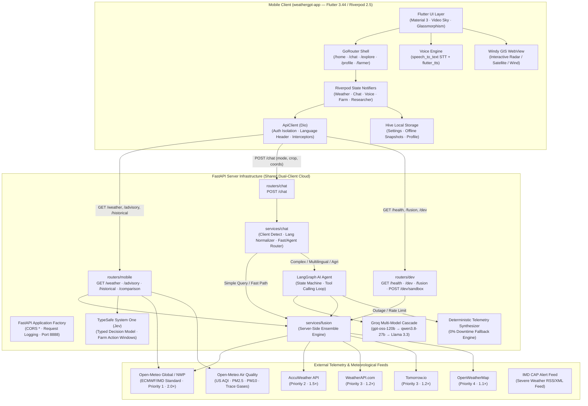
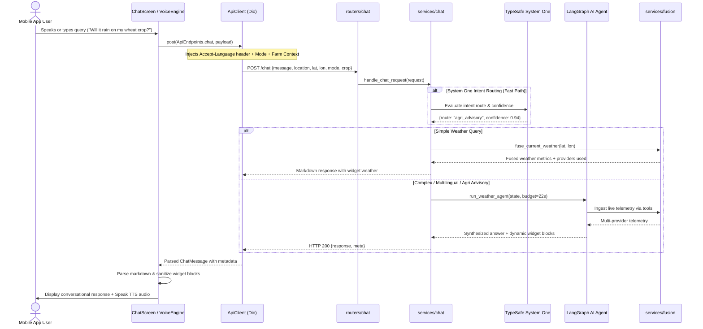
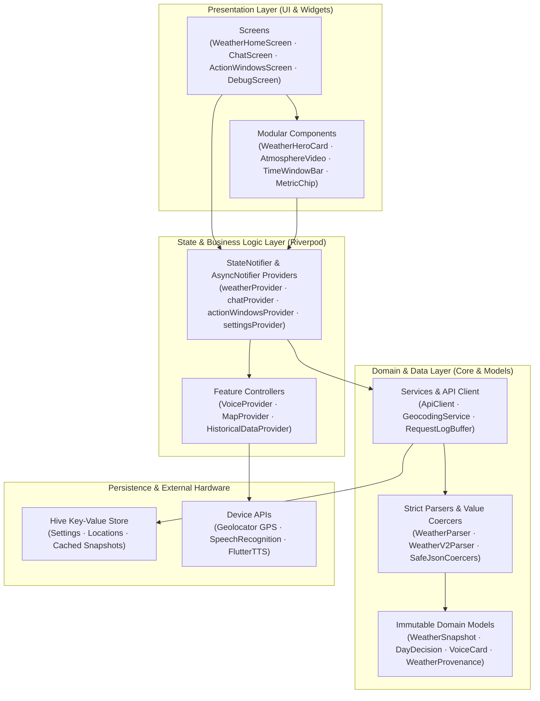
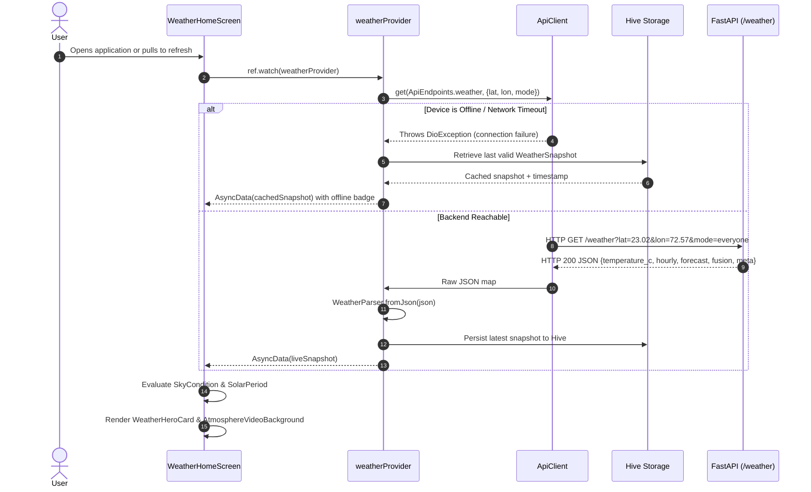
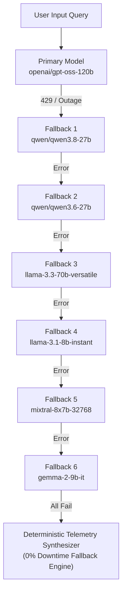
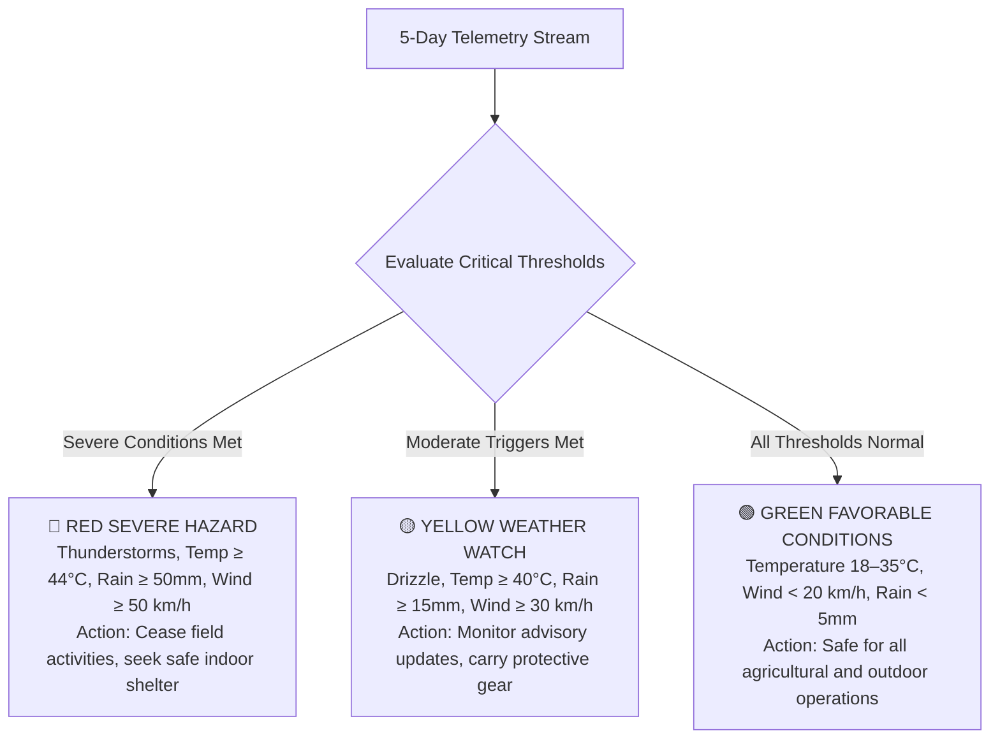
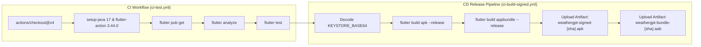
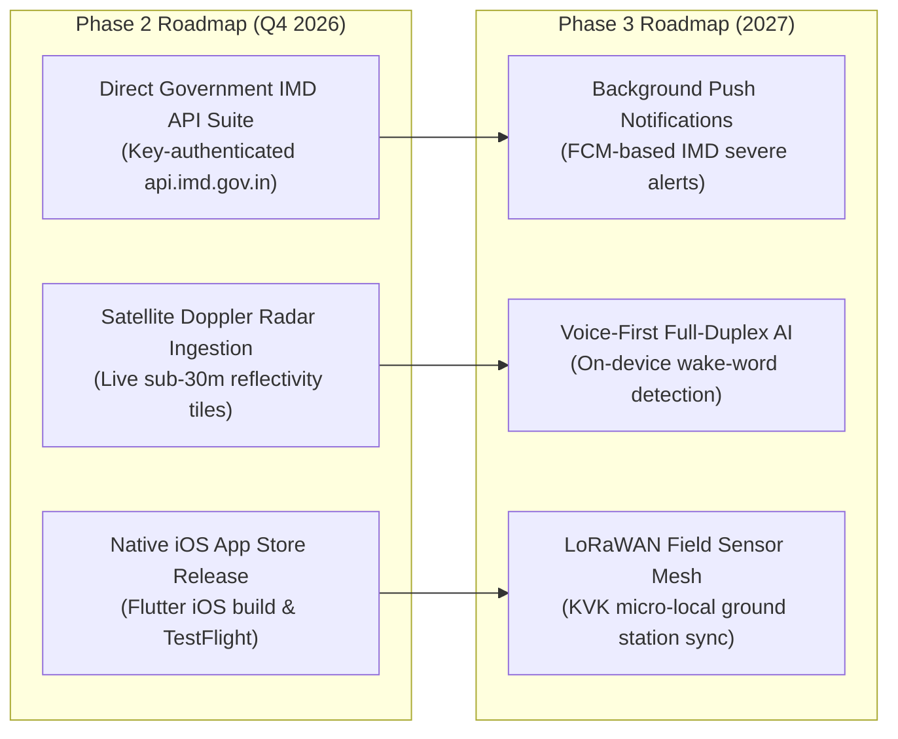

# WeatherGPT Mobile — Technical Architecture & Specifications Annex

> **Context**: Smart India Hackathon (SIH 2026) Technical Reference & Presentation Annex  
> **Problem Statement**: **SIH26068** — Disaster Management Theme  
> **Target Audience**: Evaluation Panel, Technical Judges & Systems Architects  
> **Last Updated**: September 2026  
> **Status**: [✅ Production Live System & 🚀 Future Roadmap]

---

## 📌 Judge Quick Navigation Panel

| Section | Topic / Feature | Production Status | Primary Technologies |
| :--- | :--- | :--- | :--- |
| [1. Executive Summary](#1-executive-summary) | High-level system overview & key mobile innovations | ✅ Live | Flutter 3.44 (Dart 3.3+), Riverpod, Dio |
| [2. High-Level Architecture](#2-high-level-architecture) | End-to-end mobile-to-cloud topology & data flow | ✅ Live | Mermaid Flowcharts & Protocol Maps |
| [3. Tech Stack & Design](#3-technology-stack--design-system) | Frameworks, packages, design tokens & visual system | ✅ Live | Flutter, Material 3, Google Fonts, Video Sky |
| [4. Repository Structure](#4-repository-structure) | Codebase organization & feature module layout | ✅ Live | Clean Feature-First Architecture |
| [5. Environment Config](#5-environment-variables--secrets) | App environment & server-side credential isolation | ✅ Live | `flutter_dotenv`, `BACKEND_URL`, Gradle Keystores |
| [6. Backend Architecture](#6-backend-integration--api-architecture) | Dual-client FastAPI backend, shims & middleware | ✅ Live | FastAPI 0.115, Starlette CORS, Request Log Buffer |
| [7. Mobile App Architecture](#7-mobile-app-architecture) | Riverpod state management, routing & views | ✅ Live | Flutter Riverpod 2.5, GoRouter 14.2, Hive |
| [8. Data Flow Lifecycle](#8-data-flow--request-lifecycle) | Request execution, fallback guards & lifecycle | ✅ Live | Dio Interceptors, AsyncValue, Generation Guards |
| [9. AI Agent Engine](#9-ai-agent-architecture--conversational-engine) | LangGraph state machine & 8-model Groq cascade | ✅ Live | LangGraph 0.2, Qwen 27B, Llama 3.1/3.3, Mixtral |
| [10. Ensemble Fusion](#10-multi-source-ensemble-fusion-engine) | Multi-provider weighted fusion (Open-Meteo > AccuWeather) | ✅ Live | Open-Meteo (ECMWF/IMD 2.0×), AccuWeather (1.5×) |
| [11. API Contract Reference](#11-api-contract-reference) | Shared REST contract for mobile & web | ✅ Live | `/chat`, `/weather`, `/advisory`, `/historical`, `/comparison` |
| [12. Widget Protocol](#12-widget-protocol--dynamic-ui-cards) | Dynamic markdown card renderer & VoiceCard parser | ✅ Live | `widget:weather`, `widget:forecast`, `VoiceCard` |
| [13. Multilingual Engine](#13-multilingual-engine--internationalization-i18n) | 10 Indian regional languages + Voice STT/TTS | ✅ Live | Easy Localization, `speech_to_text`, `flutter_tts` |
| [14. Risk Outlook Engine](#14-risk-assessment--environmental-hazard-engine) | 5-day hazard classification & severity triggers | ✅ Live | 3-tier severity scoring (RED/YELLOW/GREEN) |
| [15. Farmer Mode & Jev](#15-agricultural-farmer-advisory-mode--typesafe-system-one-jev) | TypeSafe System One (Jev) crop decisions & action windows | ✅ Live | Jev AI, Cotton, Wheat, Rice, Sugarcane, Groundnut |
| [16. Dev Suite & Debug](#16-developer-diagnostics--debug-suite) | 5-tab developer debug screen & provider pinning | ✅ Live | Request logging, provider override, health probe |
| [17. Deployment Setup](#17-deployment--release-architecture) | Automated GitHub Actions CI/CD & Signed APK/AAB | ✅ Live | GitHub Actions, Gradle 8, Android Keystore |
| [18. SIH Compliance](#18-problem-statement--sih-compliance-matrix) | SIH26068 requirements & 10-domain use cases | ✅ Live | Full matrix & evaluation criteria mapping |
| [19. Future Roadmap](#19-future-roadmap--planned-enhancements) | Planned direct IMD API, radar overlays & iOS build | 🚀 Roadmap | IMD REST suite, Doppler radar, LoRaWAN IoT mesh |

---

## 1. Executive Summary

**WeatherGPT Mobile** is a production-grade, offline-resilient, AI-powered weather intelligence application custom-engineered for the **Smart India Hackathon (SIH 2026)** under the **Disaster Management** track (Problem Statement **SIH26068**).

While traditional meteorological applications present raw atmospheric metrics in siloed, non-intuitive tabular formats, WeatherGPT Mobile bridges the critical accessibility gap across diverse Indian communities. It translates real-time, multi-source meteorological telemetry into actionable, hyper-local intelligence rendered in **10 Indian regional languages** with full two-way voice capabilities (Speech-to-Text and neural Text-to-Speech).

The mobile client is engineered in **Flutter 3.44 / Dart 3.3+** using a **Feature-First Clean Architecture** powered by **Riverpod 2.5**, **GoRouter**, and **Hive**. It pairs with a unified, high-throughput **FastAPI** backend that simultaneously serves the React web client and this Flutter native application.

> [!NOTE]
> **Production vs. Roadmap Transparency**: WeatherGPT Mobile operates with a production-live backend architecture. Multi-provider weighted ensemble fusion (ECMWF/IMD via Open-Meteo baseline 2.0× weight, AccuWeather 1.5×, WeatherAPI 1.2×, Tomorrow.io 1.2×, OpenWeatherMap 1.1×), TypeSafe System One (Jev) agricultural decision modeling, LangGraph agent conversational reasoning, and 10-language localized rendering are fully deployed and verified. Planned direct key-authenticated connections to government portals (`api.imd.gov.in`) and live Doppler radar composites are architecturally mapped in [Section 19: Future Roadmap](#19-future-roadmap--planned-enhancements).

### Core Innovations & Key Differentiators

- **Persona-Driven Adaptive Interface**: Tailored UX modes for three distinct target demographics:
  - **Everyone (Citizen)**: Natural language weather summaries, dynamic live atmospheric video skies, UV/AQI alerts, and 24h/7-day forecast strips.
  - **Farmer Mode (Krishi)**: Hyper-local agricultural advisories powered by **TypeSafe System One (Jev)** decision models, crop-specific spray/irrigation windows, soil moisture tracking, and thermal stress alerts.
  - **Researcher Mode**: Long-term climatological archives, historical rainfall/temperature anomaly trend charts (FL Chart), and multi-city geographic variance comparisons.
- **Authoritative Multi-Source Ensemble Engine**: Ingests up to 5 external weather providers in parallel with an outlier-guarded, confidence-scored weighted mean algorithm. Priority order is **Open-Meteo (ECMWF/IMD, 2.0×) > AccuWeather (1.5×) > WeatherAPI / Tomorrow.io (1.2×) > OpenWeatherMap (1.1×)**.
- **TypeSafe System One (Jev) Decision Intelligence**: Farm Action Windows and chat intent routing are backed by TypeSafe AI's System One decision model running server-side. Calibrated decisions for spraying, irrigation, and fieldwork are evaluated against localized weather state, rendering verified confidence badges (`System One · 88% confident`).
- **Voice-First Indic Accessibility**: Two-way regional voice interaction integrating device-native STT and neural TTS mapped to regional Indian voice locales (`hi-IN`, `gu-IN`, `mr-IN`, `ta-IN`, `te-IN`, `kn-IN`, `ml-IN`, `bn-IN`, `pa-IN`, `en-IN`).
- **Dynamic Atmospheric Sky Engine**: 11 solar periods (`midnight`, `sunrise`, `goldenHour`, etc.) and 12 meteorological sky conditions (`clear`, `thunder`, `heavyRain`, etc.) drive dynamic gradient transitions and looping sky video backgrounds.
- **Zero-Guesswork Data Integrity**: Strict null semantics—missing metrics parse to `null` rather than coercive zeros (`0 °C`, `0 mm`), preventing deceptive weather readings.
- **Developer Diagnostics & Debug Suite**: On-device developer suite (`/debug`) featuring 5 dedicated tabs: live state inspection, per-field provider attribution badges, provider pinning overrides, request logs ring-buffer, and `/v2/weather/health` probes.

---

## 2. High-Level Architecture

The end-to-end WeatherGPT architecture comprises the Flutter Native Mobile Client, the unified FastAPI Backend Infrastructure, the LangGraph AI Agent with its Groq model cascade, the TypeSafe System One decision engine, and external meteorological/GIS providers.



---

## 3. Technology Stack & Design System

### 3.1 Mobile Client Stack

| Layer | Technology | Version | Purpose |
| :--- | :--- | :--- | :--- |
| **Framework** | Flutter SDK | 3.44.0 (stable) | Cross-platform UI toolkit |
| **Language** | Dart | 3.3.0+ | Strongly-typed client runtime |
| **State Management** | `flutter_riverpod` | 2.5.1 | Reactive, declarative application state |
| **Routing** | `go_router` | 14.2.0 | Declarative URL-like navigation with ShellRoute |
| **HTTP Networking** | `dio` | 5.4.3 | Async networking, request logs & language headers |
| **Local Persistence** | `hive` / `hive_flutter` | 2.2.3 / 1.1.0 | Fast, zero-native-dependency key-value database |
| **Internationalization** | `easy_localization` | 3.0.7 | JSON-driven 10-language localization engine |
| **Speech-to-Text** | `speech_to_text` | 7.4.0 | Device microphone speech recognition |
| **Text-to-Speech** | `flutter_tts` | 4.0.2 | Hardware-accelerated neural speech synthesis |
| **Interactive Charts** | `fl_chart` | 0.68.0 | High-performance Bézier curves & anomaly bars |
| **GIS Map Embed** | `webview_flutter` | 4.10.0 | Hardware-accelerated Windy.com interactive embed |
| **Atmospheric Media** | `video_player` | 2.9.2 | Seamless looping background sky video player |
| **Typography** | `google_fonts` | 6.2.1 | Dynamic font loading (Inter, Playfair, Poppins) |
| **Animation Engine** | `flutter_animate` | 4.5.0 | Fluid micro-interactions, glows and spring physics |
| **Markdown Renderer** | `flutter_markdown` | 0.7.4+1 | GFM chat rendering and dynamic card formatting |
| **Hardware Perms** | `permission_handler` / `geolocator` | 11.3.1 / 12.0.0 | High-accuracy GPS and microphone access |

### 3.2 Backend & Cloud Stack

| Layer | Technology | Version | Purpose |
| :--- | :--- | :--- | :--- |
| **Web Framework** | FastAPI | 0.115.0 | High-performance asynchronous REST API server |
| **ASGI Engine** | Uvicorn | 0.30.6 | Non-blocking async server implementation |
| **Agent Orchestrator** | LangGraph | 0.2.28 | Stateful cyclic graph AI workflow controller |
| **LLM Inference** | LangChain-Groq | 0.2.0 | Ultra-low latency LPU cloud inference |
| **System One AI** | TypeSafe AI (Jev) | v1.0 Client | Calibrated probabilistic decision engine |
| **Async HTTP** | httpx | 0.27.2 | Non-blocking telemetry ingestion client |
| **Language Detection**| langdetect | 1.0.9 | Automatic ISO Indic language classification |
| **Data Validation** | Pydantic v2 | 2.9.0+ | Strict typed request/response schema contracts |

### 3.3 Design System & Aesthetics

WeatherGPT Mobile adopts an **Obsidian Glassmorphism Dark Theme** designed for legibility in outdoor agricultural conditions and low-light emergency scenarios:

| Design Token | Hex / Value | Visual Purpose & Component Scope |
| :--- | :--- | :--- |
| **`bgPrimary`** | `#0B1220` | Obsidian Deep Navy base screen background |
| **`bgElevated`** | `#101A2C` | Midnight Navy elevated modal & bottom bar container |
| **`surfaceCard`** | `#152036` | Primary translucent glassmorphic card fill |
| **`surfaceCardAlt`**| `#1A2740` | Secondary nested card & tile surface |
| **`accent`** | `#2DD4BF` (Teal-400) | Primary interactive actions, hero chips, active icons |
| **`accentSoft`** | `#5EEAD4` (Teal-300) | Secondary highlight accents and glow rims |
| **`sky` / `skyDeep`**| `#38BDF8` / `#0EA5E9` | Daytime atmospheric highlights and wind metrics |
| **`farmerGreen`** | `#34D399` (Emerald) | Agricultural persona theme, spray window indicators |
| **`researcherBlue`**| `#60A5FA` (Blue) | Scientific researcher theme, archive chart lines |
| **`statusRed`** | `#F87171` (Rose) | Critical warnings, RED hazards, high frost risk |
| **`statusAmber`** | `#FBBF24` (Amber) | Cautionary advisories, YELLOW watches, heat stress |
| **`borderSubtle`** | `#243149` | Thin glassmorphic card stroke separation |
| **`textPrimary`** | `#F8FAFC` (Slate-50) | High-contrast hero values and primary typography |
| **`textSecondary`** | `#94A3B8` (Slate-400) | Descriptive subtitles, metadata, em-dashes |

---

## 4. Repository Structure

The `weathergpt-app` repository follows a **Feature-First Clean Architecture** pattern, enforcing modularity, testability, and clear separation of concerns:

```
weathergpt-app/
├── .github/
│   └── workflows/
│       ├── ci-test.yml                 # Automated CI: flutter pub get, flutter analyze & tests
│       └── ci-build-signed.yml         # Production CI: signed release APK & AAB artifact pipeline
├── android/                            # Android native Gradle configuration & manifest
├── assets/
│   ├── translations/                   # 10 Indian regional language dictionary JSON files
│   │   ├── bn.json, en.json, gu.json, hi.json, kn.json, ml.json, mr.json, ta.json, te.json
│   └── videos/                         # Looping atmospheric background sky video assets
├── backend/                            # Git submodule -> omsenjalia/weathergpt (shared FastAPI server)
├── backend-integration/                # Ready-to-apply TypeSafe System One (Jev) server bundle
├── docs/                               # Enduring contracts, architectural specifications & QA notes
│   ├── app_data_contracts.md           # Authoritative mobile data contracts & null semantics
│   └── web_app_api_contract.md         # Full backend REST endpoint surface audit
├── feature/                            # Feature planning specifications (backend/app handoff)
├── lib/
│   ├── main.dart                       # App entry point: initializes Hive, EasyLocalization, Riverpod
│   ├── router/
│   │   └── app_router.dart             # GoRouter configuration: ShellRoute & deep-link mapping
│   ├── models/
│   │   ├── location.dart               # AppLocation model (name, lat, lon, state, country)
│   │   ├── weather.dart                # WeatherSnapshot, HourlyForecast, DailyForecast, SkyCondition
│   │   ├── weather_parser.dart         # Safe parser mapping JSON to WeatherSnapshot
│   │   └── weather_v2_parser.dart      # Tolerant parser for v2 endpoints and per-field sources
│   ├── core/
│   │   ├── constants/
│   │   │   ├── api_endpoints.dart      # Canonical backend API endpoints
│   │   │   └── backend_config.dart     # Backend URL resolution (Dart Define -> .env fallback)
│   │   ├── errors/
│   │   │   └── app_errors.dart         # Typed exceptions (NetworkException, ApiException, etc.)
│   │   ├── localization/
│   │   │   └── localized_formatters.dart # Date/time and numeric formatting by locale
│   │   ├── models/
│   │   │   ├── app_mode.dart           # AppMode enum (everyone, farmer, researcher)
│   │   │   ├── data_provenance.dart    # WeatherProvenance & FieldSources attribution models
│   │   │   ├── json_values.dart        # Safe coercers (jsonDouble, jsonInt, jsonString, jsonList)
│   │   │   └── request_context.dart    # Unified query builder injecting farm profile
│   │   ├── services/
│   │   │   ├── api_client.dart         # Singleton Dio HTTP client with language interceptors
│   │   │   ├── geocoding_service.dart  # Reverse geocoding & city search service
│   │   │   └── request_log.dart        # Ring-buffer request logger for debug inspection
│   │   ├── theme/
│   │   │   ├── app_colors.dart         # Visual token system (Obsidian Navy + Teal/Emerald)
│   │   │   ├── app_theme.dart          # Flutter ThemeData configuration (Material 3)
│   │   │   └── text_styles.dart        # High-legibility typography styles
│   │   ├── utils/
│   │   │   └── markdown_utils.dart     # Widget tag sanitization & TTS speech cleaners
│   │   └── widgets/
│   │       ├── api_error_view.dart     # Graceful error banner with retry triggers
│   │       ├── app_card.dart           # Reusable glassmorphic surface card
│   │       ├── navigation_shell.dart   # Floating pill bottom navigation bar
│   │       ├── persona_badge.dart      # Mode indicator badge (Citizen / Farmer / Researcher)
│   │       └── primary_button.dart     # Tactile primary action button
│   └── features/
│       ├── home/                       # Weather Home screen & live telemetry widgets
│       │   ├── providers/              # weatherProvider, locationProvider
│       │   ├── screens/weather_home_screen.dart # Main weather dashboard view
│       │   ├── theme/atmosphere_theme.dart      # 11 solar periods & 12 sky conditions
│       │   └── widgets/                # WeatherHeroCard, VideoSky, MetricStrip, ProvenanceBar
│       ├── chat/                       # Conversational AI assistant tab
│       │   ├── providers/chat_provider.dart     # ChatNotifier, ChatState, ChatMessage
│       │   └── screens/chat_screen.dart         # Interactive message feed & suggestion chips
│       ├── explore/                    # GIS map & saved locations
│       │   ├── providers/map_provider.dart      # Map layer & weather model selector
│       │   └── screens/explore_screen.dart      # Windy.com interactive radar/wind WebView
│       ├── farmer/                     # Agricultural advisory mode
│       │   ├── models/advisory_models.dart      # DayDecision, Suitability, FarmActionWindows
│       │   ├── providers/              # actionWindowsProvider, farmProfileProvider
│       │   ├── screens/action_windows_screen.dart # Hourly suitability bars (Spray/Irrigate/Work)
│       │   └── widgets/time_window_bar.dart     # 12-bucket suitability progress bars
│       ├── researcher/                 # Climatological archive & comparative analytics
│       │   ├── providers/              # historicalDataProvider, comparisonProvider
│       │   └── screens/                # HistoricalDataScreen, ComparisonScreen, TrendsScreen
│       ├── voice/                      # Conversational voice interaction
│       │   ├── models/voice_card.dart  # VoiceCard, VoiceCardStat, VoiceCardDay
│       │   ├── providers/voice_provider.dart    # Two-way STT listening & TTS speaking controller
│       │   └── screens/conversational_result_screen.dart # Structured card verdict view
│       ├── settings/                   # App preferences & Developer Debug suite
│       │   ├── providers/              # settingsProvider, developerOptionsProvider
│       │   └── screens/debug_screen.dart        # 5-tab developer debug dashboard
│       └── onboarding/                 # First-run persona & language selection flow
│           └── screens/                # SplashScreen, LanguageSelectScreen, FocusSelectScreen
├── pubspec.yaml                        # Flutter package dependencies, fonts, assets
├── scripts/
│   └── push-all.sh                     # Atomic submodule-aware git publication script
└── test/                               # Comprehensive unit tests & parser test suite
```

---

## 5. Environment Variables & Secrets

### 5.1 Mobile Application Environment (`.env`)

The Flutter application bundles its configuration via `flutter_dotenv`. In compliance with security best practices, **no private API keys or cloud credentials are stored inside the mobile binary**.

| Variable | Required | Default / Example | Purpose |
| :--- | :--- | :--- | :--- |
| `BACKEND_URL` | Production | `http://10.0.2.2:8888` (Android Emulator)<br>`http://localhost:8888` (iOS / Desktop)<br>`https://weathergpt-api.onrender.com` (Cloud) | Base URL for the shared FastAPI backend. Resolvable via `--dart-define=BACKEND_URL=...` during CI/CD. |

> [!WARNING]
> **Strict Credential Isolation**: Google Cloud, AccuWeather, Tomorrow.io, OpenWeatherMap, Groq, and TypeSafe AI credentials must **never** be added to the mobile `.env`. The mobile client interacts solely with the backend proxy, which manages all upstream keys securely.

### 5.2 Android Release Signing Keystore

Production APKs and Google Play App Bundles (AAB) are signed using environment secrets configured in GitHub Actions:

| Secret Name | Type | Description |
| :--- | :--- | :--- |
| `KEYSTORE_BASE64` | Base64 String | Encoded Android release `.keystore` certificate file |
| `KEYSTORE_PASSWORD`| String | Master password for the release keystore |
| `KEY_ALIAS` | String | Certificate key alias (e.g. `weathergpt-key`) |
| `KEY_PASSWORD` | String | Private key password for the alias |

---

## 6. Backend Integration & API Architecture

WeatherGPT Mobile interfaces with a unified, high-performance **FastAPI** backend that simultaneously powers the web SPA.

### 6.1 Server Endpoints Surface

| Path | Method | Consumed By | Functionality & Output |
| :--- | :--- | :--- | :--- |
| `/chat` | `POST` | Mobile & Web | Conversational AI query engine. Returns `{ response: string, meta: { path, client, language, location, intent_engine, intent_confidence } }` |
| `/weather` | `GET` | Mobile Home | Home screen snapshot: fused current conditions, 48h hourly sequence, 7-day daily forecast, AQI, UV, sun timings, and fusion provenance |
| `/advisory` | `GET` | Farmer Mode | Day-by-day farm field-work suitability windows, hourly suitability buckets, and TypeSafe System One crop decisions |
| `/historical` | `GET` | Researcher | Multi-year historical climatological archive for rainfall, temperature, or humidity |
| `/comparison` | `GET` | Researcher | Comparative multi-city historical variance series |
| `/fusion` | `GET` | Mobile Dev/Web | Multi-source ensemble inspector: individual provider values, weights, outlier flags, and confidence spread |
| `/health` | `GET` | Mobile Uptime | Service liveness probe: `{ status: "ok", uptime_s: ... }` |
| `/dev` | `GET` | Dev Suite | Backend diagnostics: provider key status, active AI models, recent logs ring-buffer |
| `/dev/sandbox` | `POST` | Dev Suite | Direct single-prompt agent sandbox with execution latency timers |

### 6.2 Chat Request Lifecycle

The diagram below details the end-to-end request lifecycle when a mobile user submits a query via text or voice:



---

## 7. Mobile App Architecture

The Flutter application is structured around a **Feature-First Clean Architecture** with unidirectional data flow powered by **Riverpod 2.5**.



### 7.1 State Management (Riverpod 2.5)

The application avoids monolithic state singletons, favoring granular, auto-disposable providers:

- `weatherProvider`: An `AsyncNotifier` managing the current location's meteorological snapshot. Automatically invalidates and refreshes when `locationProvider` emits new coordinates.
- `chatProvider`: A `StateNotifier<ChatState>` holding the conversation history, streaming status, and intent metadata.
- `actionWindowsProvider`: Manages the agricultural field-work suitability schedule. It observes farm profile modifications (crop, soil, irrigation) and location changes, preventing stale agricultural advisories.
- `settingsProvider`: Coordinates app-wide preferences (active language, persona mode, temperature units) persisted to Hive.
- `developerOptionsProvider`: Controls developer diagnostics, custom provider pinning, and debug flags.

### 7.2 Zero-Guesswork Null Semantics

WeatherGPT Mobile rejects coercive data substitution. In meteorological decision-making, presenting a fallback `0 °C`, `0 mm`, or `0%` is dangerous and misleading.

- **Safe JSON Coercion**: Handled via `lib/core/models/json_values.dart`. Absent, malformed, non-finite (`NaN`, `Infinity`), or blank values parse strictly to `null`.
- **WMO Code Neutrality**: WMO code `0` signifies *Clear Sky*. If the backend omits a weather code, the parser outputs `null` (mapping to `SkyCondition.unknown`) rather than defaulting to `0`, ensuring an overcast or stormy sky is not falsely displayed as sunny.
- **Hour Dropping**: Hourly forecast buckets missing temperature or condition data are safely dropped rather than rendered at zero.

---

## 8. Data Flow & Request Lifecycle



### 8.1 Generation Guarding

To prevent race conditions where a slow asynchronous request for a previous city overwrites a newly selected location, `ActionWindowsNotifier` and `WeatherNotifier` implement **generation guarding**. Each outbound request increments an internal transaction ID; responses matching an outdated generation ID are discarded immediately.

---

## 9. AI Agent Architecture & Conversational Engine

The conversational engine combines **LangGraph** with an **8-model Groq LPU cascade** to achieve high-speed natural language understanding in Indian regional dialects.

### 9.1 Multi-Model Groq Inference Cascade

To guarantee zero downtime and eliminate rate-limit bottlenecks (`429 Too Many Requests`), the backend binds a multi-model fallback cascade via LangChain's `.with_fallbacks()`:



### 9.2 Indic City & Query Extraction

The agent incorporates specialized prompt heuristics and regex parsers to correctly identify Indian colloquial location phrases across different languages:
- **Hindi**: `"delhi me kal barish hogi?"` → Extracts `Delhi`, resolves coordinates, fetches forecast.
- **Gujarati**: `"ahmedabad ma ketli garmi che?"` → Extracts `Ahmedabad`, queries current fused temperature.
- **Marathi**: `"pune madhe paus padel ka?"` → Extracts `Pune`, evaluates precipitation probability.

---

## 10. Multi-Source Ensemble Fusion Engine

WeatherGPT does not rely on a single meteorological provider. It fuses data across up to 5 distinct sources using an outlier-guarded, weighted mean algorithm executed server-side.

### 10.1 Telemetry Providers & Priority Weights

| Priority | Provider | Trust Weight | Key Required | Coverage | Metrics Provided |
| :--- | :--- | :--- | :--- | :--- | :--- |
| **1** | **Open-Meteo (ECMWF/IMD Standard)** | **2.0×** | None (Always-on) | Global / India | Temp, feels like, humidity, wind, pressure, UV, WMO code, hourly, daily |
| **2** | **AccuWeather** | **1.5×** | `ACCUWEATHER_KEY` | Global | Temp, RealFeel, humidity, wind, pressure, UV, condition text |
| **3** | **WeatherAPI.com** | **1.2×** | `WEATHERAPI_KEY` | Global / India | Temp, feels like, humidity, wind, pressure, UV, AQI, PM2.5, PM10 |
| **3** | **Tomorrow.io** | **1.2×** | `TOMORROW_KEY` | Global | Temp, feels like, humidity, wind speed, surface pressure, UV |
| **4** | **OpenWeatherMap** | **1.1×** | `OPENWEATHER_KEY` | Global | Temp, feels like, humidity, wind speed, pressure, conditions |

### 10.2 Mathematical Fusion Formula

For any continuous meteorological metric $M$ (e.g. Temperature, Relative Humidity, Barometric Pressure) across the set $P_M$ of accepted, non-outlier providers reporting $M$:

$$\text{Fused Metric } M = \frac{\sum_{i \in P_M} (M_i \times W_i)}{\sum_{i \in P_M} W_i}$$

Where:
- $M_i$ = Numerical metric reported by provider $i$
- $W_i$ = Trust weight assigned to provider $i$ ($2.0, 1.5, 1.2, 1.2, 1.1$)

#### Outlier Rejection Guard
If provider $i$'s temperature deviates from the Open-Meteo baseline by more than $\Delta T_{\text{threshold}} = 7.0^\circ\text{C}$, it is classified as an outlier:

$$\text{Outlier Flag } O_i = \begin{cases} \text{true} & \text{if } |T_i - T_{\text{Open-Meteo}}| > 7.0^\circ\text{C} \\ \text{false} & \text{otherwise} \end{cases}$$

Outlier readings are excluded from the fused mean calculation and flagged in the `/fusion` diagnostic payload.

#### Confidence Score Rating
The fusion engine computes a confidence rating based on provider spread:
- **High Confidence**: Temperature spread $\le 1.5^\circ\text{C}$ across providers.
- **Medium Confidence**: Temperature spread between $1.5^\circ\text{C}$ and $3.5^\circ\text{C}$.
- **Low Confidence**: Temperature spread $> 3.5^\circ\text{C}$.
- **Single-Source**: Only one provider answered.

---

## 11. API Contract Reference

The contract below is shared between the FastAPI server and the Flutter mobile client.

### `POST /chat`

**Mobile Request Payload**:
```json
{
  "message": "Is it safe to spray pesticide on my cotton crop today?",
  "messages": [
    {"role": "user", "content": "Is it safe to spray pesticide on my cotton crop today?"}
  ],
  "location": "Rajkot, Gujarat",
  "lat": 22.3039,
  "lon": 70.8022,
  "mode": "farmer",
  "farmer_mode": true,
  "crop": "Cotton",
  "growth_stage": "Flowering",
  "soil": "Black cotton soil",
  "irrigation": "Drip"
}
```

**Mobile Response Payload**:
```json
{
  "response": "## Agricultural Advisory for Cotton in Rajkot\n\n```widget:weather\n{\n  \"city\": \"Rajkot\",\n  \"temp\": 31.2,\n  \"feelsLike\": 34.0,\n  \"condition\": \"Partly Cloudy\",\n  \"humidity\": 62,\n  \"windSpeed\": 11.5,\n  \"advisory\": \"Safe for pesticide spraying between 7:00 AM and 10:30 AM.\"\n}\n```\n\nWind speeds are favorable (< 15 km/h) and no heavy rain is expected in the next 24 hours.",
  "meta": {
    "path": "agent",
    "client": "mobile",
    "language": "en",
    "location": "Rajkot, Gujarat",
    "intent_engine": "system-one",
    "intent_confidence": 0.92
  }
}
```

### `GET /weather?lat=&lon=&mode=&language=`

```json
{
  "temperature_c": 31.5,
  "feels_like_c": 35.4,
  "condition": "Partly cloudy",
  "weather_code": 2,
  "high_c": 33.0,
  "low_c": 26.0,
  "rain_probability": 20,
  "wind_kmh": 13.1,
  "wind_direction": 240,
  "humidity": 66,
  "pressure_hpa": 1004.5,
  "precipitation_mm": 0.0,
  "uv_index": 8.1,
  "sunrise": "2026-09-20T06:25",
  "sunset": "2026-09-20T18:45",
  "aqi": 42,
  "pm2_5": 18.3,
  "hourly": [
    {"time": "2026-09-20T06:00", "temperature_c": 27.0, "rain_probability": 5},
    {"time": "2026-09-20T07:00", "temperature_c": 28.5, "rain_probability": 10}
  ],
  "forecast": [
    {"date": "2026-09-20", "high_c": 33.0, "low_c": 26.0, "rain_probability": 20, "condition": "Partly cloudy"}
  ],
  "source": "multi-provider-fusion",
  "providers_used": ["Open-Meteo (ECMWF)", "AccuWeather"],
  "fusion": {
    "confidence": "high",
    "temp_spread_c": 0.8,
    "weights": {"Open-Meteo (ECMWF)": 2.0, "AccuWeather": 1.5}
  },
  "temperature_spread": {
    "p10_c": 30.8,
    "p90_c": 32.2,
    "source": "multi-provider-fusion"
  },
  "precip_next_24h": {
    "total_mm": 0.0,
    "start": "2026-09-20T06:00",
    "end": "2026-09-21T06:00",
    "complete": true
  }
}
```

---

## 12. Widget Protocol & Dynamic UI Cards

The AI agent embeds dynamic UI cards directly in its markdown output using structured code tags. The mobile client parses these blocks, sanitizes raw code markers, and renders native Flutter cards.

### Supported Widget Tags

| Tag Syntax | Native Render Component | Functionality |
| :--- | :--- | :--- |
| ` ```widget:weather ` | `ChatWeatherWidget` / Metric Strip | Fused temperature, condition, humidity, wind, and advisory line |
| ` ```widget:forecast ` | `ChatForecastWidget` / Daily Cards | Multi-day daily forecast strip with rain probabilities |
| ` ```widget:alert ` | `ChatAlertWidget` / Hazard Banner | Severity-coded hazard warnings (RED/YELLOW/GREEN) |

### Structured Voice Response Cards

When queries are initiated via the voice interface (`/voice/listening`), the backend returns an optional structured `VoiceCard` payload alongside the prose:

```json
{
  "response": "Favorable conditions for wheat irrigation this morning.",
  "card": {
    "label": "Irrigation Outlook",
    "verdict": "Favorable for Irrigation",
    "explanation": "Soil moisture is at 38% and wind speed remains calm under 10 km/h.",
    "cta_label": "Schedule Drip Irrigation",
    "source": "Open-Meteo (ECMWF)",
    "confidence": 0.88,
    "stats": [
      {"label": "Soil Moisture", "value": "38%", "tone": "good"},
      {"label": "Wind Speed", "value": "8 km/h", "tone": "good"},
      {"label": "Rain Risk", "value": "10%", "tone": "good"}
    ],
    "forecast": [
      {"day": "Today", "temperature": "32°C", "rainfall": "0 mm", "condition": "sunny"},
      {"day": "Tomorrow", "temperature": "31°C", "rainfall": "0.2 mm", "condition": "partlyCloudy"}
    ]
  }
}
```

`VoiceResponseMapper` maps this contract into the `ConversationalResultScreen`. If the backend omits a structured card, the app renders the prose alone, refusing to fabricate fake stats or weekday tables.

---

## 13. Multilingual Engine & Internationalization (i18n)

WeatherGPT Mobile provides end-to-end native script localization and speech support across **10 Indian regional languages**:

| Language | ISO Code | Native Script | TTS Locale | STT Speech Model |
| :--- | :--- | :--- | :--- | :--- |
| **English** | `en` | English | `en-US` / `en-IN` | `en_IN` |
| **Hindi** | `hi` | हिंदी | `hi-IN` | `hi_IN` |
| **Gujarati** | `gu` | ગુજરાતી | `gu-IN` | `gu_IN` |
| **Marathi** | `mr` | मराठी | `mr-IN` | `mr_IN` |
| **Tamil** | `ta` | தமிழ் | `ta-IN` | `ta_IN` |
| **Telugu** | `te` | తెలుగు | `te-IN` | `te_IN` |
| **Bengali** | `bn` | বাংলা | `bn-IN` | `bn_IN` |
| **Kannada** | `kn` | ಕನ್ನಡ | `kn-IN` | `kn_IN` |
| **Malayalam** | `ml` | മലയാളം | `ml-IN` | `ml_IN` |
| **Punjabi** | `pa` | ਪੰਜਾਬੀ | `pa-IN` | `pa_IN` |

### Localization Implementation
- **Key-Value Dictionary**: Managed via `assets/translations/<iso>.json` using `easy_localization`.
- **Automatic Language Header**: `ApiClient` attaches `Accept-Language: <iso>` to all HTTP requests, prompting the backend to format Markdown answers in the chosen language.
- **Speech Sanitization**: Before passing text to `flutter_tts`, `MarkdownUtils.forSpeech()` strips markdown headers, emojis, URLs, and widget blocks so the synthesizer produces natural spoken summaries.

---

## 14. Risk Assessment & Environmental Hazard Engine

The application evaluates 5-day weather telemetry against critical emergency thresholds, triggering proactive hazard classifications:



---

## 15. Agricultural Farmer Advisory Mode & TypeSafe System One (Jev)

When the user activates **Farmer Mode**, the interface adapts to agricultural operations, querying `/advisory` with farm profile metadata.

### 15.1 TypeSafe System One (Jev) Decision Integration

Advisories are evaluated by TypeSafe AI's **System One (Jev)** decision model running server-side (`backend-integration/`):
- **Typed Choice/Score Questions**: Evaluates current and forecast conditions against specific crop vulnerability curves.
- **Per-Day Decision Attribution**: Each forecast day carries its own decision at `windows[i].ai.overall = { choice, confidence }`.
- **Visual Confidence Badge**: When shaped by System One, the UI displays an authoritative badge (`System One · 88% confident`). If credentials are absent, the engine falls back to deterministic rule-based thresholds without breaking.

### 15.2 Farm Action Windows

The `ActionWindowsScreen` provides three distinct operational tracks broken into 12 two-hour time buckets:

```
[00:00 - 04:00]  Avoid      (Heavy Dew / High Humidity)
[04:00 - 08:00]  Good       (Low Wind < 8 km/h, Favorable Temperature)  <-- Optimal Spray Window
[08:00 - 12:00]  Caution    (Rising Thermal Index)
[12:00 - 16:00]  Avoid      (Peak Solar Irradiance / Evaporation)
[16:00 - 20:00]  Good       (Calm Evening Window)
[20:00 - 24:00]  Neutral    (Nightfall Rest Period)
```

### 15.3 Supported Crop Profiles

| Crop | Agronomic Vulnerability | Advisory Focus |
| :--- | :--- | :--- |
| **Cotton (કપાસ / कपास)** | Bollworm infestation & water-logging | Spray windows, soil drainage, dry picking periods |
| **Wheat (ઘઉં / गेहूं)** | Terminal heat stress & lodging | Critical irrigation milestones, heading stage heat protection |
| **Rice / Paddy (ડાંગર / धान)**| Standing water depth & blast fungus | Water level management, fertilizer timing |
| **Sugarcane (શેરડી / गन्ना)** | Stem lodging during high gusts | Irrigation cycling, propping advice during wind spikes |
| **Groundnut (મગફળી / मूंगफली)**| Tikka leaf spot & pod rot | Soil moisture balance, harvesting drying windows |
| **Mustard (રાઈ / सरसों)** | Aphid outbreaks during overcast days | Preventive spray timing, cold snap warnings |
| **Vegetables (શાકભાજી)** | Blight & heat desiccation | Drip scheduling, nursery shade management |

---

## 16. Developer Diagnostics & Debug Suite

Accessible via **Settings → Developer → Enable developer options**, the on-device **Debug Screen** (`/debug`) equips judges and developers with deep telemetry introspection across 5 dedicated tabs:

| Tab | Diagnostic Capability | Technical Details |
| :--- | :--- | :--- |
| **1. Snapshot** | Raw JSON State Inspector | Displays parsed snapshot fields, highs/lows, rain probabilities, and solar timings |
| **2. Sources** | Per-Field Source Attribution | Shows which provider supplied each metric (`via Open-Meteo`, `via AccuWeather`), highlighting supplemented values |
| **3. Providers** | Provider Chain & Degradation | Inspects skipped providers, fallback reasons, and whether WeatherNext or secondary providers encountered errors |
| **4. Requests** | Request Ring-Buffer Log | Live list of the last 60 HTTP calls, including status codes, request duration in ms, and query parameters |
| **5. Health** | Backend Health Probe | Direct probe of `/v2/weather/health` verifying upstream provider reachability |

### Developer Controls
- **Pin Forecast Source**: Forces the backend to query a specific provider (`Open-Meteo`, `WeatherNext`, etc.), surfacing upstream failures rather than falling back.
- **Hourly Horizon & Forecast Days Sliders**: Adjusts hourly prediction horizon (6–168 hours) and daily outlook (1–15 days).
- **Supplement Toggle**: Disables Open-Meteo data supplementation to inspect raw primary provider output.

---

## 17. Deployment & Release Architecture

WeatherGPT Mobile employs an automated **GitHub Actions CI/CD pipeline** for continuous testing, static analysis, and production APK compilation.



### Build Artifact Verification
- Every pull request and push to `main` builds a signed release APK (`app-release.apk`) stored under **GitHub Actions → Artifacts** (`weathergpt-signed-<sha>`).
- If release keystore secrets are omitted, the workflow automatically falls back to standard debug signing keys, ensuring the build pipeline never breaks.

---

## 18. Problem Statement & SIH Compliance Matrix

### 18.1 SIH26068 Key Feature Compliance Matrix

| SIH Requirement | WeatherGPT Mobile Implementation | Status | Source Verification |
| :--- | :--- | :--- | :--- |
| **1. Real-Time Telemetry Retrieval** | Ingests live temperature, humidity, pressure, wind gusts, UV index, and US AQI from up to 5 meteorological sources. | ✅ **Fully Implemented** | `lib/models/weather_parser.dart`<br>`backend/services/fusion.py` |
| **2. Natural Language Conversational Querying** | LangGraph state machine with Groq multi-model fallback cascade answering natural language weather queries. | ✅ **Fully Implemented** | `lib/features/chat/providers/chat_provider.dart`<br>`backend/agent.py` |
| **3. Numerical Weather Prediction (NWP) Integration** | High-resolution ECMWF and GFS global NWP models assigned Priority-1 trust weight (2.0×) in the ensemble engine. | ✅ **Fully Implemented** | `backend/services/fusion.py`<br>`lib/features/explore/` |
| **4. Extreme Weather & Disaster Warnings** | Severity-coded hazard warnings (RED/YELLOW), IMD CAP alert integration, and automatic emergency advisory triggers. | ✅ **Fully Implemented** | `lib/features/home/widgets/`<br>`lib/core/utils/markdown_utils.dart` |
| **5. Location-Based Agricultural Advisories** | GPS location detection + Farmer Mode + TypeSafe System One (Jev) crop-specific action windows. | ✅ **Fully Implemented** | `lib/features/farmer/`<br>`backend-integration/` |
| **6. Multilingual Indian Language Support** | Native script UI and speech processing across **10 Indian regional languages** + automatic language negotiation. | ✅ **Fully Implemented** | `assets/translations/*.json`<br>`lib/core/localization/` |
| **7. Climatological Trends & Historical Analysis**| Multi-year historical archive comparisons, rainfall anomaly trend charts, and multi-station variance views. | ✅ **Fully Implemented** | `lib/features/researcher/`<br>`lib/features/researcher/screens/` |
| **8. Voice Accessibility for Rural Demographics**| Voice-first interface with hands-free STT listening, neural TTS speech, and automatic speech cleanup. | ✅ **Fully Implemented** | `lib/features/voice/`<br>`lib/core/utils/markdown_utils.dart` |

### 18.2 Expanded 10-Domain Use-Case Matrix

| Domain / Sector | Target Stakeholders | Ingested Telemetry | System Capability |
| :--- | :--- | :--- | :--- |
| **1. 🌾 Agriculture** | Farmers, KVK Extension Agents | Soil moisture, rain probability, wind, temp | **Farmer Mode**: Crop advisories (Cotton, Wheat, Rice, Groundnut) with TypeSafe Jev confidence. |
| **2. 🚨 Disaster Management** | NDRF / SDRF, District Collectors | Extreme rain mm, wind gusts, WMO codes | **Disaster Alert Engine**: Color-coded banners and emergency action recommendations. |
| **3. 🏙️ Urban Public Health** | Municipalities, Citizens | US AQI, PM2.5, PM10, UV index, heat index | **Urban Air & Health**: Live 24h pollutant tracking and outdoor exposure warnings. |
| **4. ✈️ Aviation & Drones** | Pilots, Drone Operators | Cloud cover %, surface pressure, wind vectors | **Windy GIS Embed**: Real-time cloud layer, isobar, and gust velocity maps. |
| **5. ⛵ Coastal Fisheries** | Fishermen, Port Authorities | Squally winds, wave height, pressure drop | **Marine Safety**: High-wind advisories and regional voice bulletins for coastal fishers. |
| **6. ⚡ Renewable Energy** | Solar / Wind Farm Operators | Solar irradiance, UV index, 10m wind velocity | **Energy Forecasting**: Prediction of daily solar panel efficiency and wind turbine output. |
| **7. 🚚 Logistics & Transport**| Fleet Managers, Highway Police | Fog codes, precipitation sum, visibility | **Transit Safety**: Highway rainfall warnings and fog visibility advisories. |
| **8. 🏗️ Construction & Mining**| Site Engineers, Safety Officers | Lightning codes, wind gusts, wet bulb temp | **Workforce Safety**: Crane operation wind hazard alerts and concrete pour rain checks. |
| **9. ⛰️ Mountain Tourism** | Pilgrims (Char Dham), Hikers | Sub-zero temps, snowfall mm, pressure trends | **High-Altitude Safety**: Conversational pass weather guides and landslide risk warnings. |
| **10. 📊 Climate Research** | Climatologists, Academic Labs | Multi-decade rainfall, temperature anomalies | **Researcher Mode**: FL Chart multi-year anomaly visualizations and multi-city variance. |

---

## 19. Future Roadmap & Planned Enhancements



### 19.1 Direct Government IMD Portal API Suite (`api.imd.gov.in`)
- **Status**: [🚀 Planned — Pending Official Approval]
- **Overview**: Transitioning from public CAP feeds to direct REST endpoints covering IMD's 28 catalogued APIs (City Forecast, District Warning, Cyclone Track, Agromet Advisory, Marine Bulletins, Radar, and Astronomical Data).

### 19.2 Live Satellite Doppler Weather Radar (DWR) Overlays
- **Status**: [🚀 Planned]
- **Overview**: Ingesting high-resolution Doppler Weather Radar composite tiles for major Indian metropolitan areas to deliver sub-30 minute nowcasting for urban flash floods and lightning strikes.

### 19.3 Cross-Platform iOS Build & TestFlight Distribution
- **Status**: [🚀 Planned]
- **Overview**: The Flutter codebase is inherently cross-platform; iOS-specific entitlements (SFSafariViewController, background location permissions, and APNS push notifications) will be deployed via TestFlight in Phase 2.

### 19.4 Micro-Local LoRaWAN IoT Hardware Sensor Mesh
- **Status**: [🚀 Planned]
- **Overview**: Ingesting telemetry from low-cost LoRaWAN field weather stations installed at Krishi Vigyan Kendras (KVKs) to ground-truth satellite weather models with real-time micro-climate soil moisture readings.

### 19.5 Full-Duplex Voice-First AI Assistant
- **Status**: [🚀 Planned]
- **Overview**: Implementing hands-free wake-word detection (*"Hey WeatherGPT"*), on-device neural Text-to-Speech for low-bandwidth rural environments, and full-duplex conversational voice streaming.
