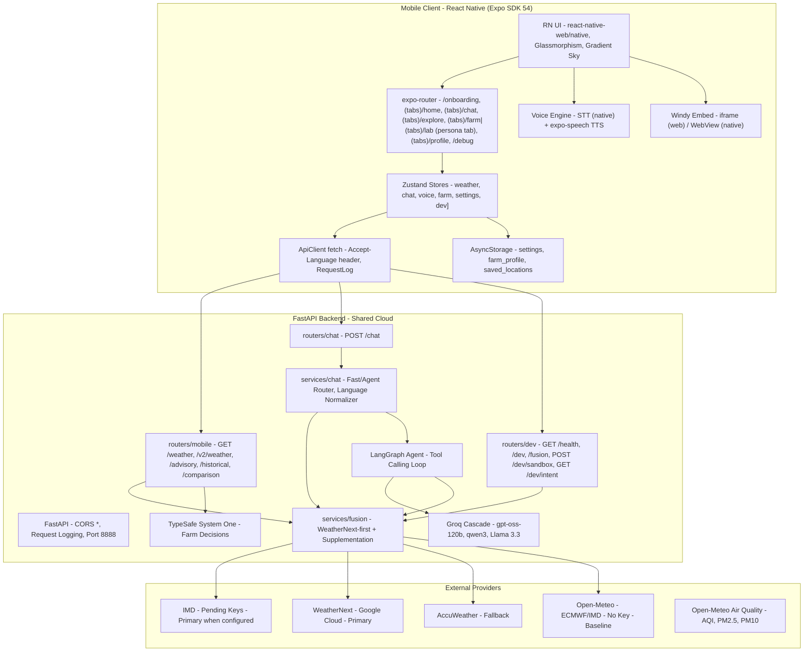
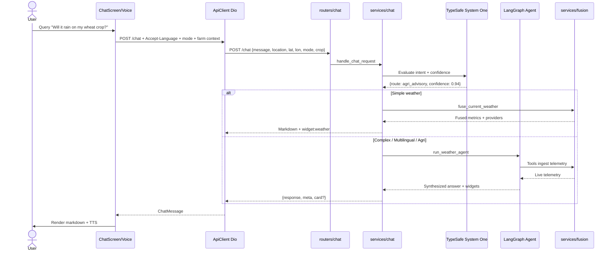
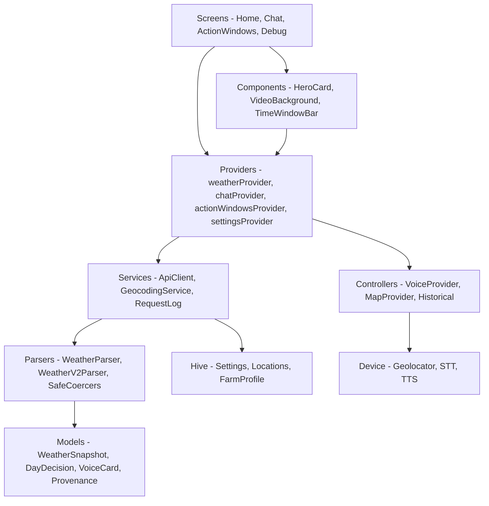
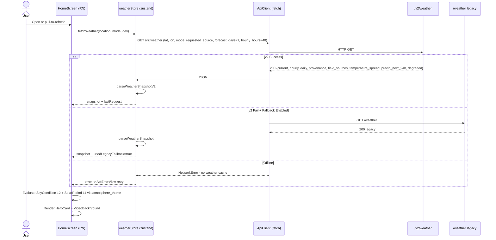
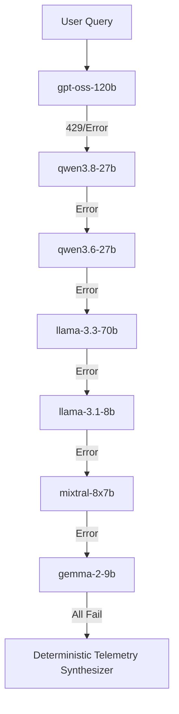
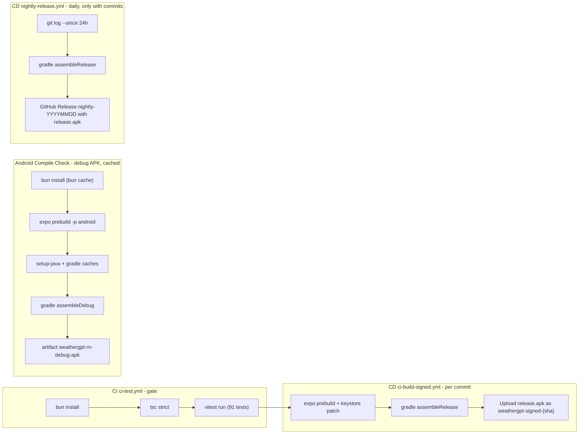
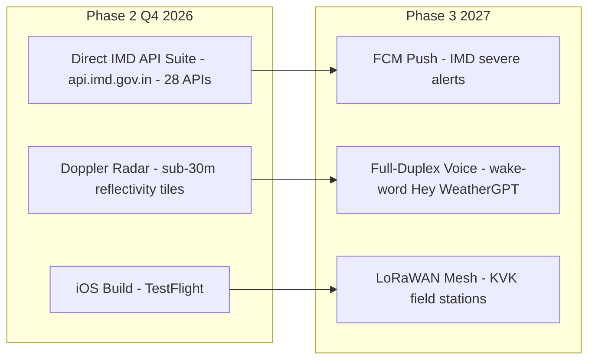

# WeatherGPT Mobile — Technical Architecture

> **Context**: Smart India Hackathon (SIH 2026) Technical Reference  
> **Problem Statement**: **SIH26068** — Disaster Management Theme  
> **Team**: **visionaries_bvm**  
> **Target Audience**: Evaluation Panel, Technical Judges, Systems Architects  
> **Last Updated**: September 2026  
> **Status**: Production Live System + Future Roadmap  
> **Backend**: `https://weathergpt-backend.vercel.app`
> **Mobile client (September 2026)**: **React Native (Expo SDK 54, TypeScript)** — the app was ported from Flutter 3.44. Full mapping table in [`FLUTTER_TO_REACT_NATIVE_MIGRATION.md`](FLUTTER_TO_REACT_NATIVE_MIGRATION.md). Backend contracts and the fusion policy are unchanged.

---

## Navigation Panel

| # | Section | Status | Key Technologies |
| :--- | :--- | :--- | :--- |
| [1. Executive Summary](#1-executive-summary) | System overview and innovations | Live | Expo SDK 54 (React Native), Zustand 5, fetch |
| [2. High-Level Architecture](#2-high-level-architecture) | Mobile-to-cloud topology | Live | Mermaid, FastAPI |
| [3. Technology Stack and Design System](#3-technology-stack-and-design-system) | Frameworks and design tokens | Live | React Native, expo-router, react-native-web |
| [4. Repository Structure](#4-repository-structure) | Codebase layout | Live | Feature-First Clean Architecture |
| [5. Environment Variables and Secrets](#5-environment-variables-and-secrets) | Config and credential isolation | Live | EXPO_PUBLIC_BACKEND_URL, Gradle/EAS signing |
| [6. Backend Integration and API Architecture](#6-backend-integration-and-api-architecture) | FastAPI endpoints | Live | FastAPI, /v2/weather, /chat |
| [7. Mobile App Architecture](#7-mobile-app-architecture) | State, routing, persistence | Live | Zustand 5, expo-router 6, AsyncStorage |
| [8. Data Flow and Request Lifecycle](#8-data-flow-and-request-lifecycle) | Request flow and guards | Live | Dio Interceptors, FutureProvider |
| [9. AI Agent Architecture and Conversational Engine](#9-ai-agent-architecture-and-conversational-engine) | LangGraph and Groq | Live | LangGraph, Groq cascade, TypeSafe |
| [10. Multi-Source Ensemble Fusion Engine](#10-multi-source-ensemble-fusion-engine) | WeatherNext-first + supplementation | Live | IMD, WeatherNext, AccuWeather, Open-Meteo |
| [11. API Contract Reference](#11-api-contract-reference) | REST contract | Live | /chat, /weather, /v2/weather, /advisory |
| [12. Widget Protocol and Dynamic UI Cards](#12-widget-protocol-and-dynamic-ui-cards) | Dynamic markdown cards | Live | widget:weather, widget:forecast, VoiceCard |
| [13. Multilingual Engine and Internationalization](#13-multilingual-engine-and-internationalization) | 9 Indian languages + Voice | Live | easy_localization, STT, TTS |
| [14. Risk Assessment and Environmental Hazard Engine](#14-risk-assessment-and-environmental-hazard-engine) | Hazard advisory | Live | Backend-driven thresholds |
| [15. Agricultural Farmer Advisory Mode and TypeSafe System One](#15-agricultural-farmer-advisory-mode-and-typesafe-system-one) | Crop decisions | Live | Jev AI, Farm Action Windows |
| [16. Developer Diagnostics and Debug Suite](#16-developer-diagnostics-and-debug-suite) | 5-tab debug screen | Live | Request log, provider pinning |
| [17. Deployment and Release Architecture](#17-deployment-and-release-architecture) | CI/CD and signing | Live | GitHub Actions, Gradle 8 |
| [18. Problem Statement and SIH Compliance Matrix](#18-problem-statement-and-sih-compliance-matrix) | SIH26068 compliance | Live | 10-domain matrix |
| [19. Future Roadmap and Planned Enhancements](#19-future-roadmap-and-planned-enhancements) | Roadmap | Planned | IMD APIs, radar, iOS, LoRaWAN |

---

## 1. Executive Summary

**WeatherGPT Mobile** is a production-grade, AI-powered weather intelligence app built for **SIH 2026** Disaster Management (SIH26068) by **Team visionaries_bvm**.

It translates multi-source meteorological telemetry into actionable, hyper-local intelligence in **9 live Indian languages** (bn, en, gu, hi, kn, ml, mr, ta, te) with two-way voice (STT + TTS).

- **Framework**: **React Native (Expo SDK 54)** + TypeScript 5.9 strict — ported from Flutter 3.44 (September 2026); feature-first structure preserved (`app/` routes + `src/` modules)
- **State**: Zustand 5 stores, Routing: expo-router 6, Persistence: AsyncStorage
- **Backend**: Unified FastAPI at `https://weathergpt-backend.vercel.app` (submodule `omsenjalia/weathergpt`)
- **Fusion**: Production uses **IMD → WeatherNext → AccuWeather → Open-Meteo** selection with per-field supplementation and provenance. Legacy weighted fusion (Open-Meteo 2.0×, AccuWeather 1.5×, WeatherAPI 1.2×, Tomorrow.io 1.2×, OWM 1.1×) remains for `GET /fusion` dev diagnostics.

### Core Innovations

- **Persona-Driven UI**:
  - **Everyone**: Hero weather card, 48h hourly, 7-day forecast, AQI/UV, video skies
  - **Farmer (Krishi)**: TypeSafe System One crop advisories, spray/irrigation windows, soil moisture
  - **Researcher**: Historical archives, anomaly charts (react-native-svg LineChart), multi-city comparison
- **TypeSafe System One (Jev)**: Server-side calibrated decisions for farm operations with confidence badges (`System One · 88% confident`)
- **Voice-First Indic**: STT (native module, capability-checked) + TTS `expo-speech` mapped to `hi-IN, gu-IN, mr-IN, ta-IN, te-IN, kn-IN, ml-IN, bn-IN, en-IN`; typed input is the graceful fallback where STT is unavailable (e.g. web preview)
- **Atmospheric Sky Engine**: 11 solar periods (midnight, predawn, night, sunrise, morning, midday, afternoon, goldenHour, sunset, dusk, evening) and 12 sky conditions (clear, partlyCloudy, cloudy, overcast, fog, drizzle, rain, heavyRain, thunder, snow, windy, unknown) driving gradients and video backgrounds
- **Zero-Guesswork**: Missing values → `null`, not `0 °C / 0 mm`. WMO code `0` = clear sky, `null` = unknown
- **Debug Suite**: 5 tabs — Snapshot, Sources, Providers, Requests, Health

---

## 2. High-Level Architecture



---

## 3. Technology Stack and Design System

### 3.1 Mobile Client (React Native — `package.json`)

| Layer | Package | Version | Purpose |
| :--- | :--- | :--- | :--- |
| Framework | expo | ~54.0 (SDK 54, `sdk-54` dist-tag) | Cross-platform runtime (iOS/Android/web) |
| Language | typescript | ~5.9 (strict) | Typed runtime |
| State | zustand | ^5.0 | Stores replacing Riverpod notifiers |
| Routing | expo-router | 6.0 | File-tree routes + `(tabs)` shell |
| HTTP | fetch (global) | — | `ApiClient` wrapper with timeouts + request log |
| Persistence | @react-native-async-storage/async-storage | 2.2.0 | Key-value store replacing Hive |
| i18n | custom engine (`src/i18n`) | — | Same 9-language JSON bundles, eager-loaded |
| TTS | expo-speech | ~14.0.8 | Speech synthesis |
| STT | native module (optional) | — | Capability-checked; typed fallback on web |
| Charts | react-native-svg | 15.12 | `LineChart` replacing fl_chart |
| GIS | iframe / WebView | — | Windy.com embed |
| Gradients | expo-linear-gradient | ~15.0.8 | Atmosphere sky canvas |
| Markdown | custom `RichText` renderer | — | Headings/lists/quotes/links; widget fences stripped |
| Icons | @expo/vector-icons (MaterialCommunityIcons) | ^15.1 | Iconography |
| Tests | vitest | ^5.0 | 91 unit tests over ported pure logic |
| Web runtime | react-native-web + @expo/metro-runtime | 0.21 / ~6.1 | Browser preview |
| Animation (transitive) | react-native-reanimated via expo-router | ~4.1 / worklets pinned `0.5.1` via `package.json` `overrides` | No direct app usage; bun override pins worklets to the Expo SDK 54-blessed `0.5.1` (the npm `latest` 0.13.x targets RN ≥0.86 and fails reanimated's version assertion on RN 0.81) |

### 3.2 Backend

| Layer | Technology | Purpose |
| :--- | :--- | :--- |
| Web Framework | FastAPI | Async REST API |
| ASGI | Uvicorn | Non-blocking server |
| Agent | LangGraph | Stateful AI workflow |
| LLM | LangChain-Groq | Low-latency inference |
| System One | TypeSafe AI (Jev) | Calibrated decisions |
| HTTP | httpx | Telemetry ingestion |
| Validation | Pydantic v2 | Typed contracts |

### 3.3 Design Tokens

| Token | Value | Usage |
| :--- | :--- | :--- |
| bgPrimary | #0B1220 | Base background |
| bgElevated | #101A2C | Modals, bottom bar |
| surfaceCard | #152036 | Glassmorphic card |
| surfaceCardAlt | #1A2740 | Nested card |
| accent | #2DD4BF Teal-400 | Primary actions |
| accentSoft | #5EEAD4 Teal-300 | Glow rims |
| sky / skyDeep | #38BDF8 / #0EA5E9 | Daytime highlights |
| farmerGreen | #34D399 Emerald | Farmer persona |
| researcherBlue | #60A5FA Blue | Researcher persona |
| statusRed | #F87171 Rose | Critical warnings |
| statusAmber | #FBBF24 Amber | Cautions |
| borderSubtle | #243149 | Card stroke |
| textPrimary | #F8FAFC Slate-50 | Hero values |
| textSecondary | #94A3B8 Slate-400 | Subtitles |

---

## 4. Repository Structure

```
weathergpt-app/
├── app/                                   # expo-router routes (React Native app)
│   ├── _layout.tsx                        # Store hydration, atmosphere background, clock ticker
│   ├── index.tsx                          # Onboarding guard redirect
│   ├── onboarding/index.tsx               # Splash → language → persona → farm choice/form
│   ├── (tabs)/
│   │   ├── _layout.tsx                    # Persona-aware NavigationShell (Farm/Lab tab)
│   │   ├── home.tsx                       # Hero card, metric chips, hourly + 7-day segments
│   │   ├── chat.tsx                       # Markdown chat, voice card, TTS, retry
│   │   ├── explore.tsx                    # Windy embed iframe, layer picker, saved places
│   │   ├── farm.tsx                       # Farm hub + action windows (unavailable state, System One badge)
│   │   ├── lab.tsx                        # Historical archive, comparison, anomaly trends (LineChart)
│   │   └── profile.tsx                    # Language, persona, units, voice, developer toggle
│   ├── farm-profile.tsx                   # Farm profile editor (wire-value catalogs)
│   └── debug.tsx                          # 5-tab debug suite (snapshot/sources/providers/requests/health)
├── src/
│   ├── core/
│   │   ├── config/                        # backendConfig (EXPO_PUBLIC_BACKEND_URL), apiEndpoints
│   │   ├── errors/appErrors.ts            # NetworkError/ServerError/ValidationError
│   │   ├── models/
│   │   │   ├── jsonValues.ts              # Safe coercers — null semantics (absent/NaN/blank → null)
│   │   │   ├── appMode.ts                 # everyone|farmer|researcher, reject-or-de-escalate
│   │   │   ├── dataProvenance.ts          # WeatherProvenance, FallbackReason (unconfigured ≠ degraded)
│   │   │   ├── fieldSources.ts            # Per-field attribution, TemperatureSpread, PrecipInterval
│   │   │   └── requestContext.ts          # Shared /chat + /voice payload builder
│   │   ├── services/
│   │   │   ├── apiClient.ts               # fetch client: 60s timeout, Accept-Language, error mapping
│   │   │   ├── requestLog.ts              # Ring buffer 60 entries (zustand)
│   │   │   └── geocodingService.ts        # Open-Meteo geocoding + BigDataCloud reverse
│   │   ├── theme/appColors.ts             # Design tokens (bgPrimary, accent teal, glass fills)
│   │   └── utils/markdownUtils.ts         # forSpeech() TTS cleanup, spokenSummary()
│   ├── features/
│   │   ├── weather/
│   │   │   ├── models/                    # weather.ts, weatherParser (legacy), weatherV2Parser
│   │   │   ├── theme/atmosphereTheme.ts   # 11 periods × 12 conditions, palette engine
│   │   │   └── weatherStore.ts            # /v2 → legacy fallback, generation guard, atmospherePalette
│   │   ├── farm/                          # farmOptions, farmProfile, advisoryModels, farmVoiceParser, farmStores
│   │   ├── chat/chatStore.ts              # History, /chat payload, generation guard
│   │   ├── voice/                         # voiceCard model, response mapper, voiceStore (STT+TTS)
│   │   ├── settings/                      # settingsStore, developerOptionsStore, ttsVoiceOption
│   │   ├── location/locationStore.ts      # One-time GPS prompt contract, reverse geocode
│   │   ├── explore/exploreStores.ts       # Saved locations, Windy map state/URL
│   │   ├── research/researchStores.ts     # /historical + /comparison fetchers, anomaly stats
│   │   └── onboarding/onboardingStore.ts  # Language/persona, TTS locale sync
│   ├── i18n/                              # 9 locale JSONs (en hi gu mr ta te kn ml bn) + typed translator
│   ├── ui/                                # appColors re-export, theme, components/ (GlassCard,
│   │                                      #  buttons, chips, AtmosphereBackground, NavigationShell,
│   │                                      #  LineChart, TimeWindowBar, RichText, ApiErrorView)
│   └── lib/                               # persistence (AsyncStorage), hydration helpers
├── test/                                  # vitest ports of the Dart fixture tests + stubs/
├── .github/workflows/
│   ├── ci-test.yml                        # bun install → tsc strict → vitest (the CI gate)
│   ├── android-compile.yml                # prebuild → cached gradle assembleDebug → debug APK artifact
│   ├── ci-build-signed.yml                # prebuild → keystore patch → signed release APK artifact
│   └── nightly-release.yml                # daily dated GitHub Release with direct release.apk
├── app.json / metro.config.js / babel.config.js / tsconfig.json / vitest.config.ts
├── .env.example                           # EXPO_PUBLIC_BACKEND_URL template (non-secret)
├── env.example                            # kept in sync (same single value)
├── FLUTTER_TO_REACT_NATIVE_MIGRATION.md   # Full before/after mapping table
├── backend/                               # Submodule omsenjalia/weathergpt (FastAPI)
├── backend-integration/                   # TypeSafe Jev bundle + patches
├── docs/
│   ├── app_data_contracts.md              # Mobile data contracts, null semantics
│   └── web_app_api_contract.md            # Backend endpoint audit
└── scripts/push-all.sh                    # Submodule-aware push
```

---

## 5. Environment Variables and Secrets

### Mobile env — `EXPO_PUBLIC_BACKEND_URL` (template: `env.example`)

| Variable | Required | Value | Purpose |
| :--- | :--- | :--- | :--- |
| EXPO_PUBLIC_BACKEND_URL | No | `https://weathergpt-backend.vercel.app` (prod) <br> `http://localhost:8888` (local web) <br> `http://10.0.2.2:8888` (Android emulator) | FastAPI base URL. Resolved via `EXPO_PUBLIC_BACKEND_URL` (Metro inlines it at bundle time) > prod fallback. `resolveBackendUrl()` trims quotes/slashes. |

> **Credential Isolation**: No AccuWeather, Tomorrow.io, OpenWeatherMap, Groq, TypeSafe keys in mobile. Only the backend URL. Backend proxies all providers. `ApiClient` only uses the base URL + `Accept-Language` header from the settings store `language` (default `en`).

### Android Release Signing

| Secret | Type |
| :--- | :--- |
| KEYSTORE_BASE64 | Base64 keystore |
| KEYSTORE_PASSWORD | Keystore password |
| KEY_ALIAS | Key alias |
| KEY_PASSWORD | Key password |

CI falls back to debug keys if secrets missing, never breaks build.

---

## 6. Backend Integration and API Architecture

### Endpoints

| Path | Method | Used By | Function |
| :--- | :--- | :--- | :--- |
| /chat | POST | Mobile + Web | Conversational AI. Body: message, messages, location, lat, lon, language, mode, crop, growth_stage, soil, irrigation. Returns {response: markdown, meta: {path, client, language, location, intent, intent_engine, intent_confidence}, card?} |
| /weather | GET | Mobile legacy fallback | Home snapshot: current, 48h hourly, 7-day, AQI, UV, sunrise/sunset |
| /v2/weather | GET | Mobile primary | WeatherNext-first: lat, lon, mode, requested_source (auto/weathernext/open_meteo/accuweather/imd), forecast_days, hourly_hours, supplement, model. Returns {current, hourly, daily, provenance, field_sources, temperature_spread, precip_next_24h, degraded} |
| /v2/weather/health | GET | Debug | Health probe |
| /v2/weather/catalog | GET | Future | Catalog |
| /v2/weather/series | GET | Future | Time series |
| /advisory | GET | Farmer | Day-by-day suitability, hourly buckets (irrigation/spraying/field_work), TypeSafe decisions |
| /historical | GET | Researcher | {metric, points: [{year, value}]} |
| /comparison | GET | Researcher | {metric, locations: [{name, points}]} locations=name,lat,lon;... from saved_locations |
| /fusion | GET | Dev only | Legacy weighted inspector: provider values, weights, outlier flags. Not in ApiEndpoints, only backend dev router |
| /health | GET | Mobile | {status: ok} |
| /dev | GET | Debug | {ai_decisions, fusion weights, provider_keys_status, recent_logs} |
| /dev/sandbox | POST | Debug | Single-prompt sandbox with latency |
| /dev/intent | GET | Debug | Intent routing inspector |

### Chat Lifecycle



---

## 7. Mobile App Architecture



### State Management (Zustand 5 — `src/features/**/[store].ts`)

- **weatherStore**: fetches on context change (location, mode, dev options). Tries `/v2/weather` primary, falls back to `/weather` legacy unless `disableV2Fallback`. Records `lastRequest` (endpoint, query, usedLegacyFallback, v2Error). No weather cache — on error exposes the message → `ApiErrorView`. Also hosts `atmospherePalette(now, snapshot, dev)` used app-wide.
- **chatStore**: message history, sending flag, intent meta, generation guard
- **actionWindowsStore** (`farmStores.ts`): farm suitability — keyed by contextKey = `lat,lon|crop|stage|soil|irrig|UTCdate`, generation guard, per-tab cache, explicit unavailable state
- **settingsStore**: language, persona (validated, unknown values rejected), units, per-language TTS voice picks (`ttsVoices` map) — persisted to AsyncStorage
- **developerOptionsStore**: DevSourcePin (auto/weathernext/open_meteo/accuweather/imd), wnModel, hourly 1–168, forecast 1–15, supplement toggle, disable-v2-fallback, log-requests
- **farmProfileStore** (`farmStores.ts`): FarmProfile + explicit-saved completion flag (pre-flag saves count as completed)
- **onboardingStore**: language/persona selection; `completeOnboarding()` writes language + TTS locale + persona + completion flag, then re-hydrates `settingsStore` so the first home fetch already uses the chosen mode
- **voiceStore**: STT (native, capability-checked) + TTS (`expo-speech`) + generation guard; `speak()` cleans text via `MarkdownUtils.forSpeech` and applies the saved locale/rate
- **mapStore / savedLocationsStore** (`exploreStores.ts`): Windy layer/zoom state + embed URL builder, saved locations
- **researchStores**: `/historical` + `/comparison` fetchers, `ArchiveStatus` (available/empty/unsupported), anomaly display statistics

### Null Semantics

- `src/core/models/jsonValues.ts`: absent, wrong-typed, blank, NaN, Infinity → `null`
- WMO code `0` = clear sky. Missing code → `null` → `SkyCondition.unknown`, not clear
- Hourly buckets without temperature dropped, not rendered at 0

---

## 8. Data Flow and Request Lifecycle



**Generation Guarding**: Each request increments a generation ID; stale responses are discarded. Used in `chatStore`, `voiceStore`, `actionWindowsStore` and `weatherStore`.

---

## 9. AI Agent Architecture and Conversational Engine

- **LangGraph**: Stateful cyclic graph controlling tool calling loop
- **Groq Cascade**: Primary `openai/gpt-oss-120b` → fallbacks `qwen/qwen3.8-27b`, `qwen/qwen3.6-27b`, `llama-3.3-70b-versatile`, `llama-3.1-8b-instant`, `mixtral-8x7b-32768`, `gemma-2-9b-it` → deterministic telemetry synthesizer (0% downtime)
- **TypeSafe System One (Jev) Intent Routing**: Classifies query into `agri_advisory`, `weather_query`, `smalltalk`, `abuse` etc. Returns `intent_engine: system-one|keywords` + confidence. Fast path (simple weather) → direct fusion, no agent. Complex → agent.
- **Indic Extraction**: Regex + prompt heuristics for Hindi/Gujarati/Marathi city phrases: `"delhi me kal barish hogi?"` → Delhi coords.



---

## 10. Multi-Source Ensemble Fusion Engine

### Production Policy (Live)

| Priority | Provider | Key | Role |
| :--- | :--- | :--- | :--- |
| 0 | IMD | IMD_API_KEY / JWT | Official India, when configured |
| 1 | WeatherNext | Google IAM | Primary NWP, no sunrise/UV/AQI |
| 2 | AccuWeather | ACCUWEATHER_KEY | Fallback, RealFeel |
| 3 | Open-Meteo | None | Baseline + supplement (sunrise, UV, AQI, humidity) |

**Flow**:
- App sends `requested_source`: `auto` (backend policy) or pinned (`weathernext`, `open_meteo`, `accuweather`, `imd`) via `DevSourcePin`. Researcher mode pins `weathernext` unless dev override.
- Backend returns `provenance: {selected_source, requested_source, fallback_reasons[], tried_providers[], source, product, run_id, issued_at, degraded}` and `field_sources: {temperature_c: "weathernext", humidity: "open_meteo", uv_index: null, _supplement: {provider, enabled, attempted, filled[], errors[], cache_hit}}`
- `FieldSources` in `src/features/weather/models/weather.ts` keeps per-field attribution; the "via Open-Meteo" badges, the home status line and the source/run rows in the detail sheets render **only in developer mode** — regular users see no provenance or freshness UI on the home screen at all
- `degraded` = true only when configured provider failed or stale, not when IMD skipped for missing key
- Enrichments (Everyone mode): `temperature_spread {p10_c, p90_c, source, run_id, valid_from, valid_to, members}` (rejected if inverted/one-sided) and `precip_next_24h {total_mm, start, end, complete}` (partial labelled)

### Legacy Weighted Fusion (Dev Inspector `GET /fusion`)

| Provider | Weight | Key |
| :--- | :--- | :--- |
| Open-Meteo ECMWF/IMD | 2.0× | None |
| AccuWeather | 1.5× | ACCUWEATHER_KEY |
| WeatherAPI | 1.2× | WEATHERAPI_KEY |
| Tomorrow.io | 1.2× | TOMORROW_KEY |
| OpenWeatherMap | 1.1× | OPENWEATHER_KEY |

Formula: `M = sum(M_i * W_i) / sum(W_i)`  
Outlier guard: `|T_i - T_OpenMeteo| > 7°C` → excluded  
Confidence: High ≤1.5°C spread, Medium 1.5-3.5°C, Low >3.5°C, Single-Source

Still exposed via `backend-integration/backend/routers/dev.py` for diagnostics, but mobile home uses WeatherNext-first.

---

## 11. API Contract Reference

### POST /chat

Request:
```json
{
  "message": "Is it safe to spray pesticide on my cotton crop today?",
  "messages": [{"role": "user", "content": "Is it safe to spray pesticide on my cotton crop today?"}],
  "location": "Rajkot, Gujarat",
  "lat": 22.3039,
  "lon": 70.8022,
  "mode": "farmer",
  "farmer_mode": true,
  "crop": "Cotton",
  "growth_stage": "Flowering",
  "soil": "Black cotton soil",
  "irrigation": "Drip"
}
```

Response:
```json
{
  "response": "## Advisory for Cotton in Rajkot\n\n```widget:weather\n{\"city\": \"Rajkot\", \"temp\": 31.2, \"feelsLike\": 34.0, \"condition\": \"Partly Cloudy\", \"humidity\": 62, \"windSpeed\": 11.5, \"advisory\": \"Safe for spraying 7:00-10:30 AM\"}\n```\n\nWind <15 km/h, no heavy rain next 24h.",
  "meta": {
    "path": "agent",
    "client": "mobile",
    "language": "en",
    "location": "Rajkot, Gujarat",
    "intent_engine": "system-one",
    "intent_confidence": 0.92
  }
}
```

### GET /v2/weather (Primary)

Query: `lat, lon, mode=everyone|farmer|researcher, requested_source=auto|weathernext|open_meteo|accuweather|imd, forecast_days=7, hourly_hours=48, supplement, model`

Response includes `current, hourly, daily, provenance, field_sources, temperature_spread, precip_next_24h, degraded`

### GET /weather (Legacy fallback)

Same as v2 but older shape: `temperature_c, feels_like_c, condition, weather_code, high_c, low_c, rain_probability, wind_kmh, humidity, pressure_hpa, precipitation_mm, uv_index, sunrise, sunset, aqi, hourly[], forecast[], source, providers_used, fusion{confidence, temp_spread_c, weights}`

### Other Endpoints

- `/advisory?lat=&lon=&crop=&growth_stage=&soil=&irrigation=&days=&mode=` → `{summary, windows: [{date, suitability, summary, best_window, rain_probability, rain_mm, wind_kmh_max, high_c, hourly: {irrigation, spraying, field_work: [{hour, suitability}]}, ai: {spray, irrigation, fieldwork: {score, confidence, band}, overall: {choice, confidence}}}], advisory_engine, ai: {enabled, applied, model, evaluated_days, mean_confidence, overall_verdict}}`
- `/historical?lat=&lon=&metric=&start_year=&end_year=` → `{metric, points: [{year, value}]}`
- `/comparison?locations=name,lat,lon;...&metric=` → `{metric, locations: [{name, points}]}`
- `/health` → `{status: ok}`
- `/dev` → diagnostics
- `/dev/sandbox` POST `{prompt, location, language}` → `{status, duration_ms, response, model_used}`
- `/dev/intent?text=` → routing inspector

---

## 12. Widget Protocol and Dynamic UI Cards

AI embeds native cards in markdown via code fences. The app sanitizes and renders React Native card components.

| Tag | Render | Purpose |
| :--- | :--- | :--- |
| ```widget:weather | ChatWeatherWidget | Temp, condition, humidity, wind, advisory |
| ```widget:forecast | ChatForecastWidget | Multi-day strip |

Sanitization: `src/core/utils/markdownUtils.ts` strips widget blocks for TTS via `forSpeech()` (tables are flattened into spoken prose, LaTeX delimiters removed). Display rendering goes through the shared `RichText` component (`src/ui/components/RichText.tsx`): headings, bold/italic, inline code, bullet lists, styled blockquotes and links, with `widget:`/`json` fence stripping so native-card instructions never leak into the conversation. Chat and all AI surfaces share this one renderer.

### VoiceCard (Structured)

When voice query initiated, backend may return:

```json
{
  "response": "Favorable conditions for wheat irrigation this morning.",
  "card": {
    "label": "Irrigation Outlook",
    "verdict": "Favorable for Irrigation",
    "explanation": "Soil moisture 38% and wind calm <10 km/h.",
    "cta_label": "Schedule Drip Irrigation",
    "source": "Open-Meteo (ECMWF)",
    "confidence": 0.88,
    "stats": [
      {"label": "Soil Moisture", "value": "38%", "tone": "good"},
      {"label": "Wind Speed", "value": "8 km/h", "tone": "good"},
      {"label": "Rain Risk", "value": "10%", "tone": "good"}
    ],
    "forecast": [
      {"day": "Today", "temperature": "32°C", "rainfall": "0 mm", "condition": "sunny"}
    ]
  }
}
```

`mapBackendAnswer` (`src/features/voice/mappers/voiceResponseMapper.ts`) maps the answer onto the chat bubble / result card. If no card, renders prose only — no fabricated stats. `CardTone`: `good|caution|avoid` (aliases: safe, favourable, watch, risk, poor).

---

## 13. Multilingual Engine and Internationalization

9 live languages (Punjabi planned):

| Language | ISO | Script | TTS Locale | STT Model | File |
| :--- | :--- | :--- | :--- | :--- | :--- |
| English | en | English | en-US / en-IN | en_US | en.json |
| Hindi | hi | हिंदी | hi-IN | hi_IN | hi.json |
| Gujarati | gu | ગુજરાતી | gu-IN | gu_IN | gu.json |
| Marathi | mr | मराठी | mr-IN | mr_IN | mr.json |
| Tamil | ta | தமிழ் | ta-IN | ta_IN | ta.json |
| Telugu | te | తెలుగు | te-IN | te_IN | te.json |
| Bengali | bn | বাংলা | bn-IN | bn_IN | bn.json |
| Kannada | kn | ಕನ್ನಡ | kn-IN | kn_IN | kn.json |
| Malayalam | ml | മലയാളം | ml-IN | ml_IN | ml.json |

- **Storage**: `src/i18n/locales/<iso>.json` (same bundles the Flutter app shipped in `assets/translations/`), eager-loaded by the typed i18n engine
- **Header**: `ApiClient` attaches `Accept-Language: <iso>` from the settings store
- **Speech Cleanup**: `MarkdownUtils.forSpeech()` strips markdown, emojis, URLs, widget blocks before TTS
- **Keyset guarantee**: the vitest i18n test asserts every locale resolves the full 287-key English set without throwing (port of `localization_keyset_test.dart`)

---

## 14. Risk Assessment and Environmental Hazard Engine

Hazard handling is **backend-driven**, not a custom in-app RED/YELLOW/GREEN threshold engine.

- **Sources**: IMD CAP alert feed (RSS/XML), advisory Suitability `good|caution|avoid|neutral`, chat markdown warnings
- **Rendering**: Color-coded banners in `WeatherHeroCard`, `WeatherDetailPanels` via `statusRed #F87171`, `statusAmber #FBBF24`
- **No hardcoded 44°C/50mm/50km/h thresholds in `src/`** — thresholds evaluated server-side via fusion + Jev + CAP
- **Future**: Direct IMD API integration will bring structured district warnings, cyclone tracks

---

## 15. Agricultural Farmer Advisory Mode and TypeSafe System One

### TypeSafe System One (Jev)

- **Server**: `backend-integration/backend/services/typesafe.py` (httpx client), `advisory.py` hourly bands, `chat.py` intent routing, `dev.py` `ai_decisions`
- **Per-Day Decision**: Each day at `windows[i].ai.overall = {choice, confidence}` — UI renders that day's decision, not global aggregate
- **Badge**: When shaped by System One, shows `System One · 88% confident`. Without credentials, falls back to rule-based thresholds
- **No Bundled Offline Advisory**: Backend unreachable → explicit unavailable state, never empty neutral bars. Cache keyed on `lat,lon|crop|stage|soil|irrig|UTCdate`, discarded on move/profile edit/midnight (port: `unavailableActionWindows` + `contextKeyOf` in `src/features/farm/farmStores.ts`)

### Farm Profile Onboarding & Settings

- Picking **Farmer** in onboarding routes to a Talk-vs-type choice (`/onboarding/farm`), then the `FarmDetailsScreen` form (`/onboarding/farm-form`) or the `FarmVoiceScreen` voice conversation (`/onboarding/farm-voice`) before `/home`; skipping keeps the default profile. The same data feeds `GET /advisory` and `POST /chat` farm context.
- Voice onboarding is a scripted on-device loop, not a backend chat. In the React Native port the six-question voice flow is gated on the native STT module being present; the onboarding screen currently offers the typed form (all parsing logic — en/hi/gu aliases, romanized forms, fuzzy longest-phrase match, Indic-digit sizes — is ported and unit-tested in `src/features/farm/models/farmVoiceParser.ts`, ready to wire to a native STT session).
- Option catalogs live in `src/features/farm/models/farmOptions.ts` and are shared with the profile editor via `withCurrentOption`, so a stored value can never be missing from its picker. Catalog strings are backend wire values and stay in English; only field labels are localized.
- **Settings → Farm profile** (visible for the farmer persona) shows the saved summary or a "Complete your farm profile" prompt, and switching to the farmer persona with an incomplete profile opens the editor directly.

### Farm Action Windows

3 tracks × 12 two-hour buckets:

```
[00:00-04:00] Avoid   (Heavy Dew / High Humidity)
[04:00-08:00] Good    (Low Wind <8 km/h) <- Optimal Spray
[08:00-12:00] Caution (Rising Thermal)
[12:00-16:00] Avoid   (Peak Solar / Evaporation)
[16:00-20:00] Good    (Calm Evening)
[20:00-24:00] Neutral (Night Rest)
```

### Supported Crops

| Crop | Vulnerability | Focus |
| :--- | :--- | :--- |
| Cotton | Bollworm, water-logging | Spray windows, drainage, dry picking |
| Wheat | Heat stress, lodging | Irrigation milestones, heading protection |
| Rice / Paddy | Water depth, blast fungus | Water level, fertilizer timing |
| Sugarcane | Stem lodging | Irrigation cycling, propping during gusts |
| Groundnut | Tikka leaf spot, pod rot | Moisture balance, drying windows |
| Mustard | Aphid during overcast | Spray timing, cold snap warnings |
| Vegetables | Blight, desiccation | Drip scheduling, shade management |

---

## 16. Developer Diagnostics and Debug Suite

Enable via **Settings → Developer → Enable developer options → Debug & state** (`/debug`) — 5 tabs:

| Tab | Capability | Details |
| :--- | :--- | :--- |
| 1. Snapshot | Raw JSON inspector | Parsed fields, highs/lows, rain prob, solar timings |
| 2. Sources | Per-field attribution | `via Open-Meteo`, supplemented values highlighted |
| 3. Providers | Chain & degradation | Skipped providers, fallback_reasons, WeatherNext status |
| 4. Requests | Ring-buffer log | Last 60 HTTP calls, status, duration ms, query |
| 5. Health | Backend probe | Direct `/v2/weather/health` check (button in the debug screen) |

**Controls**:
- Pin source: `DevSourcePin` auto/weathernext/open_meteo/accuweather/imd — forces provider, surfaces failures
- Hourly horizon slider: 6–168 hours
- Forecast days slider: 1–15 days
- Supplement toggle: Disable Open-Meteo supplementation to inspect raw primary
- wnModel pin: Non-default WeatherNext model
- Provenance display: `Show provenance bar on Home` restores the source/run/freshness chips on the home screen; `Per-field source badges` toggles the "via …" pills. Both apply only with developer mode on — provider names never render for regular users, and the Debug screen stays the canonical attribution surface.

---

## 17. Deployment and Release Architecture



- Every push/PR runs the cached **Android Compile Check** (debug APK artifact `weathergpt-rn-debug-apk`) and the per-commit signed build (`weathergpt-signed-{sha}`, containing `release.apk` only — no zip archives, no AAB)
- **Cache ordering matters**: `expo prebuild` runs before `actions/setup-java(cache: gradle)` in all Gradle workflows, so the cache key can hash the generated `gradle-wrapper.properties`; one cache entry then persists Gradle home plus the compiled React Native native libraries (`~/.gradle/native`) across runs, cutting the ~13 min cold build to a few minutes after the first run. A `concurrency` group cancels superseded pushes on the same branch
- Every day with new commits (00:00 IST), `nightly-release.yml` publishes a dated GitHub Release (`nightly-YYYYMMDD`) whose sole asset is a direct-download `release.apk` for judges — manual `workflow_dispatch` runs always build
- Without keystore secrets (`KEYSTORE_BASE64`/`KEYSTORE_PASSWORD`/`KEY_ALIAS`/`KEY_PASSWORD`), both APK workflows fall back to the Expo-generated debug keystore — installable, never broken. With secrets, a CI-side patch rewrites the generated `release { signingConfig }` block to use the decoded `release.keystore`
- The native `android/` project is generated on demand (Continuous Native Generation): gitignored, regenerated by `expo prebuild` on every machine and CI run from `app.json` + `package.json`
- Publishing: `./scripts/push-all.sh "message"` pushes backend submodule then app (required, not bare `git push`)

---

## 18. Problem Statement and SIH Compliance Matrix

### SIH26068 Key Requirements

| Requirement | Implementation | Status | Source |
| :--- | :--- | :--- | :--- |
| Real-Time Telemetry | Temp, humidity, pressure, wind, UV, AQI from 5 providers | Live | weather_parser.dart, fusion |
| Natural Language Querying | LangGraph + Groq cascade | Live | chat_provider.dart, agent.py |
| NWP Integration | ECMWF/GFS via Open-Meteo + WeatherNext, Priority-1 | Live | fusion, explore |
| Extreme Weather Warnings | Hazard banners, IMD CAP, advisory Suitability | Live | home/widgets, markdown_utils |
| Agricultural Advisories | GPS + Farmer Mode + Jev action windows | Live | farmer/, backend-integration |
| Multilingual Support | 9 live languages + Accept-Language + STT/TTS | Live | translations, voice_provider |
| Historical Trends | Multi-year archive, anomaly charts, variance | Live | researcher/ |
| Voice Accessibility | Hands-free STT, TTS, forSpeech cleanup | Live | voice/, markdown_utils |

### 10-Domain Use Cases

| Domain | Stakeholders | Telemetry | Capability |
| :--- | :--- | :--- | :--- |
| Agriculture | Farmers, KVK | Soil moisture, rain prob, wind, temp | Crop advisories with Jev confidence |
| Disaster Management | NDRF/SDRF, Collectors | Extreme rain, wind gusts, WMO codes | Alert banners, emergency actions |
| Urban Health | Municipalities, Citizens | AQI, PM2.5, PM10, UV, heat index | 24h pollutant tracking, exposure warnings |
| Aviation & Drones | Pilots, Operators | Cloud cover, pressure, wind vectors | Windy GIS: cloud, isobar, gust maps |
| Coastal Fisheries | Fishermen, Ports | Squally winds, wave height, pressure drop | High-wind advisories, voice bulletins |
| Renewable Energy | Solar/Wind Operators | Irradiance, UV, 10m wind | Solar efficiency, turbine output forecast |
| Logistics & Transport | Fleet, Highway Police | Fog codes, precipitation, visibility | Rainfall, fog advisories |
| Construction & Mining | Engineers, Safety | Lightning, gusts, wet bulb | Crane wind alerts, pour rain checks |
| Mountain Tourism | Pilgrims, Hikers | Sub-zero, snowfall, pressure trends | Pass weather guides, landslide warnings |
| Climate Research | Climatologists, Labs | Multi-decade rainfall, temp anomalies | SVG LineChart anomaly, multi-city variance |

---

## 19. Future Roadmap and Planned Enhancements



- **IMD Direct APIs**: City Forecast, District Warning, Cyclone Track, Agromet, Marine Bulletins, Radar, Astronomical — key-authenticated `api.imd.gov.in`
- **Doppler Radar**: Live DWR composite tiles for metros, sub-30 min nowcasting for flash floods/lightning
- **iOS**: Flutter iOS build, SFSafariViewController, background location, APNS via TestFlight
- **LoRaWAN**: Low-cost field stations at KVKs for micro-climate ground truth
- **Voice**: On-device wake-word, neural TTS for low-bandwidth rural, full-duplex streaming
- **Push**: FCM-based IMD severe alerts background notifications

---

**Team**: visionaries_bvm  
**Backend**: https://weathergpt-backend.vercel.app  
**Mobile**: React Native (Expo SDK 54) / TypeScript 5.9 / Zustand 5 / expo-router 6 / AsyncStorage  
**History**: ported from Flutter 3.44 (see `FLUTTER_TO_REACT_NATIVE_MIGRATION.md`)  
**Docs**: `docs/app_data_contracts.md` (authoritative mobile contract), `docs/web_app_api_contract.md` (endpoint audit)
