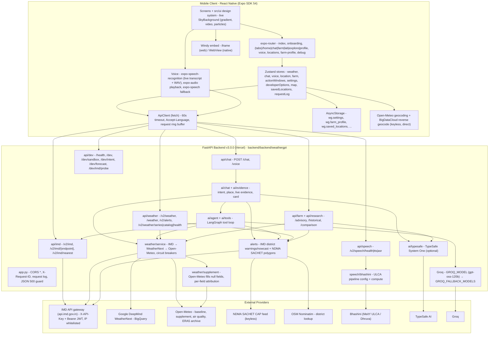
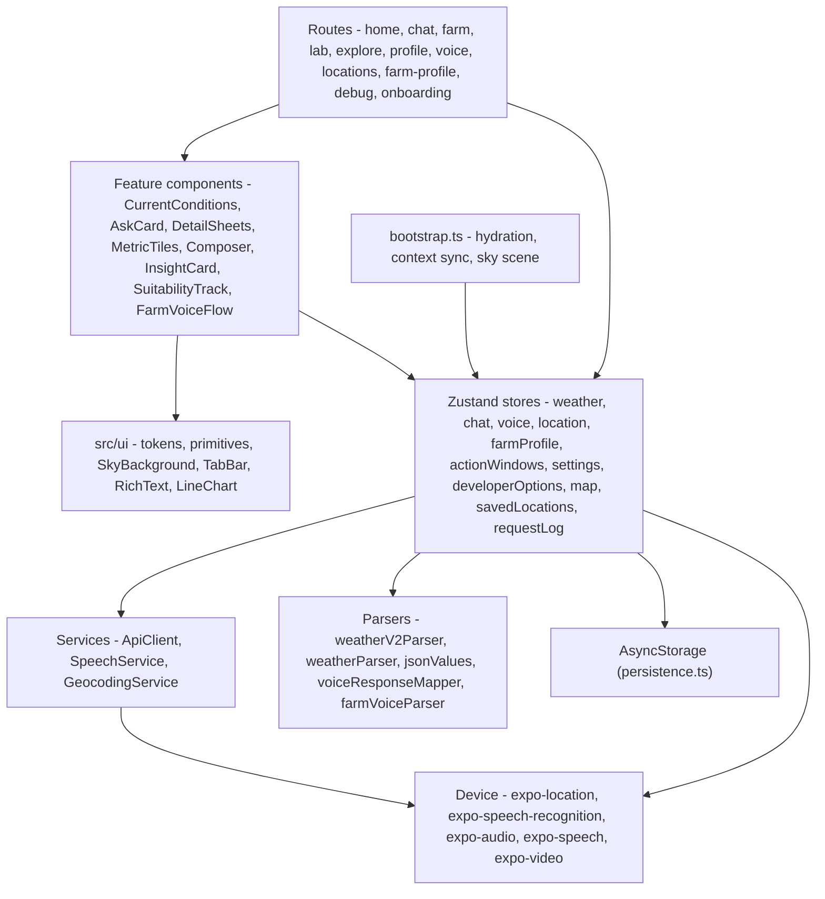
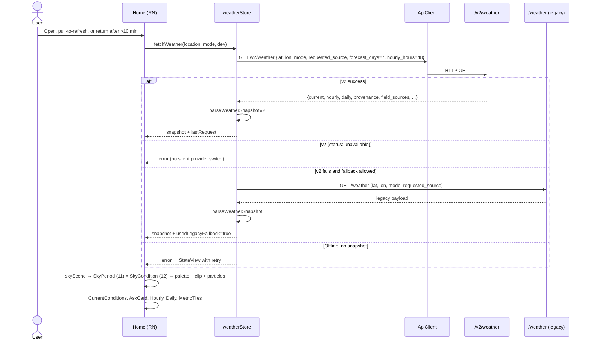
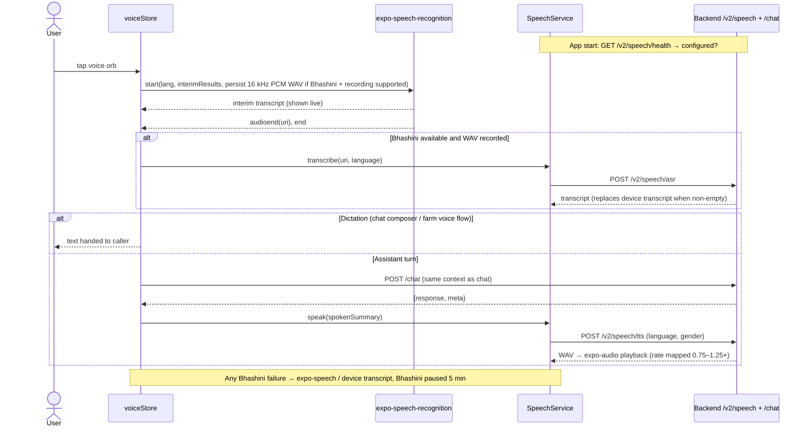
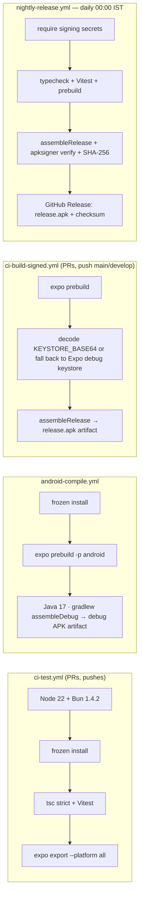
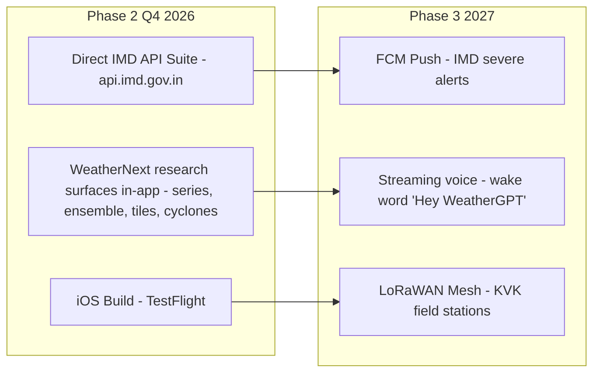

# WeatherGPT Mobile — Technical Architecture

> **Context**: Smart India Hackathon (SIH 2026) Technical Reference  
> **Problem Statement**: **SIH26068** — Disaster Management Theme  
> **Team**: **visionaries_bvm**  
> **Target Audience**: Evaluation Panel, Technical Judges, Systems Architects  
> **Last Updated**: 27 September 2026  
> **Status**: React Native app — typecheck, 148 unit tests and Expo bundles verified; native release/device acceptance pending
> **Backend**: `https://weathergpt-backend.vercel.app` — WeatherGPT API **v3.0.0** (submodule `backend/` → `omsenjalia/weathergpt`)
> **Mobile client**: **React Native (Expo SDK 54, React Native 0.81, TypeScript 5.9)** — ported from Flutter 3.44 (mapping table in [`FLUTTER_TO_REACT_NATIVE_MIGRATION.md`](FLUTTER_TO_REACT_NATIVE_MIGRATION.md)), then rebuilt around a voice-first UX, a shared design system (`src/ui`), looping video skies and Bhashini speech.

---

## Navigation Panel

| # | Section | Status | Key Technologies |
| :--- | :--- | :--- | :--- |
| [1. Executive Summary](#1-executive-summary) | System overview and innovations | Live | Expo SDK 54, Zustand 5, Bhashini |
| [2. High-Level Architecture](#2-high-level-architecture) | Mobile-to-cloud topology | Live | Mermaid, FastAPI |
| [3. Technology Stack and Design System](#3-technology-stack-and-design-system) | Frameworks and design tokens | Live | React Native, expo-router, `src/ui` |
| [4. Repository Structure](#4-repository-structure) | Codebase layout (app + backend) | Live | Feature-first modules |
| [5. Environment Variables and Secrets](#5-environment-variables-and-secrets) | Config and credential isolation | Live | EXPO_PUBLIC_BACKEND_URL, backend `.env`, signing |
| [6. Backend Integration and API Architecture](#6-backend-integration-and-api-architecture) | FastAPI routers and endpoints | Live | weather, imd, farm, research, chat, speech, dev |
| [7. Mobile App Architecture](#7-mobile-app-architecture) | Routing, stores, persistence | Live | expo-router 6, Zustand 5, AsyncStorage |
| [8. Data Flow and Request Lifecycle](#8-data-flow-and-request-lifecycle) | Weather fetch and live sky | Live | fetch, generation-guarded stores |
| [9. AI Agent Architecture and Conversational Engine](#9-ai-agent-architecture-and-conversational-engine) | Routing policy, LangGraph, Groq | Live | LangGraph, Groq cascade, TypeSafe |
| [10. Provider Chain and Official Data](#10-provider-chain-and-official-data) | Provider selection, IMD, WeatherNext, supplementation, warnings | Live | IMD, WeatherNext, Open-Meteo, NDMA SACHET |
| [11. API Contract Reference](#11-api-contract-reference) | Request/response shapes | Live | /chat, /v2/weather, /v2/speech, /advisory |
| [12. Answer Cards and Markdown Rendering](#12-answer-cards-and-markdown-rendering) | RichText + structured cards from live evidence | Live | `card`, InsightCard, RichText |
| [13. Voice and Multilingual Engine](#13-voice-and-multilingual-engine) | 9 Indian languages + Bhashini | Live | Bhashini TTS/ASR, expo-speech-recognition, expo-audio |
| [14. Risk Assessment and Environmental Hazard Engine](#14-risk-assessment-and-environmental-hazard-engine) | Hazard advisory | Live | Backend-driven thresholds |
| [15. Agricultural Farmer Advisory Mode and TypeSafe System One](#15-agricultural-farmer-advisory-mode-and-typesafe-system-one) | Crop decisions | Live | Jev AI, Farm Action Windows |
| [16. Developer Diagnostics and Debug Suite](#16-developer-diagnostics-and-debug-suite) | 5-tab debug screen | Live | Request log, provider pinning |
| [17. Deployment and Release Architecture](#17-deployment-and-release-architecture) | CI/CD, signing, backend hosting | Live | GitHub Actions, Expo prebuild, Vercel |
| [18. Problem Statement and SIH Compliance Matrix](#18-problem-statement-and-sih-compliance-matrix) | SIH26068 compliance | Live | 10-domain matrix |
| [19. Future Roadmap and Planned Enhancements](#19-future-roadmap-and-planned-enhancements) | Roadmap | Planned | IMD APIs, radar, iOS, LoRaWAN |

---

## 1. Executive Summary

**WeatherGPT Mobile** is an AI-powered, voice-first weather intelligence app built for **SIH 2026** Disaster Management (SIH26068) by **Team visionaries_bvm**.

It turns multi-source meteorological data into actionable, hyper-local guidance in **9 Indian languages** (bn, en, gu, hi, kn, ml, mr, ta, te) with two-way voice: **Bhashini** neural TTS and ASR through the backend, with on-device speech as the fallback.

- **Framework**: React Native 0.81 on **Expo SDK 54** + TypeScript 5.9 strict; file-based routes in `app/`, feature modules in `src/`
- **State**: Zustand 5 stores · **Routing**: expo-router 6 · **Persistence**: AsyncStorage
- **Backend**: one FastAPI app (v3.0.0) serving the web client, this app and weathergpt-android, deployed on Vercel
- **Forecast policy**: **IMD → WeatherNext → Open-Meteo** selection with per-field Open-Meteo supplementation and full provenance. IMD answers with the nearest city station's observation and official 7-day forecast; official warnings come from IMD district warnings/nowcasts and the NDMA SACHET CAP feed. The same backend serves weathergpt-app, weathergpt-android and the web app.

### Core Innovations

- **Voice-first assistant**: a large voice orb on Home (`AskCard`), in the centre of the floating tab bar and in the chat composer opens a full-screen voice mode (`/voice`): listen → live transcript → answer → read aloud. Chat replies can be dictated and are read back.
- **Bhashini speech**: backend proxy (`/v2/speech/tts`, `/v2/speech/asr`) to MeitY's ULCA pipeline; credentials never reach the device. Female/male voice choice in Settings.
- **Persona-driven UI**:
  - **Everyone**: hero conditions over a live video sky, tappable hourly / 7-day / metric tiles that open detail sheets, AQI/UV, full-screen Windy map
  - **Farmer (Krishi)**: Farm tab with TypeSafe System One action windows (irrigation, spraying, field work); farm profile by form **or by voice**
  - **Researcher**: Lab tab with historical archive, anomaly bars and multi-location comparison; full Windy layer/model catalog
- **TypeSafe System One (Jev)**: server-side calibrated decisions with per-day confidence badges (`System One · 88% confident`)
- **Atmospheric sky engine**: 11 solar periods × 12 sky conditions drive a gradient palette, 6 bundled looping sky clips, and native-driver particles (rain, stars, lightning)
- **Zero-guesswork data**: missing values are `null` and render as "—", never `0 °C / 0 mm`. WMO code `0` = clear sky, `null` = unknown
- **Debug suite**: 5 tabs — Snapshot, Sources, Providers, Requests, Health

---

## 2. High-Level Architecture


```mermaid
graph TB
    subgraph "Mobile Client - React Native (Expo SDK 54)"
        UI["Screens + src/ui design system - live SkyBackground (gradient, video, particles)"]
        NAV["expo-router - index, onboarding, (tabs)/home|chat|farm|lab|explore|profile, voice, locations, farm-profile, debug"]
        STATE["Zustand stores - weather, chat, voice, location, farm, actionWindows, settings, developerOptions, map, savedLocations, requestLog"]
        CLIENT["ApiClient (fetch) - 60s timeout, Accept-Language, request ring buffer"]
        CACHE["AsyncStorage - wg.settings, wg.farm_profile, wg.saved_locations, ..."]
        VOICE["Voice - expo-speech-recognition (live transcript + WAV), expo-audio playback, expo-speech fallback"]
        GEO["Open-Meteo geocoding + BigDataCloud reverse geocode (keyless, direct)"]
        WEBVIEW["Windy embed - iframe (web) / WebView (native)"]
    end

    subgraph "FastAPI Backend v3.0.0 (Vercel) · backend/backend/weathergpt"
        API["app.py - CORS *, X-Request-ID, request log, JSON 500 guard"]
        RCHAT["api/chat - POST /chat, /voice"]
        RWX["api/weather - /v2/weather, /weather, /v2/alerts, /v2/weather/series|catalog|health"]
        RFARM["api/farm + api/research - /advisory, /historical, /comparison"]
        RIMD["api/imd - /v2/imd, /v2/imd/{endpoint}, /v2/imd/nearest"]
        RSPEECH["api/speech - /v2/speech/health|tts|asr"]
        RDEV["api/dev - /health, /dev, /dev/sandbox, /dev/intent, /dev/forecast, /dev/imd/probe"]
        CHAIN["weather/service - IMD → WeatherNext → Open-Meteo, circuit breakers"]
        SUP["weather/supplement - Open-Meteo fills null fields, per-field attribution"]
        ALERTS["alerts - IMD district warnings/nowcast + NDMA SACHET polygons"]
        CHATSVC["ai/chat + ai/evidence - intent, place, live evidence, card"]
        AGT["ai/agent + ai/tools - LangGraph tool loop"]
        LLM["Groq - GROQ_MODEL (gpt-oss-120b) → GROQ_FALLBACK_MODELS"]
        JEV["ai/typesafe - TypeSafe System One (optional)"]
        BH["speech/bhashini - ULCA pipeline config + compute"]
    end

    subgraph "External Providers"
        IMD["IMD API gateway (api.imd.gov.in) - X-API-Key + Bearer JWT, IP whitelisted"]
        WN["Google DeepMind WeatherNext - BigQuery"]
        OM["Open-Meteo - baseline, supplement, air quality, ERA5 archive"]
        SACHET["NDMA SACHET CAP feed (keyless)"]
        OSM["OSM Nominatim - district lookup"]
        BHX["Bhashini (MeitY ULCA / Dhruva)"]
        TS["TypeSafe AI"]
        GROQ["Groq"]
    end

    UI --> NAV --> STATE
    STATE --> CLIENT
    STATE --> CACHE
    STATE --> GEO
    UI --> VOICE
    UI --> WEBVIEW
    VOICE --> CLIENT

    CLIENT --> RCHAT & RWX & RFARM & RIMD & RSPEECH & RDEV

    RCHAT --> CHATSVC
    CHATSVC --> JEV --> TS
    CHATSVC --> CHAIN & ALERTS
    CHATSVC --> AGT
    AGT --> LLM --> GROQ
    AGT --> CHAIN & ALERTS & RIMD
    RWX --> CHAIN --> SUP
    RWX --> ALERTS
    RFARM --> CHAIN & ALERTS & JEV
    RIMD --> IMD
    RSPEECH --> BH --> BHX

    CHAIN --> IMD & WN & OM
    SUP --> OM
    ALERTS --> IMD & SACHET & OSM
```

---

## 3. Technology Stack and Design System

### 3.1 Mobile Client (`package.json`)

| Layer | Package | Version | Purpose |
| :--- | :--- | :--- | :--- |
| Framework | expo / react-native / react | ^54.0 / 0.81.5 / 19.1 | Cross-platform runtime (Android / iOS / web) |
| Language | typescript | ~5.9 (strict) | Typed source; `tsc -b --noEmit` gate |
| State | zustand | ^5.0 | Feature stores |
| Routing | expo-router | 6.0.24 | File-tree routes + `(tabs)` shell |
| HTTP | fetch (global) | — | `ApiClient` wrapper: timeout, error mapping, request log |
| Persistence | @react-native-async-storage/async-storage | 2.2.0 | JSON key-value store (`src/lib/persistence.ts`) |
| i18n | custom engine (`src/i18n`) | — | 9 eager-loaded JSON bundles, 312 keys each |
| TTS (primary) | Bhashini via `/v2/speech/tts` + expo-audio | ~1.1.1 | Indic neural voices (female/male); WAV played with expo-audio |
| TTS (fallback) | expo-speech | ~14.0.8 | On-device synthesis when Bhashini is unconfigured or failing |
| STT | expo-speech-recognition | ~3.1.3 | Live interim transcript; persists a 16 kHz WAV (where supported) that Bhashini ASR re-transcribes |
| Files | expo-file-system | ~19.0.24 | Read recorded WAV / write TTS audio to cache |
| Video sky | expo-video | ~3.0.16 | Looping bundled sky clips (`assets/sky/*.mp4`) |
| Haptics | expo-haptics | ~15.0.8 | Selection / light / success feedback on native |
| Clipboard | expo-clipboard | ~8.0.8 | Copy assistant replies |
| Browser | expo-web-browser | ~15.0.11 | Opens Google DeepMind Weather Lab (needs Google sign-in) |
| Typeface | @expo-google-fonts/manrope | ^0.4 | Manrope 300–800, tabular numerals for data |
| Navigation theme | @react-navigation/native | ^7.4 | Transparent dark theme so the sky shows through every route |
| Charts | react-native-svg | 15.12.1 | `LineChart`, `DeviationBars`, sun arc, sky glow |
| GPS | expo-location | ~19.0.8 | Foreground permission + position with 12 s timeout and stale-result guard |
| GIS | react-native-webview / web iframe | 13.15.0 | Windy.com embed |
| Gradients | expo-linear-gradient | ~15.0.8 | Atmosphere palette |
| Icons | @expo/vector-icons (MaterialCommunityIcons) | ^15.1 | Iconography |
| Gestures / screens | react-native-gesture-handler, -screens, -safe-area-context | ~2.28 / ~4.16 / ~5.6 | Native navigation primitives, insets |
| Animation | react-native-reanimated + react-native-worklets | ~4.1 / `0.5.1` (pinned via `overrides`) | No direct app usage (app animations use RN `Animated`); worklets pinned to the SDK 54 version because npm `latest` fails reanimated's version assertion on RN 0.81 |
| Web runtime | react-native-web + @expo/metro-runtime | ^0.21 / ~6.1 | Browser preview (`expo start --web`) |
| Tests | vitest | ^5.0 | 148 tests in 13 files: parsers, stores, generation guards, formatting, markdown, Bhashini speech paths, farm voice parser, i18n completeness, release config |
| Tooling | bun 1.4.2, Node ≥ 22.13 | — | Package manager (`bun.lock`) and runtime |

### 3.2 Backend (`backend/backend/requirements.txt`)

| Layer | Technology | Purpose |
| :--- | :--- | :--- |
| Web framework | FastAPI 0.115 + Uvicorn | Async REST API (port 8888 locally) |
| Agent | LangGraph 0.2 + langchain-core | Tool-calling loop over the same services the REST API uses |
| LLM | langchain-groq | `GROQ_MODEL` with `GROQ_FALLBACK_MODELS` |
| HTTP | httpx behind `weathergpt/http.py` | Every upstream call goes through one seam (tests install a fake transport) |
| WeatherNext | google-cloud-bigquery, google-auth | Bounded BigQuery point queries (lazy import) |
| Decisions | TypeSafe AI (optional) | Intent routing, advisory overlay |
| Speech | Bhashini ULCA | TTS / ASR proxy |
| Tests | pytest + pytest-socket | 65 offline tests (`backend/backend/tests/`) |

### 3.3 Design System (`src/ui`)

Semantic tokens live in `src/ui/theme/tokens.ts`; screens import from the `src/ui` barrel, never raw hex.

| Token group | Values | Usage |
| :--- | :--- | :--- |
| Canvas | canvas #0A1120, canvasDeep #060B16 | App background under the sky |
| Surfaces | surface rgba(9,15,30,.42), surfaceStrong .62, surfaceInset white 6% | Translucent cards over the live sky; one hairline, no drop shadows |
| Text | text #F8FAFC, secondary 72%, tertiary 50% | Hierarchy by opacity, not hue |
| Accent | teal #2DD4BF (accentText #5EEAD4) | The single accent: primary actions, selection, voice orb |
| Status | good #4ADE80, caution #FBBF24, danger #F87171, info #60A5FA | Semantic only (advisory bands, errors) |
| Personas | farmer #4ADE80, researcher #60A5FA | Persona chips/icons |
| Type scale | display 96 light, largeTitle 30, title 22, headline 17, body 15, callout 14, footnote 12, caption 11, metric 28, numeric 15 (tabular) | Manrope |
| Spacing / radius | 4-pt grid (2–48); radius 6–26 + pill | Gutter 20, max content width 640 |

- **Primitives** (`src/ui/primitives`): `AppText`, `Icon`, `Touchable` (press scale/dim + haptics), `Card`/`CardHeader`, `Button`/`IconButton` (44 pt targets), `SegmentedControl`, `Chip`/`ChipGroup`, `SwitchRow`, `ListRow`, `Divider`, `TextField`, `Skeleton`, `StateView`, `InlineBanner`, `Screen`/`Section`, `Sheet` (bottom sheet), `VoiceOrb` (idle breathing halo, listening rings, thinking/speaking/error states).
- **Shell** (`src/ui/shell`): `SkyBackground` (+ `SkyVideo`, `SkyParticles`), floating `TabBar` with a centre voice button, `useKeyboardVisible`.
- **Content** (`src/ui/content`): pure `markdown.ts` block parser + `RichText` renderer. **Charts** (`src/ui/charts`): `LineChart`, `DeviationBars`.

---

## 4. Repository Structure

```
weathergpt-app/
├── app/                                   # expo-router routes
│   ├── _layout.tsx                        # Fonts + store hydration, Bhashini probe, transparent nav theme, live sky
│   ├── index.tsx                          # First run → /onboarding, else → /home (+ one-time GPS auto-locate)
│   ├── onboarding/index.tsx               # One route, steps: welcome → language → persona → farm (talk / type / skip)
│   ├── (tabs)/
│   │   ├── _layout.tsx                    # Tabs + FloatingTabBar; Farm tab (farmer) or Lab tab (researcher)
│   │   ├── home.tsx                       # Conditions, AskCard, hourly, 7-day, metric tiles, detail sheets
│   │   ├── chat.tsx                       # Markdown chat, voice-first composer, voice turns read aloud
│   │   ├── farm.tsx                       # Farm profile summary + Today/Tomorrow/7-day action windows
│   │   ├── lab.tsx                        # Historical archive, anomaly bars, multi-location comparison
│   │   ├── explore.tsx                    # Full-screen Windy map, layer/model chips, zoom/locate FABs, Weather Lab link
│   │   └── profile.tsx                    # Settings: persona, language, units, voice, data, developer
│   ├── voice.tsx                          # Full-screen voice assistant (transparent modal)
│   ├── locations.tsx                      # Location picker modal: search, GPS, saved, popular places
│   ├── farm-profile.tsx                   # Farm profile editor (form or voice)
│   ├── debug.tsx                          # 5-tab debug suite
│   └── +not-found.tsx
├── assets/sky/                            # day / night / rain / sunrise / sunset / thunder .mp4 + ATTRIBUTION.txt
├── src/
│   ├── core/
│   │   ├── config/                        # apiEndpoints.ts (all paths incl. /v2/speech/*), backendConfig.ts
│   │   ├── errors/appErrors.ts            # NetworkError / ServerError / ValidationError
│   │   ├── models/                        # appMode, requestContext, dataProvenance, fieldSources, jsonValues
│   │   ├── services/                      # apiClient, geocodingService, requestLog
│   │   ├── theme/appColors.ts, utils/     # markdownUtils (forSpeech, spokenSummary), temperature
│   ├── features/
│   │   ├── app/bootstrap.ts               # useAppReady, useAgentContextSync, useSkyScene
│   │   ├── weather/                       # weatherStore (+ skyScene), format.ts, models/ (weather, parsers),
│   │   │                                  #  theme/atmosphereTheme.ts, components/ (CurrentConditions, AskCard,
│   │   │                                  #  HourlyForecast, DailyForecast, MetricTiles, DetailSheets, HomeSkeleton)
│   │   ├── voice/                         # voiceStore, speechService (Bhashini), models/voiceCard, mappers/
│   │   ├── chat/                          # chatStore; components/ (MessageItem, InsightCard, Composer)
│   │   ├── farm/                          # farmStores (profile + action windows), models/ (advisory, options,
│   │   │                                  #  profile, farmVoiceParser), components/ (FarmProfileForm,
│   │   │                                  #  FarmVoiceFlow, SuitabilityTrack)
│   │   ├── location/                      # locationStore; components/LocationPromptBar
│   │   ├── explore/exploreStores.ts       # savedLocations + Windy map store, embed / Weather Lab URL builders
│   │   ├── research/researchStores.ts     # /historical + /comparison fetchers and statistics
│   │   ├── settings/                      # settingsStore, developerOptionsStore, models/ttsVoiceOption
│   │   └── onboarding/onboardingStore.ts
│   ├── i18n/                              # index.ts (translator, LANGUAGE_META), useTranslation, locales/*.json
│   ├── ui/                                # Design system: theme/, primitives/, shell/, content/, charts/
│   ├── models/location.ts                 # AppLocation, SavedLocation, DEFAULT_LOCATION
│   └── lib/persistence.ts                 # AsyncStorage JSON helpers + StorageKeys
├── test/                                  # vitest suites + stubs/ (RN, AsyncStorage, speech, recognition, audio, file-system, location)
├── .github/workflows/                     # ci-test, android-compile, ci-build-signed, nightly-release
├── backend/                               # Submodule omsenjalia/weathergpt (branch master)
│   ├── backend/                           # FastAPI app (see below)
│   ├── frontend/                          # React/Vite web client (own Architecture.md)
│   └── frontend-backup/
├── backend-integration/                   # Historical patch staging for the backend (TypeSafe); superseded by the submodule
├── docs/                                  # data contracts, API audit, release + audit notes
├── scripts/                               # configure-android-release.cjs, push-all.sh
└── app.json, app.config.js, metro/babel/tsconfig/vitest configs, bun.lock
```

Backend layout (`backend/backend/`):

```
main.py, api/index.py   uvicorn entry / Vercel entry (vercel.json rewrites every path to api/index)
weathergpt/
  config.py             typed settings (placeholders count as unset)
  http.py, runtime.py   upstream HTTP seam; logs, uptime, TTL caches
  geo.py                Open-Meteo geocoding (+ Nominatim for Indic scripts), Nominatim reverse (district)
  weather/              models, codes (WMO + IMD ww/text), service (chain), supplement, payloads,
                        summaries, archive, providers/{imd, weathernext, open_meteo}
  imd/                  endpoints (registry of the 21 account APIs), client (auth, token renewal, errors, cache), stations, parse
  alerts/               imd_district, sachet, service
  weathernext/          bigquery, normalize, auth
  farm/advisory.py      hourly bands, best window, official warnings, System One overlay
  ai/                   chat (orchestrator), evidence (card / reply / facts), intent, place, agent, tools, typesafe, sanitize
  speech/bhashini.py    Bhashini TTS/ASR
  api/                  routers: weather, imd, farm, research, chat, speech, dev
tests/                  offline pytest suites
```

---

## 5. Environment Variables and Secrets

### Mobile — `EXPO_PUBLIC_BACKEND_URL` (template: `.env.example`)

| Variable | Required | Value | Purpose |
| :--- | :--- | :--- | :--- |
| EXPO_PUBLIC_BACKEND_URL | No | `https://weathergpt-backend.vercel.app` (prod) <br> `http://localhost:8888` (local web) <br> `http://10.0.2.2:8888` (Android emulator) | FastAPI base URL. Resolution: `process.env.EXPO_PUBLIC_BACKEND_URL` (inlined by Metro) → `expoConfig.extra.BACKEND_URL` → production URL. `resolveBackendUrl()` trims quotes and trailing slashes. |

> **Credential isolation**: the app holds no provider, LLM, TypeSafe or Bhashini keys — only the backend URL. It calls two keyless services directly: Open-Meteo geocoding (place search) and BigDataCloud's client reverse-geocode (GPS place names). Everything else goes through the backend.

### Backend (`backend/backend/.env.example`)

| Variable | Purpose |
| :--- | :--- |
| WEATHER_PROVIDER_PRIORITY | Chain order (default `imd,weathernext,open_meteo`); providers left out are not used |
| IMD_API_KEY, IMD_EMAIL, IMD_PASSWORD (or IMD_JWT_TOKEN) | IMD gateway — key bound to the server IP; the backend mints/renews 1-hour JWTs. Absent = skipped, not "degraded" |
| IMD_MAX_STATION_KM (35), IMD_OBSERVATION_MAX_AGE_HOURS (4), IMD_TIMEOUT_SECONDS (8), IMD_BASE_URL, IMD_PUBLIC_PROXY | Station distance, observation freshness, gateway, raw-proxy exposure |
| IMD_ENDPOINT_&lt;KEY&gt; | Override an IMD API path without a code change |
| WEATHERNEXT_ENABLED (0), WEATHERNEXT_MOCK_DATA | Turn WeatherNext on; mock = labelled synthetic data |
| GOOGLE_CLOUD_PROJECT, WEATHERNEXT_TABLE_3 / _3_HR / _2, WEATHERNEXT_BQ_*, WEATHERNEXT_RUN_HOURS, _DELIVERY_LATENCY_HOURS, _MAX_RUN_ATTEMPTS, _FRESHNESS_HOURS, _CACHE_TTL_SECONDS | BigQuery tables, cost bounds, run selection |
| GOOGLE_APPLICATION_CREDENTIALS_JSON, GOOGLE_APPLICATION_CREDENTIALS, GOOGLE_OAUTH_CLIENT_ID / _SECRET / _REFRESH_TOKEN | Credential chain (§10) |
| WEATHER_SUPPLEMENT_ENABLED, WEATHER_ALERTS_ENABLED | Open-Meteo gap filling; official warnings |
| GROQ_API_KEY, GROQ_MODEL, GROQ_FALLBACK_MODELS, CHAT_TIMEOUT_SECONDS (22), CHAT_FAST_PATH | Chat LLM; without a key chat answers deterministically from live data |
| BHASHINI_USER_ID, BHASHINI_ULCA_API_KEY, BHASHINI_PIPELINE_ID | Bhashini speech |
| TYPESAFE_API_KEY, TYPESAFE_* | Optional System One routing / advisory overlay |
| ADMIN_TOKEN | Enables `/dev/imd/probe` and `/dev/reset` (header `X-Admin-Token`) |

### Android Release Signing (GitHub secrets)

| Secret | Type |
| :--- | :--- |
| KEYSTORE_BASE64 | Base64 keystore |
| KEYSTORE_PASSWORD | Keystore password |
| KEY_ALIAS | Key alias |
| KEY_PASSWORD | Key password |

The nightly release **fails closed** without these; the per-commit signed build falls back to Expo's debug keystore (see §17).

---

## 6. Backend Integration and API Architecture

### Endpoints

| Path | Method | Used By | Function |
| :--- | :--- | :--- | :--- |
| / | GET | Meta | Service index: version, provider priority, endpoint lists |
| /v2/weather | GET | Mobile primary | lat, lon, mode, requested_source, model, run_id, forecast_days (7), hourly_hours (48), supplement, alerts → nested `current/hourly/daily` **and** flat legacy fields, `field_sources`, `provenance`, `alerts`, `temperature_spread`, `precip_next_24h`, `degraded`; or 200 `{status: "unavailable", fallback_reasons}` |
| /weather | GET | Mobile legacy fallback | Same payload; unavailable → 502 `{detail: {...}}` |
| /v2/alerts | GET | Shared | Official warnings for a point (IMD district warning/nowcast + NDMA SACHET): `status` ok / unknown / not_covered |
| /v2/weather/health | GET | Debug (Health tab) | Provider chain health, IMD + WeatherNext status, caches (no secrets) |
| /v2/weather/catalog, /v2/weather/series | GET | Researcher | What each provider supplies; one variable as a series (WeatherNext statistics or hourly values) |
| /v2/imd, /v2/imd/{endpoint}, /v2/imd/nearest | GET | Operators (`X-Admin-Token`) | Catalog is public; raw IMD data needs the admin token (IMD prohibits redistribution) |
| /chat, /voice | POST | Mobile chat + voice, web | `{response, meta, card}` — `card` is built from the same live evidence as the answer (§12) |
| /advisory | GET | Farm tab | Per-day suitability, hourly bands for today/tomorrow, computed best window, official-warning downgrades, optional System One |
| /historical, /comparison | GET | Lab | ERA5 yearly series; comparison names may contain commas |
| /v2/speech/health, /tts, /asr | GET/POST | Mobile voice | Bhashini |
| /health, /dev, /dev/sandbox, /dev/intent, /dev/forecast | GET/POST | Web dev view, probes | Diagnostics |
| /dev/imd/probe, /dev/reset | GET/POST | Operators (`X-Admin-Token`) | Test all IMD endpoints; drop caches after rotating keys |

All responses carry `X-Request-ID`; an unhandled exception becomes JSON `500 {detail, request_id}`.

### Chat Lifecycle

```mermaid
sequenceDiagram
    actor User
    participant Client as ApiClient
    participant Chat as ai/chat
    participant Ev as ai/evidence
    participant Agent as LangGraph agent

    User->>Client: "Will it rain tomorrow in Pune?"
    Client->>Chat: POST /chat {message, messages, lat, lon, language, mode, farm context}
    alt greeting / off-topic / abuse
        Chat-->>Client: canned reply in the user's language (no upstream calls)
    else weather question
        Chat->>Chat: intent (keywords, optional System One) + place (named place, else device location)
        Chat->>Ev: gather: provider chain + supplement + official alerts (parallel)
        Ev-->>Chat: evidence → card
        alt simple ask (current, rain, alerts, AQI) in everyone mode
            Chat-->>Client: deterministic answer from evidence (LLM-translated when not English) + card
        else farm / research / explanation
            Chat->>Agent: system prompt with live facts, 22 s budget
            Agent-->>Chat: answer (tools for other places, hours, history, IMD products)
            Chat-->>Client: answer + card
        end
    end
    Note over Chat: agent timeout/error → deterministic answer; a pinned source is never substituted
```

---

## 7. Mobile App Architecture


```mermaid
graph TD
    ROUTES["Routes - home, chat, farm, lab, explore, profile, voice, locations, farm-profile, debug, onboarding"]
    COMPONENTS["Feature components - CurrentConditions, AskCard, DetailSheets, MetricTiles, Composer, InsightCard, SuitabilityTrack, FarmVoiceFlow"]
    UIKIT["src/ui - tokens, primitives, SkyBackground, TabBar, RichText, LineChart"]
    STORES["Zustand stores - weather, chat, voice, location, farmProfile, actionWindows, settings, developerOptions, map, savedLocations, requestLog"]
    BOOT["bootstrap.ts - hydration, context sync, sky scene"]
    PARSERS["Parsers - weatherV2Parser, weatherParser, jsonValues, voiceResponseMapper, farmVoiceParser"]
    SERVICES["Services - ApiClient, SpeechService, GeocodingService"]
    STORAGE["AsyncStorage (persistence.ts)"]
    DEVICE["Device - expo-location, expo-speech-recognition, expo-audio, expo-speech, expo-video"]

    ROUTES --> COMPONENTS --> UIKIT
    ROUTES --> STORES
    COMPONENTS --> STORES
    BOOT --> STORES
    STORES --> SERVICES
    STORES --> PARSERS
    STORES --> STORAGE
    STORES --> DEVICE
    SERVICES --> DEVICE
```

### Routing and Shell

- **Root layout** (`app/_layout.tsx`): waits for `useAppReady()` (Manrope fonts + hydration of settings, developer options, location, farm profile and saved locations; a font failure falls back to the system font), fires the non-blocking Bhashini probe, runs `useAgentContextSync`, and wraps a transparent-theme `Stack` in `SkyBackground` so the live sky shows behind every screen. `locations` is a modal that slides up from the bottom; `voice` is a transparent full-screen modal.
- **Entry** (`app/index.tsx`): `wg.onboarding_complete` decides `/onboarding` vs `/home`; returning users trigger a one-time GPS auto-locate.
- **Tabs** (`app/(tabs)/_layout.tsx`): Today · Chat · [Farm | Lab] · Map · Settings. Farmer gets **Farm**, Researcher gets **Lab**, Everyone gets neither. The `FloatingTabBar` has a centre voice orb that opens `/voice`.

### State Management (Zustand 5)

- **weatherStore** (`features/weather`): builds the `/v2/weather` query from mode + developer options, falls back to legacy `/weather` unless the failure is an honest "unavailable" for a pinned source or `disableV2Fallback` is on. Records `lastRequest` + `updatedAt`. Refreshing the same request (`snapshotKey`) keeps the snapshot visible; a new location/mode/pin clears it. Exposes `skyScene(now, snapshot, dev)` → `{period, sky, palette}` using the location's UTC offset.
- **chatStore**: messages, `sending`, error, generation guard. `setContext` (language, persona, location, farm profile) clears the conversation when context changes; `retryLast` replaces the failed user turn. `buildChatPayload` and the voice store share `buildAgentRequestContext` so chat and voice send identical context.
- **voiceStore**: `startListening` (full assistant turn → `/chat` → `mapBackendAnswer`) and `startDictation(onText)` (chat composer, farm voice flow). See §13 for the speech pipeline. Generation guard on cancel and on context change.
- **speechService** (`features/voice/speechService.ts`): `/v2/speech/health` probe, TTS/ASR calls, expo-audio playback (cache file on native, data URI on web), 12-entry audio cache, 5-minute back-off after a Bhashini failure.
- **locationStore**: active location; one-time OS permission prompt (`wg.location_prompted`), never overrides an explicit choice, GPS with 12 s timeout and a generation guard, reverse-geocoded name.
- **farmProfileStore** (`farmStores.ts`): profile + explicit completion flag (legacy saves count as completed). `save()` validates size, geocodes the farm place and makes it the active location.
- **actionWindowsStore** (`farmStores.ts`): `/advisory` for Today / Tomorrow / 7-day, cached per `contextKey = mode|lat,lon|crop|stage|soil|irrig|UTCdate`, generation guard, explicit unavailable state.
- **settingsStore**: language, persona (validated; unknown values rejected on write, de-escalated to `everyone` on read), °C/°F, TTS speed (0.3–1.0), Bhashini gender, device TTS locale, per-language voice picks, notification prefs.
- **developerOptionsStore**: enable flag, source pin, WeatherNext model, hourly (1–168) / daily (1–15) horizons, supplement toggle, disable-v2-fallback, request logging, forced sky period/condition, disable video sky, provenance display.
- **onboardingStore**: chosen language/persona; `completeOnboarding()` persists them, then updates the live settings store so the first Home fetch already uses them.
- **mapStore / savedLocationsStore** (`exploreStores.ts`): Windy layer / product / zoom (3–12), researcher menu + marker toggles, embed and Weather Lab URL builders; saved places.
- **researchStores**: `/historical` + `/comparison` fetchers, `ArchiveStatus` (available / empty / unsupported), long-term average and anomaly statistics.
- **requestLog** (`core/services`): 60-entry ring buffer of every backend call (status, duration, summary such as `source=weathernext · run=… · hourly=48`).

### Persistence (`src/lib/persistence.ts`)

`wg.settings`, `wg.selected_location`, `wg.location_prompted`, `wg.farm_profile`, `wg.farm_profile_completed`, `wg.saved_locations`, `wg.onboarding_complete`, `wg.developer_options`, `wg.location_banner_dismissed`. Read/write failures are swallowed so the app keeps working in memory. Flutter Hive data is **not** imported.

### Correctness Boundaries

- Every async store uses a **generation ID**; stale responses are discarded (weather, chat, voice, action windows, location GPS).
- Explicit "unavailable" responses never silently switch providers; a new location never shows the previous place's data.
- Missing tomorrow windows are unavailable, never copied from today; a missing best-window label never implies good conditions.
- The HTTP timeout (60 s) covers headers **and** body; non-object JSON on a 2xx is an error, not an empty success.
- °F conversion happens only at the presentation layer.
- `src/core/models/jsonValues.ts`: absent, wrong-typed, blank, NaN or Infinity → `null`. Hourly points without temperature are dropped, not drawn at 0. Missing WMO code → `SkyCondition.Unknown`, not clear.

---

## 8. Data Flow and Request Lifecycle


```mermaid
sequenceDiagram
    actor User
    participant App as Home (RN)
    participant Store as weatherStore
    participant Client as ApiClient
    participant APIv2 as /v2/weather
    participant API as /weather (legacy)

    User->>App: Open, pull-to-refresh, or return after >10 min
    App->>Store: fetchWeather(location, mode, dev)
    Store->>Client: GET /v2/weather {lat, lon, mode, requested_source, forecast_days=7, hourly_hours=48}
    Client->>APIv2: HTTP GET

    alt v2 success
        APIv2-->>Store: {current, hourly, daily, provenance, field_sources, ...}
        Store->>Store: parseWeatherSnapshotV2
        Store-->>App: snapshot + lastRequest
    else v2 {status: unavailable}
        Store-->>App: error (no silent provider switch)
    else v2 fails and fallback allowed
        Store->>API: GET /weather {lat, lon, mode, requested_source}
        API-->>Store: legacy payload
        Store->>Store: parseWeatherSnapshot
        Store-->>App: snapshot + usedLegacyFallback=true
    else Offline, no snapshot
        Store-->>App: error → StateView with retry
    end

    App->>App: skyScene → SkyPeriod (11) × SkyCondition (12) → palette + clip + particles
    App->>App: CurrentConditions, AskCard, Hourly, Daily, MetricTiles
```

A failed refresh while a snapshot is on screen keeps the data and shows an `InlineBanner` with retry. Tapping an hour, a day or a metric tile opens `WeatherDetailSheet` (hour / day / metric detail; a day's hours link to hour detail).

### Live Sky (`src/ui/shell`)

`SkyBackground` draws, bottom to top: the palette gradient (always), the looping clip from `clipFor(period, sky)` (thunder → rain → cloudy → time of day; fades in when ready), `SkyParticles` (rain streaks, twinkling stars, lightning; native-driver `Animated`), horizon warmth and a sun/moon glow, and a readability veil. `useSkyScene` re-evaluates every minute. Developer mode can force a period/condition or disable video (gradient only).

---

## 9. AI Agent Architecture and Conversational Engine

- **Routing** (`ai/chat.py`): greeting/off-topic/abuse → canned reply in 9 languages; simple weather asks (current, rain, alerts, air quality) in Everyone mode → deterministic answer built from live evidence (LLM translation when the language isn't English); farm, research and explanation asks → LangGraph agent with the evidence already in its prompt and a hard timeout that falls back to the deterministic answer.
- **Intent** (`ai/intent.py`): keyword rules (English, Hinglish, Gujlish and Indic scripts), refined by TypeSafe System One when configured. Labels: `greeting`, `unrelated`, `rain_probability`, `weather_current_or_forecast`, `weather_alerts`, `air_quality`, `farm_advice`, `research_query`, `weather_explanation`, `weather_conversation`.
- **Place** (`ai/place.py`): "in Pune", "Ahmedabad ma", "दिल्ली में", "અમદાવાદમાં" → geocoded (Open-Meteo, Nominatim for Indic scripts); otherwise the device location.
- **Tools** (`ai/tools.py`): `geocode_place`, `get_weather`, `get_hourly_forecast`, `get_official_alerts`, `get_farm_advisory`, `get_climate_history`, `get_imd_product` — each calls the same service as the REST API.
- **LLM**: `GROQ_MODEL` (default `openai/gpt-oss-120b`) with `GROQ_FALLBACK_MODELS` (default `openai/gpt-oss-20b`).

---

## 10. Provider Chain and Official Data

### Selection (`weather/service.py`)

| Priority | Provider | Needs | Supplies |
| :--- | :--- | :--- | :--- |
| 1 | IMD | IMD_API_KEY + IMD_JWT_TOKEN, whitelisted IP; point in India; city station ≤ 35 km | Station observation (current), official 7-day max/min/text forecast, observed extremes, sunrise/sunset |
| 2 | WeatherNext | WEATHERNEXT_ENABLED=1, BigQuery table, Google credentials | Hourly 64-member ensemble statistics, 15 days |
| 3 | Open-Meteo | nothing | Global baseline: current, hourly, 16-day daily, UV, AQI |

- `auto`: first provider with **fresh** data wins; a stale answer is kept and used only if nothing fresher answers (then `degraded`).
- A pinned `requested_source` (`imd`, `weathernext`, `open_meteo`) returns that provider or `status: "unavailable"` — never another provider. `accuweather` is rejected (422).
- `degraded` is true only for real failures; `not_configured`, `disabled`, `out_of_coverage` and `no_station_nearby` are reported in `fallback_reasons` but are normal.
- Circuit breaker per provider: 5 transient failures → skipped for 2 minutes, then one trial request.

### IMD (`imd/`, `weather/providers/imd.py`)

- Gateway `https://api.imd.gov.in/api/v1`, headers `X-API-Key` **and** `Authorization: Bearer <JWT>`; access is IP-whitelisted. Errors are classified (`token_invalid_or_expired`, `api_key_rejected`, `forbidden_ip_not_whitelisted`, `rate_limited`, …) and reported, never hidden.
- Forecast: `cityforecastloc` (all stations, cached 30 min) → nearest station → 7-day forecast; `current_wx` → that station's observation (older than 3 h is not shown as "now"). IMD present-weather codes (WMO 4677) and forecast text are mapped to the WMO interpretation codes the app uses.
- IMD has no hourly series, rain probability or UV: those come from Open-Meteo, attributed per field.
- All 21 APIs in the IMD account docs (verified live) are exposed at `/v2/imd/{endpoint}` (catalog at `/v2/imd`); raw data there needs `X-Admin-Token` because IMD prohibits redistribution. `/dev/imd/probe` tests them all.
- Tokens: `POST /api/oauth/token.php {email, password}` → 1-hour JWT; with `IMD_EMAIL`/`IMD_PASSWORD` the backend renews it two minutes before expiry and once after an early rejection. The API key is bound to the server IP.
- Observations: only ~440 of ~1,300 forecast stations report `current_wx`, so "now" comes from the nearest *reporting* station within 35 km (observations older than 4 h are not shown as now); `current.station` names it.

### Official warnings (`alerts/`)

- **IMD**: point → district (OSM Nominatim) → fuzzy match to IMD's district list (IMD spells "AHMADABAD") → `districtwarning` (5 days) + `districtnowcast`. Colour scales differ: warnings 1 = red … 4 = green, nowcast 1 = green … 4 = red.
- **NDMA SACHET** (keyless CAP feed, IMD regional centres + state authorities): active alerts matched by exact polygon, centroid radius as fallback.
- `status: "unknown"` when no channel answers — never reported as "no alerts". Red/orange warnings downgrade that day's farm advisory.

### Supplement (`weather/supplement.py`)

Only fields the selected provider left `null` are filled from Open-Meteo (current fields, hourly series, daily rain chance/UV/sun times, air quality). `field_sources` names the provider of every field; daily rows carry their own `field_sources`. `supplement=false` disables it per request.

### WeatherNext (`weathernext/`)

- **BigQuery only** (the GCS/Earth Engine scaffolding was removed). Exact `init_time` partition filter, explicit leaf columns (`minimal` / `standard` / `extended` profiles), `ST_DWITHIN` on the clustered geography column, `maximum_bytes_billed` on every job, bounded wait with cancellation.
- Run selection: newest 00/06/12/18 UTC run expected on BigQuery (~7 h latency), stepping back up to 3 runs, never past the 2× freshness expiry.
- Normalisation: K→°C, m→mm, m/s→km/h, Pa→hPa; humidity via Magnus; condition from mean precipitation rate + cloud cover; rain probability is a lower bound from quantiles; only means are summed. Days are bucketed in IST for Indian points.
- WN2 is queried only when pinned (`model=weathernext_2`) — different schema.
- Credentials: `GOOGLE_APPLICATION_CREDENTIALS_JSON` → credentials file / ADC → OAuth refresh token.

### Enrichments

`temperature_spread` (min p10 … max p90 over 24 h; ensemble sources only) and `precip_next_24h` (exactly 24 hourly buckets starting with the one containing now; `complete: false` when short).

---

## 11. API Contract Reference

### POST /chat

Request (built by `buildChatPayload` / the voice store):
```json
{
  "message": "Is it safe to spray pesticide on my cotton crop today?",
  "messages": [{"role": "user", "content": "Is it safe to spray pesticide on my cotton crop today?"}],
  "location": "Rajkot, Gujarat, India",
  "lat": 22.3039,
  "lon": 70.8022,
  "language": "en",
  "mode": "farmer",
  "farmer_mode": true,
  "crop": "Cotton",
  "growth_stage": "Flowering",
  "soil": "Black",
  "irrigation": "Drip"
}
```

`mode` is authoritative; `farmer_mode` is derived from it. Farm fields are sent only in farmer mode with a completed profile. Voice turns send `message` only (no `messages` history). If the body's `language` is empty or English, the router falls back to a non-English `Accept-Language` header.

Before the reply is returned, `services/response.py` `sanitize_response` strips `<think>` blocks and reasoning preambles and validates any widget JSON.

Response:
```json
{
  "response": "## Spraying outlook for Rajkot\n\nWind under 15 km/h and no heavy rain in the next 24 h...",
  "meta": {
    "path": "agent",
    "client": "mobile",
    "language": "en",
    "location": "Rajkot, Gujarat, India",
    "intent": "weather_current_or_forecast",
    "intent_engine": "system-one",
    "intent_confidence": 0.92
  },
}
```

The response is `{response, meta, card}`. `meta` carries `path` (greeting / guarded / clarify / fast / agent / fallback / pinned), `intent`, `language`, `mode`, resolved `location`/`lat`/`lon`, `selected_source`, `requested_source`, `degraded`, `alerts_status` and `fallback_reasons`. `card` (null for greetings) is built from the live evidence: `{label, verdict, explanation, source, stats[{label, value, tone}], forecast[{day, date, temperature, rainfall, rain_chance, condition}], alerts[]}`.

### GET /v2/weather (primary)

Query: `lat, lon, mode=everyone|farmer|researcher, requested_source=auto|imd|weathernext|open_meteo, forecast_days (default 7), hourly_hours (default 48), supplement (sent only as false), model (sent only for weathernext_2)`

Response: `current, hourly, daily, provenance, field_sources, temperature_spread, precip_next_24h, degraded` — or `{status: "unavailable", error}`.

### GET /weather (legacy fallback)

Query: `lat, lon, mode, requested_source`. Older shape: `temperature_c, feels_like_c, condition, weather_code, high_c, low_c, rain_probability, wind_kmh, humidity, pressure_hpa, precipitation_mm, uv_index, sunrise, sunset, aqi, hourly[], forecast[], source, providers_used, fusion{confidence, temp_spread_c, weights}`

### /v2/speech/*

- `GET /v2/speech/health` → `{provider: "bhashini", configured, pipeline_id, languages: [en, hi, gu, mr, ta, te, kn, ml, bn], tasks: ["tts", "asr"]}`
- `POST /v2/speech/tts` `{text, language, gender}` → `{audio_base64 (WAV), audio_format, sample_rate, language, gender, chunks, truncated, provider, service_id}`. Long text is split into ~380-char chunks (max 2400; `truncated` flags the cut) and the WAVs concatenated by parsing the RIFF chunks directly (Bhashini returns IEEE-float WAVs, which Python's `wave` module rejects).
- `POST /v2/speech/asr` `{audio_base64, language, audio_format: "wav", sampling_rate?}` → `{transcript, language, sampling_rate, provider, service_id}`. Audio capped at ~3 MB (Vercel body limit).
- Errors: `503 {detail: {code: "speech_unavailable"}}` (not configured / language not served), `502 {detail: {code: "speech_upstream_error"}}`, `422` invalid input. Pipeline config is cached per task × language for 1 h.

### Other Endpoints

- `/advisory?lat=&lon=&crop=&days=7&mode=&growth_stage=&soil=&irrigation=` → `{summary, windows: [{date, suitability, summary, best_window, rain_probability, rain_mm, wind_kmh_max, high_c, hourly: {irrigation, spraying, field_work: [{hour, suitability}]}, ai: {spray, irrigation, fieldwork: {score, confidence, band}, overall: {choice, confidence}}}], advisory_engine, ai: {enabled, applied, model, evaluated_days, mean_confidence, overall_verdict}}`
- `/historical?lat=&lon=&metric=&start_year=&end_year=` → `{metric, points: [{year, value}]}`
- `/comparison?locations=name,lat,lon;...&metric=` → `{metric, locations: [{name, points}]}`
- `/dev/sandbox` POST `{prompt, location, language}` → `{status, duration_ms, response, model_used}`
- `/dev/intent?text=` → routing decision

Full per-field contracts: [`docs/app_data_contracts.md`](docs/app_data_contracts.md) and [`docs/web_app_api_contract.md`](docs/web_app_api_contract.md).

---

## 12. Answer Cards and Markdown Rendering

### Markdown (`src/ui/content`)

Every AI surface (chat bubbles, voice results) renders through one `RichText` component backed by the pure `markdown.ts` parser: headings, bold/italic, inline code, bullet and numbered lists, blockquotes, links, code blocks and pipe tables. Native-card payloads — ```` ```widget:* ```` fences, or JSON fences carrying a `"widget_type"` key — are **dropped**, so card instructions never leak into the conversation. The app does not render widget fences as cards.

For speech, `MarkdownUtils.forSpeech()` (`src/core/utils/markdownUtils.ts`) strips code/widget blocks, markdown, emojis, URLs and LaTeX delimiters and flattens tables to prose; `spokenSummary()` prefers the body after the heading block and trims to ~320 characters at a sentence boundary.

### Structured Cards (`card`)

The backend attaches a `card` to every weather answer, built by `weathergpt/ai/evidence.py` from the same live evidence as the prose (never canned numbers); greetings and off-topic replies carry `card: null`. The client parses it in `src/features/voice/models/voiceCard.ts` / `InsightCard.tsx`. Illustrative shape:

```json
{
  "response": "Favorable conditions for wheat irrigation this morning.",
  "card": {
    "label": "Irrigation Outlook",
    "verdict": "Favorable for Irrigation",
    "explanation": "Soil moisture 38% and wind calm <10 km/h.",
    "cta_label": "Schedule Drip Irrigation",
    "source": "Open-Meteo (ECMWF)",
    "confidence": 0.88,
    "stats": [
      {"label": "Soil Moisture", "value": "38%", "tone": "good"},
      {"label": "Wind Speed", "value": "8 km/h", "tone": "good"}
    ],
    "forecast": [
      {"day": "Today", "temperature": "32°C", "rainfall": "0 mm", "condition": "sunny"}
    ]
  }
}
```

- **Chat**: `MessageItem` shows `InsightCard` (via `insightFromCard`) above the prose, plus copy and read-aloud actions.
- **Voice**: `mapBackendAnswer` (`src/features/voice/mappers/voiceResponseMapper.ts`) builds a `VoiceResponse` (label, verdict, accent, stats, forecast, explanation); the voice screen shows the same `InsightCard`.
- Numbers come **only** from a backend card. Prose-only answers render prose only — no fabricated stats; greetings never get weather cards. `CardTone`: `good | caution | avoid` (aliases: safe, favourable, watch, risk, poor).

---

## 13. Voice and Multilingual Engine

### Languages

| Language | ISO | Script | Device TTS locale | Device STT locale | File |
| :--- | :--- | :--- | :--- | :--- | :--- |
| English | en | English | en-US / en-IN | en-US | en.json |
| Hindi | hi | हिंदी | hi-IN | hi-IN | hi.json |
| Gujarati | gu | ગુજરાતી | gu-IN | gu-IN | gu.json |
| Marathi | mr | मराठी | mr-IN | mr-IN | mr.json |
| Tamil | ta | தமிழ் | ta-IN | ta-IN | ta.json |
| Telugu | te | తెలుగు | te-IN | te-IN | te.json |
| Bengali | bn | বাংলা | bn-IN | bn-IN | bn.json |
| Kannada | kn | ಕನ್ನಡ | kn-IN | kn-IN | kn.json |
| Malayalam | ml | മലയാളം | ml-IN | ml-IN | ml.json |

Bhashini serves TTS and ASR for all nine (ISO-639-1 codes). Punjabi is mapped in the STT table and on the backend but is not a shipped UI language.

- **Bundles**: `src/i18n/locales/<iso>.json` (the same content the Flutter app shipped), eager-loaded by `src/i18n/index.ts`. `useTranslation` re-renders on language change; onboarding uses `createTranslator(selected)` so it renders in the language being chosen before it is saved. Developer-only copy (Debug, Developer section) stays English.
- **Keyset guarantee**: vitest asserts every locale has all 312 English keys and translates each one.
- **Header**: `ApiClient` sends `Accept-Language: <iso>` from settings; `/chat` also carries `language`.

### Speech Pipeline


```mermaid
sequenceDiagram
    actor User
    participant VS as voiceStore
    participant Rec as expo-speech-recognition
    participant SS as SpeechService
    participant BE as Backend /v2/speech + /chat

    Note over SS,BE: App start: GET /v2/speech/health → configured?
    User->>VS: tap voice orb
    VS->>Rec: start(lang, interimResults, persist 16 kHz PCM WAV if Bhashini + recording supported)
    Rec-->>VS: interim transcript (shown live)
    Rec-->>VS: audioend(uri), end
    alt Bhashini available and WAV recorded
        VS->>SS: transcribe(uri, language)
        SS->>BE: POST /v2/speech/asr
        BE-->>SS: transcript (replaces device transcript when non-empty)
    end
    alt Dictation (chat composer / farm voice flow)
        VS-->>User: text handed to caller
    else Assistant turn
        VS->>BE: POST /chat (same context as chat)
        BE-->>VS: {response, meta}
        VS->>SS: speak(spokenSummary)
        SS->>BE: POST /v2/speech/tts (language, gender)
        BE-->>SS: WAV → expo-audio playback (rate mapped 0.75–1.25×)
    end
    Note over VS,SS: Any Bhashini failure → expo-speech / device transcript, Bhashini paused 5 min
```

- Voice entry points: Home `AskCard`, centre tab-bar orb, chat composer (empty composer shows a large mic; dictated turns are read back), `/voice` (with tappable persona suggestions as the typed path), and the farm profile voice flow.
- Settings → Voice: Bhashini female/male voice with preview, speed (slow / normal / fast); the footer says whether Bhashini or the device engine is active.
- Where recognition is unavailable (e.g. some web browsers, denied permission) the UI says so and offers suggestions / typing.

---

## 14. Risk Assessment and Environmental Hazard Engine

Hazard handling is **backend-driven**, not an in-app RED/YELLOW/GREEN threshold engine.

- **Sources**: official IMD district warnings/nowcasts and NDMA SACHET alerts (`/v2/alerts`, included in `/v2/weather` and chat), advisory suitability `good | caution | poor | neutral` downgraded by red/orange warnings, chat cards list active warnings
- **Rendering**: status tokens `danger #F87171`, `caution #FBBF24`, `good #4ADE80` in `SuitabilityTrack`, `InlineBanner`, `InsightCard` tones and metric-tile interpretations
- **No hardcoded 44 °C / 50 mm / 50 km/h thresholds in `src/`** — thresholds are evaluated server-side
- **Future**: direct IMD APIs for structured district warnings and cyclone tracks

---

## 15. Agricultural Farmer Advisory Mode and TypeSafe System One

### TypeSafe System One (Jev)

- **Server**: `weathergpt/ai/typesafe.py`, `farm/advisory.py` (hourly bands + overlay), `ai/intent.py` routing
- **Per-day decision**: each day reads its own `windows[i].ai.overall = {choice, confidence}`; only the 7-day overview uses the aggregate verdict and mean confidence
- **Badge**: `System One · NN% confident` only when that day carries a decision; otherwise rule-based thresholds (`AdvisorySource.Thresholds`)
- **No bundled offline advisory**: backend unreachable → explicit unavailable state, never demo bars. Cache keyed on `mode|lat,lon|crop|stage|soil|irrig|UTCdate`, discarded on move, profile edit or midnight (`unavailableActionWindows`, `contextKeyOf` in `src/features/farm/farmStores.ts`)

### Farm Profile (Onboarding and Settings)

- Picking **Farmer** in onboarding adds a **farm** step: *Talk* (`FarmVoiceFlow`), *Type* (`FarmProfileForm`) or *Skip for now* (keeps the default profile, not marked completed). The same two components power `/farm-profile`, reachable from the Farm tab and Settings.
- `FarmVoiceFlow` asks six questions (location, crop, growth stage, farm size, irrigation, soil) in the chosen language using voice dictation; each answer is parsed by `farmVoiceParser.ts` (en/hi/gu aliases, romanised forms, fuzzy longest-phrase match, Indic-digit sizes) or tapped from chips, then confirmed on a review list.
- Saving validates the size, geocodes the farm place and makes it the active location; the profile then feeds `GET /advisory` and `/chat` farm context (farmer mode + completed profile only).
- Option catalogs (`src/features/farm/models/farmOptions.ts`) are English wire values; `withCurrentOption` keeps a stored value present in its picker.
  - Crops: Wheat, Rice, Cotton, Maize, Sugarcane, Soybean, Groundnut, Mustard, Potato, Onion, Tomato, Pulses
  - Growth stages: Sowing, Germination, Vegetative, Flowering, Fruiting, Maturity, Harvest
  - Irrigation: Borewell, Canal, Drip, Sprinkler, Rainfed · Soil: Loamy, Clay, Sandy, Silty, Black, Red, Alluvial

### Farm Action Windows (Farm tab)

Today / Tomorrow / 7-day segments; three tracks (irrigation, spraying, field work) drawn by `SuitabilityTrack` from the backend's 2-hour buckets (7-day view: one cell per day), with the day's verdict, explanation, best window, "as of" time and System One badge.

```
[04:00-08:00] Good    (low wind <8 km/h)  <- optimal spray
[08:00-12:00] Caution (rising thermals)
[12:00-16:00] Avoid   (peak solar / evaporation)
[16:00-20:00] Good    (calm evening)
```

---

## 16. Developer Diagnostics and Debug Suite

Enable via **Settings → Developer → Developer mode**. The section then shows:

- **Show provenance on Home** — endpoint, legacy-fallback flag and run ID under the Home attribution line
- **Disable video sky** — gradient-only background
- **Source** pin chips — `DevSourcePin` auto / imd / weathernext / open_meteo (a stored stale pin falls back to auto) (surfaces honest failures instead of substituting)
- **Debug & state** → `/debug`

Detail sheets also gain per-field "via …" sources, WMO codes and UTC times in developer mode.

`/debug` — 5 tabs:

| Tab | Capability | Details |
| :--- | :--- | :--- |
| 1. Snapshot | Parsed snapshot | Fields, highs/lows, rain probability, solar times, last request |
| 2. Sources | Per-field attribution | `field_sources`, supplemented values |
| 3. Providers | Chain & degradation | Tried/skipped providers, fallback_reasons, degraded flag |
| 4. Requests | Ring-buffer log | Last 60 backend calls: status, duration, query, summary; clear |
| 5. Health | Backend probe | `GET /v2/weather/health` on demand |

`developerOptionsStore` also persists the WeatherNext model (`weathernext_3` / `weathernext_2`), hourly (1–168) and daily (1–15) horizons, the supplement toggle, disable-v2-fallback, request logging and forced sky period/condition. These are honoured by the weather request and sky scene but have **no Settings controls in the current build** (they only take effect if set in stored developer options).

---

## 17. Deployment and Release Architecture


```mermaid
graph LR
    subgraph "ci-test.yml (PRs, pushes)"
        T1["Node 22 + Bun 1.4.2"] --> T2["frozen install"]
        T2 --> T3["tsc strict + Vitest"]
        T3 --> T4["expo export --platform all"]
    end
    subgraph "android-compile.yml"
        A1["frozen install"] --> A2["expo prebuild -p android"]
        A2 --> A3["Java 17 · gradlew assembleDebug → debug APK artifact"]
    end
    subgraph "ci-build-signed.yml (PRs, push main/develop)"
        S1["expo prebuild"] --> S2["decode KEYSTORE_BASE64 or fall back to Expo debug keystore"]
        S2 --> S3["assembleRelease → release.apk artifact"]
    end
    subgraph "nightly-release.yml — daily 00:00 IST"
        N1["require signing secrets"] --> N2["typecheck + Vitest + prebuild"]
        N2 --> N3["assembleRelease + apksigner verify + SHA-256"]
        N3 --> N4["GitHub Release: release.apk + checksum"]
    end
```

- CI Test and Android Compile Check gate PRs. Debug APKs need Metro and are **not** standalone downloads; judges should use the nightly Release or the per-commit signed artifact.
- Nightly runs at **18:30 UTC / 00:00 IST** every day (plus manual dispatch). Missing signing secrets fail closed. The keystore lives in runner temp and is cleaned up even on failure; passwords are read from the environment.
- Backend URL for builds: `EXPO_PUBLIC_BACKEND_URL` repository variable → legacy `BACKEND_URL` secret → production URL.
- `app.config.js` validates `ANDROID_VERSION_CODE` (1–2,100,000,000) and takes `APP_VERSION`. Nightly: version code = Unix epoch minute, version name `1.0.0-nightly.YYYYMMDD` (IST); tags include run ID and attempt and point at the built SHA.
- Android identity stays **`com.weathergpt.weathergpt_mobile`** (Flutter's application ID) for same-certificate upgrades; permissions: coarse/fine location, `RECORD_AUDIO`. iOS bundle ID `com.visionariesbvm.weathergpt`. Hive data is not migrated.
- **Backend**: deployed to Vercel from the submodule (`api/index.py`, 60 s max duration); locally `uvicorn main:app --port 8888`.
- Native compilation, signing and device installation remain release gates not covered by a Metro export. See [release setup](docs/ANDROID_RELEASES.md) and [audit findings](docs/REACT_NATIVE_AUDIT.md).

---

## 18. Problem Statement and SIH Compliance Matrix

### SIH26068 Key Requirements

| Requirement | Implementation | Status | Source |
| :--- | :--- | :--- | :--- |
| Real-time telemetry | Temp, humidity, pressure, wind, UV, AQI via provider selection + supplementation | Live | `weatherV2Parser.ts`, `weathergpt/weather/service.py` |
| Natural language querying | Routed chat: deterministic fast path + LangGraph/Groq agent | Live | `chatStore.ts`, `services/chat.py`, `agent.py` |
| NWP integration | WeatherNext (WN3/WN2), ECMWF/GFS/ICON via Open-Meteo and Windy | Live | `providers/weathernext.py`, `explore.tsx` |
| Extreme weather warnings | IMD district warnings/nowcast, NDMA SACHET CAP alerts, advisory downgrades | Live | `weathergpt/alerts/`, `farm/advisory.py` |
| Agricultural advisories | Farm profile (form or voice) + System One action windows | Live | `features/farm/`, `services/advisory.py` |
| Multilingual support | 9 languages, Accept-Language, Bhashini TTS/ASR | Live | `src/i18n`, `speechService.ts`, `services/bhashini.py` |
| Historical trends | Multi-year archive, anomaly bars, multi-location comparison | Live | `app/(tabs)/lab.tsx`, `researchStores.ts` |
| Voice accessibility | Voice-first UI, hands-free ask, read-aloud, voice farm onboarding | Live | `voiceStore.ts`, `app/voice.tsx`, `FarmVoiceFlow.tsx` |

### 10-Domain Use Cases

| Domain | Stakeholders | Telemetry | Capability |
| :--- | :--- | :--- | :--- |
| Agriculture | Farmers, KVK | Soil moisture, rain prob, wind, temp | Crop advisories with Jev confidence |
| Disaster Management | NDRF/SDRF, Collectors | Extreme rain, wind gusts, WMO codes | Alert banners, emergency actions |
| Urban Health | Municipalities, Citizens | AQI, PM2.5, PM10, UV, heat index | Pollutant tracking, exposure warnings |
| Aviation & Drones | Pilots, Operators | Cloud cover, pressure, wind vectors | Windy GIS: cloud, pressure, CAPE, wind maps |
| Coastal Fisheries | Fishermen, Ports | Squally winds, waves, pressure drop | High-wind advisories, voice bulletins |
| Renewable Energy | Solar/Wind Operators | Irradiance, UV, 10 m wind | Solar and wind outlook |
| Logistics & Transport | Fleet, Highway Police | Fog codes, precipitation, visibility | Rainfall and fog advisories |
| Construction & Mining | Engineers, Safety | Lightning, gusts, wet bulb | Crane wind alerts, pour rain checks |
| Mountain Tourism | Pilgrims, Hikers | Sub-zero, snowfall, pressure trends | Pass weather guides |
| Climate Research | Climatologists, Labs | Multi-decade rainfall, temp anomalies | SVG LineChart anomalies, multi-city comparison |

---

## 19. Future Roadmap and Planned Enhancements


```mermaid
graph LR
    subgraph "Phase 2 Q4 2026"
        R1["Direct IMD API Suite - api.imd.gov.in"]
        R2["WeatherNext research surfaces in-app - series, ensemble, tiles, cyclones"]
        R3["iOS Build - TestFlight"]
    end
    subgraph "Phase 3 2027"
        R4["FCM Push - IMD severe alerts"]
        R5["Streaming voice - wake word 'Hey WeatherGPT'"]
        R6["LoRaWAN Mesh - KVK field stations"]
    end
    R1 --> R4
    R2 --> R5
    R3 --> R6
```

- **IMD direct APIs**: city forecast, district warnings, cyclone track, agromet, marine bulletins, radar
- **WeatherNext in the app**: the backend already exposes `/v2/weather/series|profile|ensemble|tiles|cyclones|jobs`; the Lab tab can adopt them (endpoints are already listed in `apiEndpoints.ts` for catalog/series)
- **Doppler radar**: DWR composite tiles, sub-30-min nowcasting
- **iOS**: Expo iOS build, background location, APNS via TestFlight
- **Voice**: on-device wake word, streaming Bhashini ASR, offline fallback voices for low-bandwidth areas; Punjabi UI
- **Push**: FCM-based IMD severe alerts (notification preferences are already stored in settings)
- **Structured answer cards**: return `card` (or typed `*_evidence`) from `/chat` so `InsightCard` renders real stats
- **Developer UI**: Settings controls for the horizon, model and supplement options already in `developerOptionsStore`
- **LoRaWAN**: low-cost KVK field stations for micro-climate ground truth

---

**Team**: visionaries_bvm  
**Backend**: https://weathergpt-backend.vercel.app (FastAPI 2.1.0, submodule `omsenjalia/weathergpt`)  
**Mobile**: Expo SDK 54 / React Native 0.81 / TypeScript 5.9 / Zustand 5 / expo-router 6 / AsyncStorage / Bhashini speech  
**History**: ported from Flutter 3.44 (see `FLUTTER_TO_REACT_NATIVE_MIGRATION.md`)  
**Docs**: `docs/app_data_contracts.md` (authoritative mobile contract), `docs/web_app_api_contract.md` (endpoint audit)
