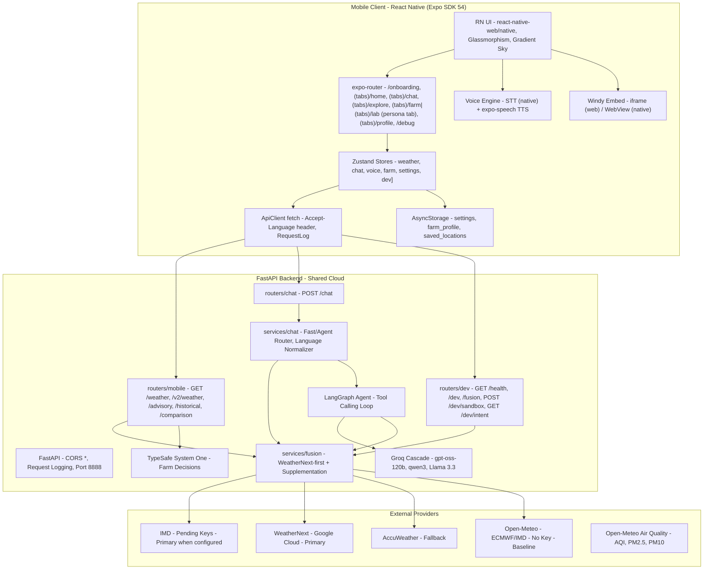
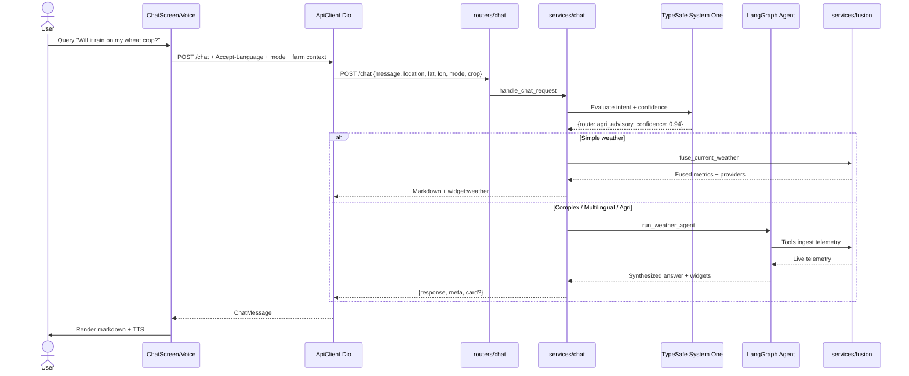
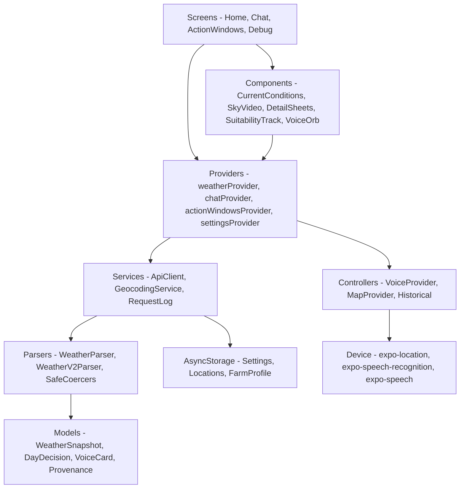
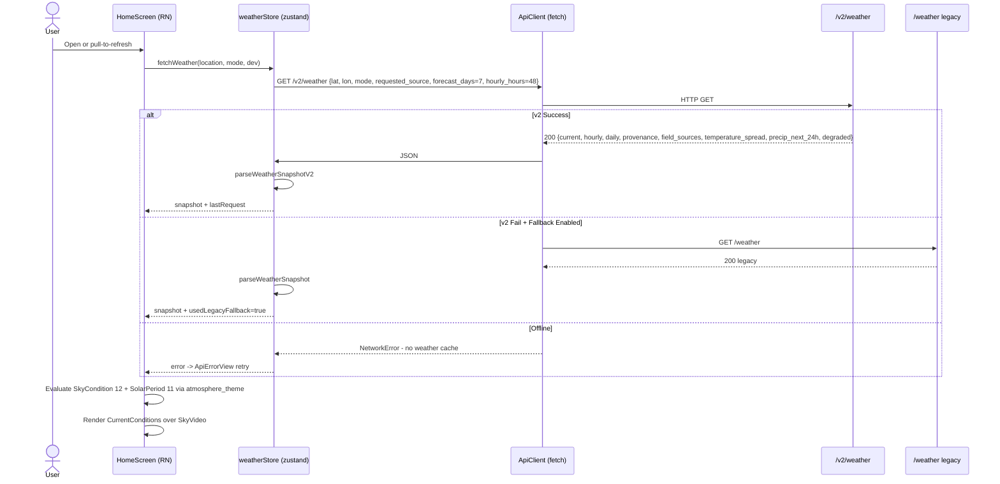
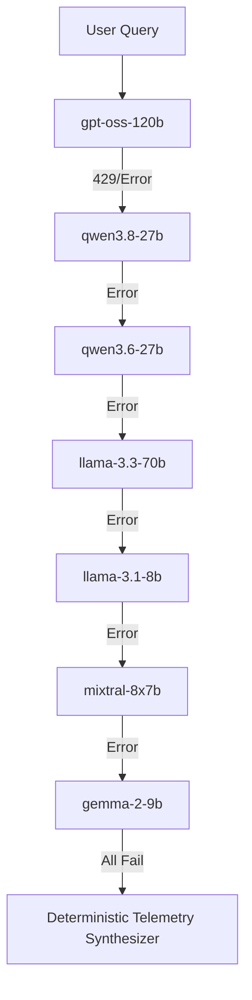
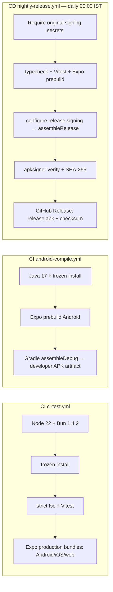
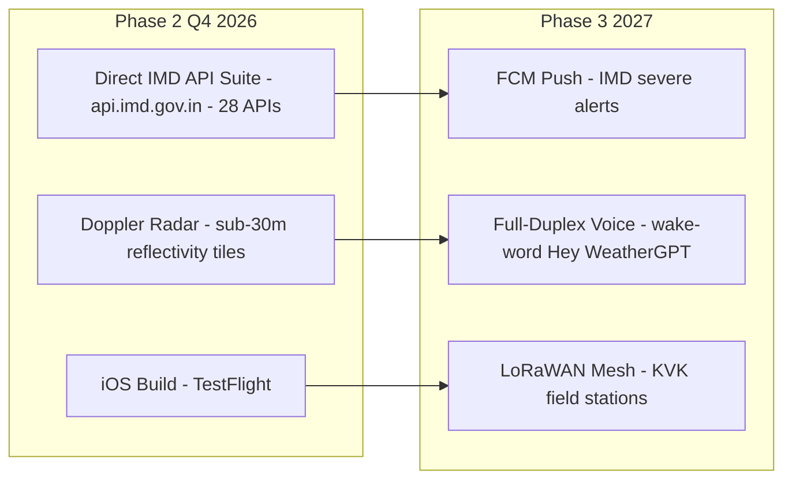

# WeatherGPT Mobile — Technical Architecture

> **Context**: Smart India Hackathon (SIH 2026) Technical Reference  
> **Problem Statement**: **SIH26068** — Disaster Management Theme  
> **Team**: **visionaries_bvm**  
> **Target Audience**: Evaluation Panel, Technical Judges, Systems Architects  
> **Last Updated**: September 2026  
> **Status**: React Native migration — source/bundle checks verified; native release/device acceptance pending
> **Backend**: `https://weathergpt-backend.vercel.app`
> **Mobile client (September 2026)**: **React Native (Expo SDK 54, TypeScript)** — the app was ported from Flutter 3.44. Full mapping table in [`FLUTTER_TO_REACT_NATIVE_MIGRATION.md`](FLUTTER_TO_REACT_NATIVE_MIGRATION.md). Backend contracts and the fusion policy are unchanged.

---

## Navigation Panel

| # | Section | Status | Key Technologies |
| :--- | :--- | :--- | :--- |
| [1. Executive Summary](#1-executive-summary) | System overview and innovations | Live | Expo SDK 54 (React Native), Zustand 5, fetch |
| [2. High-Level Architecture](#2-high-level-architecture) | Mobile-to-cloud topology | Live | Mermaid, FastAPI |
| [3. Technology Stack and Design System](#3-technology-stack-and-design-system) | Frameworks and design tokens | Live | React Native, expo-router, react-native-web |
| [4. Repository Structure](#4-repository-structure) | Codebase layout | Live | Feature-First Clean Architecture |
| [5. Environment Variables and Secrets](#5-environment-variables-and-secrets) | Config and credential isolation | Live | EXPO_PUBLIC_BACKEND_URL, Gradle/EAS signing |
| [6. Backend Integration and API Architecture](#6-backend-integration-and-api-architecture) | FastAPI endpoints | Live | FastAPI, /v2/weather, /chat |
| [7. Mobile App Architecture](#7-mobile-app-architecture) | State, routing, persistence | Live | Zustand 5, expo-router 6, AsyncStorage |
| [8. Data Flow and Request Lifecycle](#8-data-flow-and-request-lifecycle) | Request flow and guards | Live | fetch, generation-guarded Zustand stores |
| [9. AI Agent Architecture and Conversational Engine](#9-ai-agent-architecture-and-conversational-engine) | LangGraph and Groq | Live | LangGraph, Groq cascade, TypeSafe |
| [10. Multi-Source Ensemble Fusion Engine](#10-multi-source-ensemble-fusion-engine) | WeatherNext-first + supplementation | Live | IMD, WeatherNext, AccuWeather, Open-Meteo |
| [11. API Contract Reference](#11-api-contract-reference) | REST contract | Live | /chat, /weather, /v2/weather, /advisory |
| [12. Widget Protocol and Dynamic UI Cards](#12-widget-protocol-and-dynamic-ui-cards) | Dynamic markdown cards | Live | widget:weather, widget:forecast, VoiceCard |
| [13. Multilingual Engine and Internationalization](#13-multilingual-engine-and-internationalization) | 9 Indian languages + Voice | Live | typed i18n, expo-speech-recognition, expo-speech |
| [14. Risk Assessment and Environmental Hazard Engine](#14-risk-assessment-and-environmental-hazard-engine) | Hazard advisory | Live | Backend-driven thresholds |
| [15. Agricultural Farmer Advisory Mode and TypeSafe System One](#15-agricultural-farmer-advisory-mode-and-typesafe-system-one) | Crop decisions | Live | Jev AI, Farm Action Windows |
| [16. Developer Diagnostics and Debug Suite](#16-developer-diagnostics-and-debug-suite) | 5-tab debug screen | Live | Request log, provider pinning |
| [17. Deployment and Release Architecture](#17-deployment-and-release-architecture) | CI/CD and signing | Live | GitHub Actions, Expo prebuild, Gradle |
| [18. Problem Statement and SIH Compliance Matrix](#18-problem-statement-and-sih-compliance-matrix) | SIH26068 compliance | Live | 10-domain matrix |
| [19. Future Roadmap and Planned Enhancements](#19-future-roadmap-and-planned-enhancements) | Roadmap | Planned | IMD APIs, radar, iOS, LoRaWAN |

---

## 1. Executive Summary

**WeatherGPT Mobile** is a production-grade, AI-powered weather intelligence app built for **SIH 2026** Disaster Management (SIH26068) by **Team visionaries_bvm**.

It translates multi-source meteorological telemetry into actionable, hyper-local intelligence in **9 live Indian languages** (bn, en, gu, hi, kn, ml, mr, ta, te) with two-way voice (STT + TTS).

- **Framework**: **React Native (Expo SDK 54)** + TypeScript 5.9 strict — ported from Flutter 3.44 (September 2026); feature-first structure preserved (`app/` routes + `src/` modules)
- **State**: Zustand 5 stores, Routing: expo-router 6, Persistence: AsyncStorage
- **Backend**: Unified FastAPI at `https://weathergpt-backend.vercel.app` (submodule `omsenjalia/weathergpt`)
- **Fusion**: Production uses **IMD → WeatherNext → AccuWeather → Open-Meteo** selection with per-field supplementation and provenance. Legacy weighted fusion (Open-Meteo 2.0×, AccuWeather 1.5×, WeatherAPI 1.2×, Tomorrow.io 1.2×, OWM 1.1×) remains for `GET /fusion` dev diagnostics.

### Core Innovations

- **Persona-Driven UI**:
  - **Everyone**: Hero weather card, tappable hourly / 7-day / metric details, AQI/UV, looping video skies with live particles, voice-first assistant (Bhashini speech)
  - **Farmer (Krishi)**: TypeSafe System One crop advisories, spray/irrigation windows, soil moisture
  - **Researcher**: Historical archives, anomaly charts (react-native-svg LineChart), multi-city comparison
- **TypeSafe System One (Jev)**: Server-side calibrated decisions for farm operations with confidence badges (`System One · 88% confident`)
- **Voice-First Indic**: STT (native module, capability-checked) + TTS `expo-speech` mapped to `hi-IN, gu-IN, mr-IN, ta-IN, te-IN, kn-IN, ml-IN, bn-IN, en-IN`; typed input is the graceful fallback where STT is unavailable (e.g. web preview)
- **Atmospheric Sky Engine**: 11 solar periods (midnight, predawn, night, sunrise, morning, midday, afternoon, goldenHour, sunset, dusk, evening) and 12 sky conditions (clear, partlyCloudy, cloudy, overcast, fog, drizzle, rain, heavyRain, thunder, snow, windy, unknown) driving gradients and video backgrounds
- **Zero-Guesswork**: Missing values → `null`, not `0 °C / 0 mm`. WMO code `0` = clear sky, `null` = unknown
- **Debug Suite**: 5 tabs — Snapshot, Sources, Providers, Requests, Health

---

## 2. High-Level Architecture


```mermaid
graph TB
    subgraph "Mobile Client - React Native (Expo SDK 54)"
        UI["RN UI - react-native-web/native, Glassmorphism, Gradient Sky"]
        NAV["expo-router - /onboarding, (tabs)/home, (tabs)/chat, (tabs)/explore, (tabs)/farm|(tabs)/lab (persona tab), (tabs)/profile, /debug"]
        STATE["Zustand Stores - weather, chat, voice, farm, settings, dev]"]
        CLIENT["ApiClient fetch - Accept-Language header, RequestLog"]
        CACHE["AsyncStorage - settings, farm_profile, saved_locations"]
        VOICE["Voice Engine - STT (native) + expo-speech TTS"]
        WEBVIEW["Windy Embed - iframe (web) / WebView (native)"]
    end

    subgraph "FastAPI Backend - Shared Cloud"
        API["FastAPI - CORS *, Request Logging, Port 8888"]
        RCHAT["routers/chat - POST /chat"]
        RMOB["routers/mobile - GET /weather, /v2/weather, /advisory, /historical, /comparison"]
        RDEV["routers/dev - GET /health, /dev, /fusion, POST /dev/sandbox, GET /dev/intent"]
        CHATSVC["services/chat - Fast/Agent Router, Language Normalizer"]
        FUSION["services/fusion - WeatherNext-first + Supplementation"]
        JEV["TypeSafe System One - Farm Decisions"]
        AGT["LangGraph Agent - Tool Calling Loop"]
        LLM["Groq Cascade - gpt-oss-120b, qwen3, Llama 3.3"]
    end

    subgraph "External Providers"
        OM["Open-Meteo - ECMWF/IMD - No Key - Baseline"]
        AW["AccuWeather - Fallback"]
        WN["WeatherNext - Google Cloud - Primary"]
        IMD["IMD - Pending Keys - Primary when configured"]
        AQI["Open-Meteo Air Quality - AQI, PM2.5, PM10"]
    end

    UI --> NAV
    NAV --> STATE
    STATE --> CLIENT
    STATE --> CACHE
    UI --> VOICE
    UI --> WEBVIEW

    CLIENT --> RMOB
    CLIENT --> RCHAT
    CLIENT --> RDEV

    RCHAT --> CHATSVC
    CHATSVC --> FUSION
    CHATSVC --> AGT
    AGT --> LLM
    AGT --> FUSION
    RMOB --> FUSION
    RMOB --> JEV
    RDEV --> FUSION

    FUSION --> IMD
    FUSION --> WN
    FUSION --> AW
    FUSION --> OM
```

---

## 3. Technology Stack and Design System

### 3.1 Mobile Client (React Native — `package.json`)

| Layer | Package | Version | Purpose |
| :--- | :--- | :--- | :--- |
| Framework | expo | ~54.0 (SDK 54, `sdk-54` dist-tag) | Cross-platform runtime (iOS/Android/web) |
| Language | typescript | ~5.9 (strict) | Typed runtime |
| State | zustand | ^5.0 | Stores replacing Riverpod notifiers |
| Routing | expo-router | 6.0 | File-tree routes + `(tabs)` shell |
| HTTP | fetch (global) | — | `ApiClient` wrapper with timeouts + request log |
| Persistence | @react-native-async-storage/async-storage | 2.2.0 | Key-value store replacing Hive |
| i18n | custom engine (`src/i18n`) | — | Same 9-language JSON bundles, eager-loaded |
| TTS (primary) | Bhashini via backend `/v2/speech/tts` + expo-audio | ~1.1.1 | Indic neural voices (female/male); WAV played with expo-audio |
| TTS (fallback) | expo-speech | ~14.0.8 | On-device synthesis when Bhashini is unconfigured or fails |
| STT | expo-speech-recognition | ~3.1.3 | Live interim transcript; persists a 16 kHz WAV (Android 13+/iOS) that Bhashini ASR (`/v2/speech/asr`) re-transcribes |
| Files | expo-file-system | ~19.0.24 | Read recorded WAV / write TTS audio to cache |
| Video sky | expo-video | ~3.0.16 | Looping bundled sky clips (`assets/sky/*.mp4`, 720p, ~5 MB total) |
| Haptics | expo-haptics | ~15.0.8 | Selection / light / success feedback on native |
| Typeface | @expo-google-fonts/manrope | ^0.4 | Manrope 300–800, tabular numerals for data |
| Navigation theme | @react-navigation/native | ^7.4 | Transparent dark theme so the sky shows through every route |
| Charts | react-native-svg | 15.12 | Responsive multi-series `LineChart`, `DeviationBars`, sun arc, sky glow |
| GPS | expo-location | ~19.0.8 | Foreground permission + GPS with stale-result guard |
| GIS | react-native-webview / web iframe | 13.15.0 | Windy.com embed with selected product |
| Font runtime | expo-font | ~14.0.12 | Native vector-icon fonts |
| System UI | expo-system-ui | ~6.0.9 | Native dark-mode support |
| Gradients | expo-linear-gradient | ~15.0.8 | Atmosphere sky canvas |
| Markdown | custom `RichText` + pure `markdown.ts` parser | — | Headings, bullet/numbered lists, quotes, links, code, pipe tables; `widget:` and `"widget_type"` JSON fences dropped |
| Icons | @expo/vector-icons (MaterialCommunityIcons) | ^15.1 | Iconography |
| Tests | vitest | ^5.0 | 148 unit tests: parsers, stores, generation guards, formatting, markdown, Bhashini speech paths, i18n completeness, release config |
| Web runtime | react-native-web + @expo/metro-runtime | 0.21 / ~6.1 | Browser preview |
| Animation | react-native-reanimated + react-native-worklets (direct dependencies) | ~4.1 / worklets pinned `0.5.1` via `package.json` `overrides` | No direct app usage; bun override pins worklets to the Expo SDK 54-blessed `0.5.1` (the npm `latest` 0.13.x targets RN ≥0.86 and fails reanimated's version assertion on RN 0.81) |

### 3.2 Backend

| Layer | Technology | Purpose |
| :--- | :--- | :--- |
| Web Framework | FastAPI | Async REST API |
| ASGI | Uvicorn | Non-blocking server |
| Agent | LangGraph | Stateful AI workflow |
| LLM | LangChain-Groq | Low-latency inference |
| System One | TypeSafe AI (Jev) | Calibrated decisions |
| HTTP | httpx | Telemetry ingestion |
| Validation | Pydantic v2 | Typed contracts |

### 3.3 Design System (`src/ui`)

Semantic tokens live in `src/ui/theme/tokens.ts`; screens import only from `src/ui` (the barrel), never raw hex.

| Token group | Values | Usage |
| :--- | :--- | :--- |
| Canvas | canvas #0A1120, canvasDeep #060B16 | App background under the sky |
| Surfaces | surface rgba(9,15,30,.42), surfaceStrong .62, surfaceInset white 6% | Translucent cards over the live sky; one hairline, no drop shadows |
| Text | text #F8FAFC, secondary 72%, tertiary 50% | Hierarchy by opacity, not hue |
| Accent | teal #2DD4BF (accentText #5EEAD4) | The single accent: primary actions, selection, voice orb |
| Status | good #4ADE80, caution #FBBF24, danger #F87171, info #60A5FA | Semantic only (advisory bands, errors) |
| Personas | farmer #4ADE80, researcher #60A5FA | Persona chips/icons |
| Type scale | display 96 light, largeTitle 30, title 22, headline 17, body 15, callout 14, footnote 12, caption 11, metric 28, numeric 15 (tabular) | Manrope |
| Spacing / radius | 4-pt grid (2–48); radius 6–26 + pill | Consistent gutters (20) and max content width (640) |

Primitives: `AppText`, `Icon`, `Touchable` (press scale/dim + haptics), `Card`/`CardHeader`, `Button`/`IconButton` (44 pt targets), `SegmentedControl`, `Chip`/`ChipGroup`, `SwitchRow`, `ListRow`, `TextField`, `Skeleton`, `StateView`, `InlineBanner`, `Screen`/`Section`, `Sheet` (bottom sheet), `VoiceOrb`. Shell: `SkyBackground` (+ `SkyVideo`, `SkyParticles`), floating `TabBar` with a centre voice button.

---

## 4. Repository Structure

```
weathergpt-app/
├── app/                                   # expo-router routes
│   ├── _layout.tsx                        # Fonts + store hydration, nav theme, live sky (video + particles)
│   ├── index.tsx                          # Onboarding guard redirect
│   ├── onboarding/index.tsx               # Welcome → language → persona → farm (talk / type / skip)
│   ├── (tabs)/
│   │   ├── _layout.tsx                    # expo-router Tabs + floating TabBar (persona tabs, centre mic)
│   │   ├── home.tsx                       # Hero, voice card, hourly, 7-day, metric tiles, detail sheets
│   │   ├── chat.tsx                       # Markdown chat, dictation composer, answers read aloud
│   │   ├── explore.tsx                    # Full-screen Windy map, layers/models, zoom/locate, Weather Lab link
│   │   ├── farm.tsx                       # Farm profile summary + action windows (suitability tracks)
│   │   ├── lab.tsx                        # Historical archive, anomaly bars, multi-location comparison
│   │   └── profile.tsx                    # Settings: persona, language, units, voice picker, developer
│   ├── voice.tsx                          # Full-screen voice assistant (listen → answer → read aloud)
│   ├── locations.tsx                      # Location picker: search, GPS, saved, popular places
│   ├── farm-profile.tsx                   # Farm profile editor (form or voice)
│   ├── debug.tsx                          # 5-tab debug suite
│   └── +not-found.tsx
├── assets/sky/                            # 6 looping sky clips (day/night/rain/sunrise/sunset/thunder) + ATTRIBUTION
├── src/
│   ├── core/                              # config (apiEndpoints incl. /v2/speech/*), errors, models, services, utils
│   ├── features/
│   │   ├── app/bootstrap.ts               # useAppReady (fonts + hydration + speech probe), context sync, useSkyScene
│   │   ├── weather/                       # models, parsers, atmosphereTheme, weatherStore (skyScene), format.ts,
│   │   │                                  #  components/ (CurrentConditions, AskCard, Hourly/DailyForecast,
│   │   │                                  #  MetricTiles, DetailSheets, HomeSkeleton)
│   │   ├── voice/                         # voiceStore (ask + dictation), speechService (Bhashini TTS/ASR),
│   │   │                                  #  voiceCard, response mapper
│   │   ├── chat/                          # chatStore; components/ (MessageItem, InsightCard, Composer)
│   │   ├── farm/                          # models, farmStores; components/ (FarmProfileForm, FarmVoiceFlow,
│   │   │                                  #  SuitabilityTrack)
│   │   ├── location/                      # locationStore; components/LocationPromptBar
│   │   └── settings/, explore/, research/, onboarding/
│   ├── i18n/                              # 9 locale JSONs (312 keys each, fully translated) + translator
│   ├── ui/                                # Design system: theme/tokens, primitives/, shell/, content/, charts/
│   └── lib/persistence.ts                 # AsyncStorage JSON helpers + StorageKeys
├── test/                                  # vitest suites + stubs/ (RN, AsyncStorage, speech, audio, file-system)
├── .github/workflows/                     # ci-test (gate), nightly-release, android-compile
├── backend/                               # Submodule omsenjalia/weathergpt (FastAPI; /v2/speech/* Bhashini proxy)
└── docs/, scripts/, app.json, app.config.js, metro/babel/tsconfig/vitest configs
```

---

## 5. Environment Variables and Secrets

### Mobile env — `EXPO_PUBLIC_BACKEND_URL` (template: `env.example`)

| Variable | Required | Value | Purpose |
| :--- | :--- | :--- | :--- |
| EXPO_PUBLIC_BACKEND_URL | No | `https://weathergpt-backend.vercel.app` (prod) <br> `http://localhost:8888` (local web) <br> `http://10.0.2.2:8888` (Android emulator) | FastAPI base URL. Resolved via `EXPO_PUBLIC_BACKEND_URL` (Metro inlines it at bundle time) > prod fallback. `resolveBackendUrl()` trims quotes/slashes. |

> **Credential Isolation**: No AccuWeather, Tomorrow.io, OpenWeatherMap, Groq, TypeSafe keys in mobile. Only the backend URL. Backend proxies all providers. `ApiClient` only uses the base URL + `Accept-Language` header from the settings store `language` (default `en`).

### Android Release Signing

| Secret | Type |
| :--- | :--- |
| KEYSTORE_BASE64 | Base64 keystore |
| KEYSTORE_PASSWORD | Keystore password |
| KEY_ALIAS | Key alias |
| KEY_PASSWORD | Key password |

CI falls back to debug keys if secrets missing, never breaks build.

---

## 6. Backend Integration and API Architecture

### Endpoints

| Path | Method | Used By | Function |
| :--- | :--- | :--- | :--- |
| /chat | POST | Mobile + Web | Conversational AI. Body: message, messages, location, lat, lon, language, mode, crop, growth_stage, soil, irrigation. Returns {response: markdown, meta: {path, client, language, location, intent, intent_engine, intent_confidence}, card?} |
| /weather | GET | Mobile legacy fallback | Home snapshot: current, 48h hourly, 7-day, AQI, UV, sunrise/sunset |
| /v2/weather | GET | Mobile primary | WeatherNext-first: lat, lon, mode, requested_source (auto/weathernext/open_meteo/accuweather/imd), forecast_days, hourly_hours, supplement, model. Returns {current, hourly, daily, provenance, field_sources, temperature_spread, precip_next_24h, degraded} |
| /v2/weather/health | GET | Debug | Health probe |
| /v2/weather/catalog | GET | Future | Catalog |
| /v2/weather/series | GET | Future | Time series |
| /v2/speech/health | GET | Mobile (startup probe) | {configured, pipeline_id, languages, tasks} — no secrets |
| /v2/speech/tts | POST | Mobile voice | {text, language, gender} → {audio_base64 (WAV), sample_rate, chunks, provider: "bhashini"}; 503 speech_unavailable / 502 speech_upstream_error |
| /v2/speech/asr | POST | Mobile voice | {audio_base64 (16 kHz WAV), language, audio_format, sampling_rate?} → {transcript} |
| /advisory | GET | Farmer | Day-by-day suitability, hourly buckets (irrigation/spraying/field_work), TypeSafe decisions |
| /historical | GET | Researcher | {metric, points: [{year, value}]} |
| /comparison | GET | Researcher | {metric, locations: [{name, points}]} locations=name,lat,lon;... from saved_locations |
| /fusion | GET | Dev only | Legacy weighted inspector: provider values, weights, outlier flags. Not in ApiEndpoints, only backend dev router |
| /health | GET | Mobile | {status: ok} |
| /dev | GET | Debug | {ai_decisions, fusion weights, provider_keys_status, recent_logs} |
| /dev/sandbox | POST | Debug | Single-prompt sandbox with latency |
| /dev/intent | GET | Debug | Intent routing inspector |

### Chat Lifecycle


```mermaid
sequenceDiagram
    actor User
    participant UI as ChatScreen/Voice
    participant Client as ApiClient Dio
    participant Router as routers/chat
    participant Service as services/chat
    participant Jev as TypeSafe System One
    participant Agent as LangGraph Agent
    participant Fusion as services/fusion

    User->>UI: Query "Will it rain on my wheat crop?"
    UI->>Client: POST /chat + Accept-Language + mode + farm context
    Client->>Router: POST /chat {message, location, lat, lon, mode, crop}
    Router->>Service: handle_chat_request

    Service->>Jev: Evaluate intent + confidence
    Jev-->>Service: {route: agri_advisory, confidence: 0.94}

    alt Simple weather
        Service->>Fusion: fuse_current_weather
        Fusion-->>Service: Fused metrics + providers
        Service-->>Client: Markdown + widget:weather
    else Complex / Multilingual / Agri
        Service->>Agent: run_weather_agent
        Agent->>Fusion: Tools ingest telemetry
        Fusion-->>Agent: Live telemetry
        Agent-->>Service: Synthesized answer + widgets
        Service-->>Client: {response, meta, card?}
    end

    Client-->>UI: ChatMessage
    UI->>User: Render markdown + TTS
```

---

## 7. Mobile App Architecture


```mermaid
graph TD
    VIEWS["Screens - Home, Chat, ActionWindows, Debug"]
    WIDGETS["Components - CurrentConditions, SkyVideo, DetailSheets, SuitabilityTrack, VoiceOrb"]
    NOTIFIERS["Providers - weatherProvider, chatProvider, actionWindowsProvider, settingsProvider"]
    CONTROLLERS["Controllers - VoiceProvider, MapProvider, Historical"]
    PARSERS["Parsers - WeatherParser, WeatherV2Parser, SafeCoercers"]
    MODELS["Models - WeatherSnapshot, DayDecision, VoiceCard, Provenance"]
    SERVICES["Services - ApiClient, GeocodingService, RequestLog"]
    STORAGE["AsyncStorage - Settings, Locations, FarmProfile"]
    HARDWARE["Device - expo-location, expo-speech-recognition, expo-speech"]

    VIEWS --> WIDGETS
    VIEWS --> NOTIFIERS
    WIDGETS --> NOTIFIERS
    NOTIFIERS --> CONTROLLERS
    NOTIFIERS --> SERVICES
    CONTROLLERS --> HARDWARE
    SERVICES --> PARSERS
    PARSERS --> MODELS
    SERVICES --> STORAGE
```

### State Management (Zustand 5 — `src/features/**/[store].ts`)

- **weatherStore**: fetches on context change (location, mode, request-affecting dev options). Tries `/v2/weather` primary, falls back to `/weather` legacy unless `disableV2Fallback`. Records `lastRequest` and `updatedAt`. A refresh of the same request (`snapshotKey`) keeps the current snapshot visible and reports failures inline; a new location/mode clears it. Also hosts `skyScene(now, snapshot, dev)` → {period, sky, palette} used by the app-wide sky.
- **chatStore**: message history, sending flag, intent meta, generation guard; root synchronizes location/mode/language/completed farm context; changing context resets the conversation, and retry replaces the failed user turn
- **actionWindowsStore** (`farmStores.ts`): farm suitability — keyed by contextKey = `mode|lat,lon|crop|stage|soil|irrig|UTCdate`, generation guard, per-tab cache, explicit unavailable state
- **settingsStore**: language, persona (validated, unknown values rejected), units, TTS speed, Bhashini voice (`ttsGender` female/male), per-language device voice picks (`ttsVoices`) — persisted to AsyncStorage
- **developerOptionsStore**: DevSourcePin (auto/weathernext/open_meteo/accuweather/imd), wnModel, hourly 1–168, forecast 1–15, supplement toggle, disable-v2-fallback, log-requests
- **farmProfileStore** (`farmStores.ts`): FarmProfile + explicit-saved completion flag (pre-flag saves count as completed). Saves validate farm size and resolve the place into active coordinates before saving; unsaved profiles are not sent as real farm context
- **onboardingStore**: language/persona selection; `completeOnboarding()` writes language + TTS locale + persona + completion flag, then re-hydrates `settingsStore` so the first home fetch already uses the chosen mode
- **voiceStore**: two modes — `startListening` (full assistant turn → /chat → mapped answer) and `startDictation(onText)` (chat composer, farm voice onboarding). The device recognizer gives the live transcript and, when Bhashini is available, persists a WAV that `/v2/speech/asr` re-transcribes (device transcript is the fallback). `speak()` uses Bhashini TTS with the saved language/gender/rate, falling back to `expo-speech`; a Bhashini failure backs off for 5 minutes. Generation guard on cancel/context changes.
- **speechService** (`features/voice/speechService.ts`): startup `/v2/speech/health` probe, TTS/ASR calls, WAV playback via expo-audio (cache file on native, data URI on web), small audio cache
- **mapStore / savedLocationsStore** (`exploreStores.ts`): Windy layer/product/zoom, researcher menu/marker toggles, embed URL + Weather Lab URL builders, saved locations
- **researchStores**: `/historical` + `/comparison` fetchers, `ArchiveStatus` (available/empty/unsupported), anomaly display statistics

### Migration correctness boundaries (2026-09-26)

- Weather clear/context requests invalidate old generations; explicit unavailable
  responses never silently switch providers. New requests clear old-location data.
- Missing tomorrow windows are unavailable, never copied from today; missing
  best-window labels no longer imply good conditions.
- HTTP timeout covers headers **and** body, and malformed/non-object JSON success
  responses fail rather than parse to an empty success object.
- `/(tabs)/index.tsx` redirects to Home; the root SafeAreaView respects Android
  insets; Everyone has neither the Farmer nor Researcher specialized tab.
- Home unit display converts Celsius to Fahrenheit only at the presentation layer.
  The atmosphere clock uses the selected location's offset when provided.
- See the audit report for remaining localization, Hive import, voice onboarding,
  notifications, named-voice selection and device-testing limitations.

### Null Semantics

- `src/core/models/jsonValues.ts`: absent, wrong-typed, blank, NaN, Infinity → `null`
- WMO code `0` = clear sky. Missing code → `null` → `SkyCondition.unknown`, not clear
- Hourly buckets without temperature dropped, not rendered at 0

---

## 8. Data Flow and Request Lifecycle


```mermaid
sequenceDiagram
    actor User
    participant App as HomeScreen (RN)
    participant Store as weatherStore (zustand)
    participant Client as ApiClient (fetch)
    participant APIv2 as /v2/weather
    participant API as /weather legacy

    User->>App: Open or pull-to-refresh
    App->>Store: fetchWeather(location, mode, dev)
    Store->>Client: GET /v2/weather {lat, lon, mode, requested_source, forecast_days=7, hourly_hours=48}
    Client->>APIv2: HTTP GET

    alt v2 Success
        APIv2-->>Client: 200 {current, hourly, daily, provenance, field_sources, temperature_spread, precip_next_24h, degraded}
        Client->>Store: JSON
        Store->>Store: parseWeatherSnapshotV2
        Store-->>App: snapshot + lastRequest
    else v2 Fail + Fallback Enabled
        Client->>API: GET /weather
        API-->>Client: 200 legacy
        Store->>Store: parseWeatherSnapshot
        Store-->>App: snapshot + usedLegacyFallback=true
    else Offline
        Client-->>Store: NetworkError - no weather cache
        Store-->>App: error -> ApiErrorView retry
    end

    App->>App: Evaluate SkyCondition 12 + SolarPeriod 11 via atmosphere_theme
    App->>App: Render CurrentConditions over SkyVideo
```

**Generation Guarding**: Each request increments a generation ID; stale responses are discarded. Used in `chatStore`, `voiceStore`, `actionWindowsStore` and `weatherStore`.

---

## 9. AI Agent Architecture and Conversational Engine

- **LangGraph**: Stateful cyclic graph controlling tool calling loop
- **Groq Cascade**: Primary `openai/gpt-oss-120b` → fallbacks `qwen/qwen3.8-27b`, `qwen/qwen3.6-27b`, `llama-3.3-70b-versatile`, `llama-3.1-8b-instant`, `mixtral-8x7b-32768`, `gemma-2-9b-it` → deterministic telemetry synthesizer (0% downtime)
- **TypeSafe System One (Jev) Intent Routing**: Classifies query into `agri_advisory`, `weather_query`, `smalltalk`, `abuse` etc. Returns `intent_engine: system-one|keywords` + confidence. Fast path (simple weather) → direct fusion, no agent. Complex → agent.
- **Indic Extraction**: Regex + prompt heuristics for Hindi/Gujarati/Marathi city phrases: `"delhi me kal barish hogi?"` → Delhi coords.


```mermaid
graph TD
    Q["User Query"] --> M1["gpt-oss-120b"]
    M1 -->|429/Error| M2["qwen3.8-27b"]
    M2 -->|Error| M3["qwen3.6-27b"]
    M3 -->|Error| M4["llama-3.3-70b"]
    M4 -->|Error| M5["llama-3.1-8b"]
    M5 -->|Error| M6["mixtral-8x7b"]
    M6 -->|Error| M7["gemma-2-9b"]
    M7 -->|All Fail| DET["Deterministic Telemetry Synthesizer"]
```

---

## 10. Multi-Source Ensemble Fusion Engine

### Production Policy (Live)

| Priority | Provider | Key | Role |
| :--- | :--- | :--- | :--- |
| 0 | IMD | IMD_API_KEY / JWT | Official India, when configured |
| 1 | WeatherNext | Google IAM | Primary NWP, no sunrise/UV/AQI |
| 2 | AccuWeather | ACCUWEATHER_KEY | Fallback, RealFeel |
| 3 | Open-Meteo | None | Baseline + supplement (sunrise, UV, AQI, humidity) |

**Flow**:
- App sends `requested_source`: `auto` (backend policy) or pinned (`weathernext`, `open_meteo`, `accuweather`, `imd`) via `DevSourcePin`. Researcher mode pins `weathernext` unless dev override.
- Backend returns `provenance: {selected_source, requested_source, fallback_reasons[], tried_providers[], source, product, run_id, issued_at, degraded}` and `field_sources: {temperature_c: "weathernext", humidity: "open_meteo", uv_index: null, _supplement: {provider, enabled, attempted, filled[], errors[], cache_hit}}`
- `FieldSources` in `src/features/weather/models/weather.ts` keeps per-field attribution; the "via Open-Meteo" badges, the home status line and the source/run rows in the detail sheets render **only in developer mode** — regular users see no provenance or freshness UI on the home screen at all
- `degraded` = true only when configured provider failed or stale, not when IMD skipped for missing key
- Enrichments (Everyone mode): `temperature_spread {p10_c, p90_c, source, run_id, valid_from, valid_to, members}` (rejected if inverted/one-sided) and `precip_next_24h {total_mm, start, end, complete}` (partial labelled)

### Legacy Weighted Fusion (Dev Inspector `GET /fusion`)

| Provider | Weight | Key |
| :--- | :--- | :--- |
| Open-Meteo ECMWF/IMD | 2.0× | None |
| AccuWeather | 1.5× | ACCUWEATHER_KEY |
| WeatherAPI | 1.2× | WEATHERAPI_KEY |
| Tomorrow.io | 1.2× | TOMORROW_KEY |
| OpenWeatherMap | 1.1× | OPENWEATHER_KEY |

Formula: `M = sum(M_i * W_i) / sum(W_i)`  
Outlier guard: `|T_i - T_OpenMeteo| > 7°C` → excluded  
Confidence: High ≤1.5°C spread, Medium 1.5-3.5°C, Low >3.5°C, Single-Source

Still exposed via `backend-integration/backend/routers/dev.py` for diagnostics, but mobile home uses WeatherNext-first.

---

## 11. API Contract Reference

### POST /chat

Request:
```json
{
  "message": "Is it safe to spray pesticide on my cotton crop today?",
  "messages": [{"role": "user", "content": "Is it safe to spray pesticide on my cotton crop today?"}],
  "location": "Rajkot, Gujarat",
  "lat": 22.3039,
  "lon": 70.8022,
  "mode": "farmer",
  "farmer_mode": true,
  "crop": "Cotton",
  "growth_stage": "Flowering",
  "soil": "Black cotton soil",
  "irrigation": "Drip"
}
```

Response:
```json
{
  "response": "## Advisory for Cotton in Rajkot\n\n```widget:weather\n{\"city\": \"Rajkot\", \"temp\": 31.2, \"feelsLike\": 34.0, \"condition\": \"Partly Cloudy\", \"humidity\": 62, \"windSpeed\": 11.5, \"advisory\": \"Safe for spraying 7:00-10:30 AM\"}\n```\n\nWind <15 km/h, no heavy rain next 24h.",
  "meta": {
    "path": "agent",
    "client": "mobile",
    "language": "en",
    "location": "Rajkot, Gujarat",
    "intent_engine": "system-one",
    "intent_confidence": 0.92
  }
}
```

### GET /v2/weather (Primary)

Query: `lat, lon, mode=everyone|farmer|researcher, requested_source=auto|weathernext|open_meteo|accuweather|imd, forecast_days=7, hourly_hours=48, supplement, model`

Response includes `current, hourly, daily, provenance, field_sources, temperature_spread, precip_next_24h, degraded`

### GET /weather (Legacy fallback)

Same as v2 but older shape: `temperature_c, feels_like_c, condition, weather_code, high_c, low_c, rain_probability, wind_kmh, humidity, pressure_hpa, precipitation_mm, uv_index, sunrise, sunset, aqi, hourly[], forecast[], source, providers_used, fusion{confidence, temp_spread_c, weights}`

### Other Endpoints

- `/advisory?lat=&lon=&crop=&growth_stage=&soil=&irrigation=&days=&mode=` → `{summary, windows: [{date, suitability, summary, best_window, rain_probability, rain_mm, wind_kmh_max, high_c, hourly: {irrigation, spraying, field_work: [{hour, suitability}]}, ai: {spray, irrigation, fieldwork: {score, confidence, band}, overall: {choice, confidence}}}], advisory_engine, ai: {enabled, applied, model, evaluated_days, mean_confidence, overall_verdict}}`
- `/historical?lat=&lon=&metric=&start_year=&end_year=` → `{metric, points: [{year, value}]}`
- `/comparison?locations=name,lat,lon;...&metric=` → `{metric, locations: [{name, points}]}`
- `/health` → `{status: ok}`
- `/dev` → diagnostics
- `/dev/sandbox` POST `{prompt, location, language}` → `{status, duration_ms, response, model_used}`
- `/dev/intent?text=` → routing inspector

---

## 12. Widget Protocol and Dynamic UI Cards

AI embeds native cards in markdown via code fences. The app sanitizes and renders React Native card components.

| Tag | Render | Purpose |
| :--- | :--- | :--- |
| ```widget:weather | ChatWeatherWidget | Temp, condition, humidity, wind, advisory |
| ```widget:forecast | ChatForecastWidget | Multi-day strip |

Sanitization: `src/core/utils/markdownUtils.ts` strips widget blocks for TTS via `forSpeech()` (tables are flattened into spoken prose, LaTeX delimiters removed). Display rendering goes through the shared `RichText` component (`src/ui/components/RichText.tsx`): headings, bold/italic, inline code, bullet lists, styled blockquotes and links, with `widget:`/`json` fence stripping so native-card instructions never leak into the conversation. Chat and all AI surfaces share this one renderer.

### VoiceCard (Structured)

When voice query initiated, backend may return:

```json
{
  "response": "Favorable conditions for wheat irrigation this morning.",
  "card": {
    "label": "Irrigation Outlook",
    "verdict": "Favorable for Irrigation",
    "explanation": "Soil moisture 38% and wind calm <10 km/h.",
    "cta_label": "Schedule Drip Irrigation",
    "source": "Open-Meteo (ECMWF)",
    "confidence": 0.88,
    "stats": [
      {"label": "Soil Moisture", "value": "38%", "tone": "good"},
      {"label": "Wind Speed", "value": "8 km/h", "tone": "good"},
      {"label": "Rain Risk", "value": "10%", "tone": "good"}
    ],
    "forecast": [
      {"day": "Today", "temperature": "32°C", "rainfall": "0 mm", "condition": "sunny"}
    ]
  }
}
```

`mapBackendAnswer` (`src/features/voice/mappers/voiceResponseMapper.ts`) maps the answer onto the chat bubble / result card. If no card, renders prose only — no fabricated stats. `CardTone`: `good|caution|avoid` (aliases: safe, favourable, watch, risk, poor).

---

## 13. Multilingual Engine and Internationalization

9 live languages (Punjabi planned):

| Language | ISO | Script | TTS Locale | STT Model | File |
| :--- | :--- | :--- | :--- | :--- | :--- |
| English | en | English | en-US / en-IN | en_US | en.json |
| Hindi | hi | हिंदी | hi-IN | hi_IN | hi.json |
| Gujarati | gu | ગુજરાતી | gu-IN | gu_IN | gu.json |
| Marathi | mr | मराठी | mr-IN | mr_IN | mr.json |
| Tamil | ta | தமிழ் | ta-IN | ta_IN | ta.json |
| Telugu | te | తెలుగు | te-IN | te_IN | te.json |
| Bengali | bn | বাংলা | bn-IN | bn_IN | bn.json |
| Kannada | kn | ಕನ್ನಡ | kn-IN | kn_IN | kn.json |
| Malayalam | ml | മലയാളം | ml-IN | ml_IN | ml.json |

- **Storage**: `src/i18n/locales/<iso>.json` (same bundles the Flutter app shipped in `assets/translations/`), eager-loaded by the typed i18n engine
- **UI binding**: `useTranslation` re-renders labels when the language changes. All user-facing screens use translation keys (developer-only Debug/Developer copy stays English).
- **Voice**: Bhashini (MeitY ULCA pipeline; server-side credentials `BHASHINI_USER_ID` / `BHASHINI_ULCA_API_KEY`) provides TTS and ASR for all 9 languages; on-device engines are the fallback. The onboarding farm voice flow speaks and listens in the language being chosen.
- **Header**: `ApiClient` attaches `Accept-Language: <iso>` from the settings store
- **Speech Cleanup**: `MarkdownUtils.forSpeech()` strips markdown, emojis, URLs, widget blocks before TTS
- **Keyset guarantee**: the vitest i18n tests assert every locale resolves the full English key set (312 keys) and that every locale translates every key

---

## 14. Risk Assessment and Environmental Hazard Engine

Hazard handling is **backend-driven**, not a custom in-app RED/YELLOW/GREEN threshold engine.

- **Sources**: IMD CAP alert feed (RSS/XML), advisory Suitability `good|caution|avoid|neutral`, chat markdown warnings
- **Rendering**: Color-coded banners in `WeatherHeroCard`, `WeatherDetailPanels` via `statusRed #F87171`, `statusAmber #FBBF24`
- **No hardcoded 44°C/50mm/50km/h thresholds in `src/`** — thresholds evaluated server-side via fusion + Jev + CAP
- **Future**: Direct IMD API integration will bring structured district warnings, cyclone tracks

---

## 15. Agricultural Farmer Advisory Mode and TypeSafe System One

### TypeSafe System One (Jev)

- **Server**: `backend-integration/backend/services/typesafe.py` (httpx client), `advisory.py` hourly bands, `chat.py` intent routing, `dev.py` `ai_decisions`
- **Per-Day Decision**: Each day at `windows[i].ai.overall = {choice, confidence}` — UI renders that day's decision, not global aggregate
- **Badge**: When shaped by System One, shows `System One · 88% confident`. Without credentials, falls back to rule-based thresholds
- **No Bundled Offline Advisory**: Backend unreachable → explicit unavailable state, never empty neutral bars. Cache keyed on `mode|lat,lon|crop|stage|soil|irrig|UTCdate`, discarded on move/profile edit/midnight (port: `unavailableActionWindows` + `contextKeyOf` in `src/features/farm/farmStores.ts`)

### Farm Profile Onboarding & Settings

- Picking **Farmer** in onboarding routes to a Talk-vs-type choice (`/onboarding/farm`), then the `FarmDetailsScreen` form (`/onboarding/farm-form`) or the `FarmVoiceScreen` voice conversation (`/onboarding/farm-voice`) before `/home`; skipping keeps the default profile. The same data feeds `GET /advisory` and `POST /chat` farm context.
- Voice onboarding is a scripted on-device loop, not a backend chat. In the React Native port the six-question voice flow is gated on the native STT module being present; the onboarding screen currently offers the typed form (all parsing logic — en/hi/gu aliases, romanized forms, fuzzy longest-phrase match, Indic-digit sizes — is ported and unit-tested in `src/features/farm/models/farmVoiceParser.ts`, ready to wire to a native STT session).
- Option catalogs live in `src/features/farm/models/farmOptions.ts` and are shared with the profile editor via `withCurrentOption`, so a stored value can never be missing from its picker. Catalog strings are backend wire values and stay in English; only field labels are localized.
- **Settings → Farm profile** (visible for the farmer persona) shows the saved summary or a "Complete your farm profile" prompt, and switching to the farmer persona with an incomplete profile opens the editor directly.

### Farm Action Windows

3 tracks × 12 two-hour buckets:

```
[00:00-04:00] Avoid   (Heavy Dew / High Humidity)
[04:00-08:00] Good    (Low Wind <8 km/h) <- Optimal Spray
[08:00-12:00] Caution (Rising Thermal)
[12:00-16:00] Avoid   (Peak Solar / Evaporation)
[16:00-20:00] Good    (Calm Evening)
[20:00-24:00] Neutral (Night Rest)
```

### Supported Crops

| Crop | Vulnerability | Focus |
| :--- | :--- | :--- |
| Cotton | Bollworm, water-logging | Spray windows, drainage, dry picking |
| Wheat | Heat stress, lodging | Irrigation milestones, heading protection |
| Rice / Paddy | Water depth, blast fungus | Water level, fertilizer timing |
| Sugarcane | Stem lodging | Irrigation cycling, propping during gusts |
| Groundnut | Tikka leaf spot, pod rot | Moisture balance, drying windows |
| Mustard | Aphid during overcast | Spray timing, cold snap warnings |
| Vegetables | Blight, desiccation | Drip scheduling, shade management |

---

## 16. Developer Diagnostics and Debug Suite

Enable via **Settings → Developer → Enable developer options → Debug & state** (`/debug`) — 5 tabs:

| Tab | Capability | Details |
| :--- | :--- | :--- |
| 1. Snapshot | Raw JSON inspector | Parsed fields, highs/lows, rain prob, solar timings |
| 2. Sources | Per-field attribution | `via Open-Meteo`, supplemented values highlighted |
| 3. Providers | Chain & degradation | Skipped providers, fallback_reasons, WeatherNext status |
| 4. Requests | Ring-buffer log | Last 60 HTTP calls, status, duration ms, query |
| 5. Health | Backend probe | Direct `/v2/weather/health` check (button in the debug screen) |

**Controls**:
- Pin source: `DevSourcePin` auto/weathernext/open_meteo/accuweather/imd — forces provider, surfaces failures
- Hourly horizon slider: 6–168 hours
- Forecast days slider: 1–15 days
- Supplement toggle: Disable Open-Meteo supplementation to inspect raw primary
- wnModel pin: Non-default WeatherNext model
- Video sky: `Disable video sky` falls back to the gradient-only background (forced sky period/condition apply only in developer mode)
- Provenance display: `Show provenance bar on Home` restores the source/run/freshness chips on the home screen; `Per-field source badges` toggles the "via …" pills. Both apply only with developer mode on — provider names never render for regular users, and the Debug screen stays the canonical attribution surface.

---

## 17. Deployment and Release Architecture


```mermaid
graph LR
    subgraph "CI ci-test.yml"
        T1["Node 22 + Bun 1.4.2"] --> T2["frozen install"]
        T2 --> T3["strict tsc + Vitest"]
        T3 --> T4["Expo production bundles: Android/iOS/web"]
    end
    subgraph "CI android-compile.yml"
        A1["Java 17 + frozen install"] --> A2["Expo prebuild Android"]
        A2 --> A3["Gradle assembleDebug → developer APK artifact"]
    end
    subgraph "CD nightly-release.yml — daily 00:00 IST"
        N1["Require original signing secrets"] --> N2["typecheck + Vitest + Expo prebuild"]
        N2 --> N3["configure release signing → assembleRelease"]
        N3 --> N4["apksigner verify + SHA-256"]
        N4 --> N5["GitHub Release: release.apk + checksum"]
    end
```

- PRs and pushes to main/develop run CI and Android Compile Check. Debug APKs
  require Metro and are **not** standalone judge downloads.
- Nightly schedule preserves **18:30 UTC / 00:00 IST**, now runs every day even
  without new commits, and supports manual dispatch. GitHub schedules activate
  only after the workflow reaches the default branch and may be delayed.
- Stable release signing requires `KEYSTORE_BASE64`, `KEYSTORE_PASSWORD`,
  `KEY_ALIAS`, `KEY_PASSWORD`; missing secrets fail closed (no debug fallback).
  Keystore stays in runner temp and is cleaned even after failure. Passwords are
  environment reads, not literals written into Gradle.
- Public backend URL comes from `EXPO_PUBLIC_BACKEND_URL` repository variable,
  legacy `BACKEND_URL` secret, or the production URL, in that order. Expo embeds
  only the public URL using direct `process.env.EXPO_PUBLIC_BACKEND_URL` access.
- `app.config.js` validates the Android version code. Nightly code = Unix epoch
  minute; version name = `1.0.0-nightly.YYYYMMDD` (IST). Unique tags include run ID
  and attempt and point at the exact built SHA; releases are marked latest.
- Android identity is **`com.weathergpt.weathergpt_mobile`**, preserving Flutter's
  application ID. Same-certificate upgrades work at the identity level; Hive data
  is **not** imported into AsyncStorage. The initial port's alternate package ID
  (`com.visionariesbvm.weathergpt`) is a separate app.
- Signing secrets/native compilation/device installation remain release gates,
  not verified by a Metro export. See [release setup](docs/ANDROID_RELEASES.md)
  and [audit findings](docs/REACT_NATIVE_AUDIT.md).

---

## 18. Problem Statement and SIH Compliance Matrix

### SIH26068 Key Requirements

| Requirement | Implementation | Status | Source |
| :--- | :--- | :--- | :--- |
| Real-Time Telemetry | Temp, humidity, pressure, wind, UV, AQI from 5 providers | Live | weatherParser.ts / weatherV2Parser.ts, fusion |
| Natural Language Querying | LangGraph + Groq cascade | Live | chatStore.ts, agent.py |
| NWP Integration | ECMWF/GFS via Open-Meteo + WeatherNext, Priority-1 | Live | fusion, explore |
| Extreme Weather Warnings | Hazard banners, IMD CAP, advisory Suitability | Live | home/widgets, markdown_utils |
| Agricultural Advisories | GPS + Farmer Mode + Jev action windows | Live | farmer/, backend-integration |
| Multilingual Support | 9 live languages + Accept-Language + STT/TTS | Live | translations, voice_provider |
| Historical Trends | Multi-year archive, anomaly charts, variance | Live | researcher/ |
| Voice Accessibility | Hands-free STT, TTS, forSpeech cleanup | Live | voice/, markdown_utils |

### 10-Domain Use Cases

| Domain | Stakeholders | Telemetry | Capability |
| :--- | :--- | :--- | :--- |
| Agriculture | Farmers, KVK | Soil moisture, rain prob, wind, temp | Crop advisories with Jev confidence |
| Disaster Management | NDRF/SDRF, Collectors | Extreme rain, wind gusts, WMO codes | Alert banners, emergency actions |
| Urban Health | Municipalities, Citizens | AQI, PM2.5, PM10, UV, heat index | 24h pollutant tracking, exposure warnings |
| Aviation & Drones | Pilots, Operators | Cloud cover, pressure, wind vectors | Windy GIS: cloud, isobar, gust maps |
| Coastal Fisheries | Fishermen, Ports | Squally winds, wave height, pressure drop | High-wind advisories, voice bulletins |
| Renewable Energy | Solar/Wind Operators | Irradiance, UV, 10m wind | Solar efficiency, turbine output forecast |
| Logistics & Transport | Fleet, Highway Police | Fog codes, precipitation, visibility | Rainfall, fog advisories |
| Construction & Mining | Engineers, Safety | Lightning, gusts, wet bulb | Crane wind alerts, pour rain checks |
| Mountain Tourism | Pilgrims, Hikers | Sub-zero, snowfall, pressure trends | Pass weather guides, landslide warnings |
| Climate Research | Climatologists, Labs | Multi-decade rainfall, temp anomalies | SVG LineChart anomaly, multi-city variance |

---

## 19. Future Roadmap and Planned Enhancements


```mermaid
graph LR
    subgraph "Phase 2 Q4 2026"
        R1["Direct IMD API Suite - api.imd.gov.in - 28 APIs"]
        R2["Doppler Radar - sub-30m reflectivity tiles"]
        R3["iOS Build - TestFlight"]
    end
    subgraph "Phase 3 2027"
        R4["FCM Push - IMD severe alerts"]
        R5["Full-Duplex Voice - wake-word Hey WeatherGPT"]
        R6["LoRaWAN Mesh - KVK field stations"]
    end
    R1 --> R4
    R2 --> R5
    R3 --> R6
```

- **IMD Direct APIs**: City Forecast, District Warning, Cyclone Track, Agromet, Marine Bulletins, Radar, Astronomical — key-authenticated `api.imd.gov.in`
- **Doppler Radar**: Live DWR composite tiles for metros, sub-30 min nowcasting for flash floods/lightning
- **iOS**: Expo/React Native iOS build, expo-web-browser, background location, APNS via TestFlight
- **LoRaWAN**: Low-cost field stations at KVKs for micro-climate ground truth
- **Voice**: On-device wake-word, neural TTS for low-bandwidth rural, full-duplex streaming
- **Push**: FCM-based IMD severe alerts background notifications

---

**Team**: visionaries_bvm  
**Backend**: https://weathergpt-backend.vercel.app  
**Mobile**: React Native (Expo SDK 54) / TypeScript 5.9 / Zustand 5 / expo-router 6 / AsyncStorage  
**History**: ported from Flutter 3.44 (see `FLUTTER_TO_REACT_NATIVE_MIGRATION.md`)  
**Docs**: `docs/app_data_contracts.md` (authoritative mobile contract), `docs/web_app_api_contract.md` (endpoint audit)
