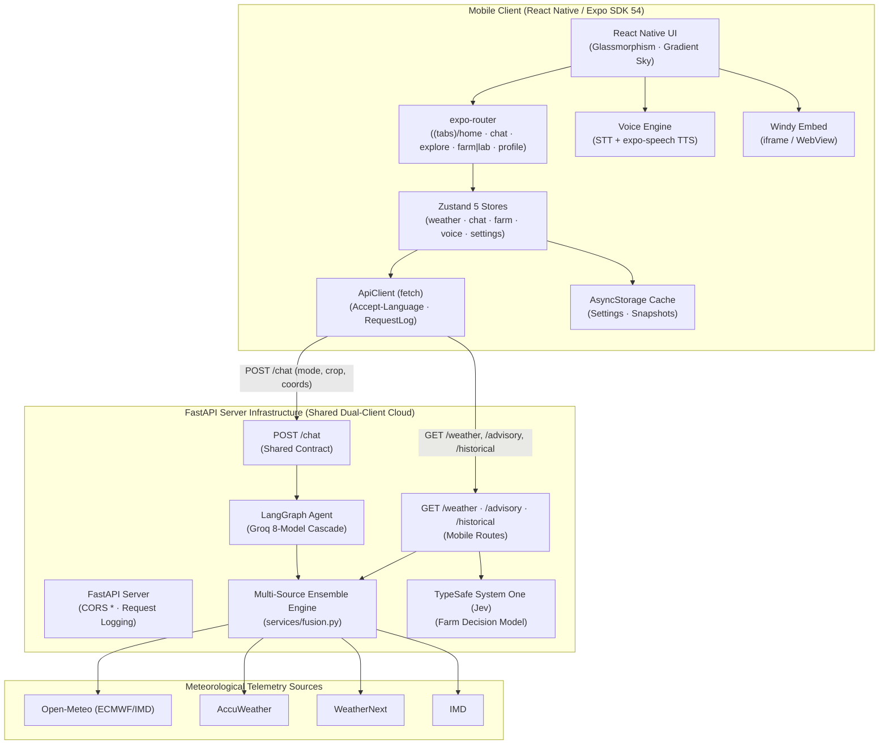

# 🌤️ WeatherGPT Mobile — AI-Powered Weather Intelligence

[](https://www.sih.gov.in/)
[](https://www.sih.gov.in/)
[](https://www.sih.gov.in/)
[](https://reactnative.dev)
[](https://fastapi.tiangolo.com)
[](https://langchain-ai.github.io/langgraph/)
[-emerald.svg?style=for-the-badge)](https://docs.typesafe.ai)

> **Smart India Hackathon (SIH 2026)** | Problem Statement **SIH26068**  
> **Theme**: Disaster Management & Meteorological Intelligence  
> **Companion Web Repository**: [`omsenjalia/weathergpt`](https://github.com/omsenjalia/weathergpt)  
> **Full Architecture Specifications**: [**`ARCHITECTURE.md`**](ARCHITECTURE.md)  
> **Flutter → React Native port details**: [**`FLUTTER_TO_REACT_NATIVE_MIGRATION.md`**](FLUTTER_TO_REACT_NATIVE_MIGRATION.md)

---

## 📱 Quick Start for Judges & Evaluators

### ⚡ Method 1: Download a Built APK (Recommended)

Every commit and pull request triggers **CI → Android Compile Check**, which generates the
native Android project via `expo prebuild` and builds a debug APK:

1. Open **[GitHub Actions → Android Compile Check](https://github.com/omsenjalia/weathergpt-app/actions/workflows/android-compile.yml)**
2. Select the latest successful run (green check ✓)
3. Download the **`weathergpt-rn-debug-apk`** artifact, extract, and install `app-debug.apk`
4. *(If prompted: enable "Install unknown apps" for your browser or file manager)*

### 🔧 Method 2: Build Locally (Android)

Prerequisites: Node.js 20+, Bun (or npm), JDK 17, Android SDK/Studio.

```bash
git clone --recursive https://github.com/omsenjalia/weathergpt-app.git
cd weathergpt-app
bun install
# Configure the backend URL (only config the app needs):
cp .env.example .env          # edit EXPO_PUBLIC_BACKEND_URL if needed
bunx expo prebuild -p android # generates the native android/ project
cd android && ./gradlew assembleDebug
# APK: android/app/build/outputs/apk/debug/app-debug.apk
```

### 💻 Method 3: Run the Dev Server (Web preview / Metro)

```bash
bun install
bun run start          # Expo dev server (press w for web, a for Android)
bun run typecheck      # tsc --noEmit, strict
bun test               # vitest — 91 unit tests over the ported logic
```

---

## 🌟 What is WeatherGPT Mobile?

WeatherGPT Mobile transforms complex meteorological telemetry into actionable, hyper-local
intelligence rendered in **9 live Indian regional languages (10th Punjabi planned)** with
two-way voice capabilities (Speech-to-Text and neural Text-to-Speech).

Unlike standard weather apps that display rigid, confusing numbers, WeatherGPT empowers
citizens, farmers, and disaster managers with:

- **Natural Language Conversational Assistant**: Ask complex weather questions in your
  regional mother tongue (*"Will it rain on my cotton crop in Rajkot tomorrow?"*).
- **TypeSafe System One (Jev) Agricultural AI**: Calibrated probabilistic farm action
  windows for pesticide spraying, irrigation scheduling, and harvesting.
- **Authoritative Multi-Source Ensemble Engine**: Current production uses
  **IMD → WeatherNext → AccuWeather → Open-Meteo** selection policy with per-field
  supplementation and provenance tracking (see `docs/app_data_contracts.md`).
- **Dynamic Live Atmospheric Sky**: 11 solar periods and 12 weather conditions driving
  smooth gradient transitions (native builds add looping video skies).
- **Interactive Windy GIS Radar & Maps**: Full-screen radar, satellite, wind stream, and
  cloud cover layers embedded directly in the app.
- **Strict Null Semantics (Zero Guesswork)**: Missing data is rendered honestly as `—`
  rather than fabricated `0 °C` or `0 mm` values.

---

## 🎯 3 Adaptive Persona Modes

```
┌─────────────────────────────────────────────────────────────────────────────┐
│                             WEATHERGPT PERSONAS                             │
├─────────────────────┬───────────────────────────┬───────────────────────────┤
│  👤 Everyone        │  🌾 Farmer Mode (Krishi)  │  🔬 Researcher Mode       │
│  (Citizen / Daily)  │  (TypeSafe System One AI) │  (Climatology & Trends)   │
├─────────────────────┼───────────────────────────┼───────────────────────────┤
│ • Hero weather card │ • Crop vulnerability curve│ • 14-day extended trend   │
│ • 48h hourly strip  │ • Spray & irrigate windows│ • Multi-year rain archive │
│ • 7-day outlook     │ • TypeSafe confidence tag │ • Anomaly trend charts    │
│ • US AQI & solar UV │ • Soil moisture telemetry │ • Multi-station variance  │
│ • Atmospheric sky   │ • Frost & heat warnings   │ • Exportable data tables  │
└─────────────────────┴───────────────────────────┴───────────────────────────┘
```

> Choosing **Farmer** during onboarding asks for farm details (location, crop, growth
> stage, size, irrigation, soil) so advisories are tuned from the first session. These
> stay editable anytime in **Profile → Farm profile** (and in the Farm tab).

---

## 🏛️ System Architecture

WeatherGPT Mobile pairs with a unified FastAPI backend that simultaneously serves the
React web client. Both clients share the conversational agent and ensemble fusion engine.



> 📖 **Deep Dive**: For full technical specifications, sequence diagrams, mathematical
> fusion formulas, and component listings, consult [**`ARCHITECTURE.md`**](ARCHITECTURE.md).

---

## 🌐 9 Live (+1 Planned) Regional Indian Languages & Voice Engine

| Language | Script | Voice Locale (TTS) | STT Locale |
| :--- | :--- | :--- | :--- |
| **English** | English | `en-US` / `en-IN` | `en_US` |
| **Hindi** | हिंदी | `hi-IN` | `hi_IN` |
| **Gujarati** | ગુજરાતી | `gu-IN` | `gu_IN` |
| **Marathi** | मराठी | `mr-IN` | `mr_IN` |
| **Tamil** | தமிழ் | `ta-IN` | `ta_IN` |
| **Telugu** | తెలుగు | `te-IN` | `te_IN` |
| **Bengali** | বাংলা | `bn-IN` | `bn_IN` |
| **Kannada** | ಕನ್ನಡ | `kn-IN` | `kn_IN` |
| **Malayalam** | മലയാളം | `ml-IN` | `ml_IN` |
| **Punjabi** | ਪੰਜਾਬੀ | `pa-IN` | `pa_IN` | ❌ Planned |

> **Profile → Voice** exposes speech-rate control and the saved TTS locale per language.

---

## 🛠️ On-Device Developer & Diagnostics Suite

1. Open **Profile** (tab bar).
2. Toggle **Developer** on.
3. Tap **Debug & state** to open the 5-tab diagnostics view:
   - **Tab 1: Snapshot**: Raw request/response info received from the server.
   - **Tab 2: Sources**: Per-field provider attribution (`via Open-Meteo`).
   - **Tab 3: Providers**: Fallback reasons, skipped providers, WeatherNext status.
   - **Tab 4: Requests**: Live ring-buffer log of the last 60 HTTP requests with latency.
   - **Tab 5: Health**: Direct probe of backend `/v2/weather/health`.

---

## 🧪 Testing & Quality Assurance

```bash
bun run typecheck   # strict TypeScript — zero errors required
bun test            # vitest: parsers, provenance, atmosphere, advisory, voice, i18n
bunx expo export --platform web   # static web build smoke test
bunx expo prebuild -p android && (cd android && ./gradlew assembleDebug)  # native proof (CI does this per PR)
```

CI runs **CI Test** (typecheck + unit tests) and **Android Compile Check** (prebuild +
debug APK) on every pull request.

---

## 🔄 Publishing Changes (Submodule Policy)

This repository links the backend as a git submodule at `backend/`. Always publish with
the bundled script to push both repositories atomically:

```bash
./scripts/push-all.sh "Your commit message"
```

---

## 👥 Hackathon Team (SIH 2026) — Team visionaries_bvm

- **Om Senjalia** — Mobile & Backend Architecture, Ensemble Fusion Engine, LangGraph Agent
- **Om Vaghela** — Frontend & UI Reference Design
- **Chaitanya Ghodasara** — Beta Testing & Mobile QA
- **Nidhi Patel** — Meteorological Data Curation & Multilingual Lexicons
- **Vishrut Gandhi** — Presentations & SIH Compliance
- **Prachi** — Domain Research & Agricultural Use Cases

---

## 📄 License & Compliance

Developed for the **Smart India Hackathon 2026** under the **Disaster Management** Theme
(Problem Statement **SIH26068**). Released under the [MIT License](LICENSE).
