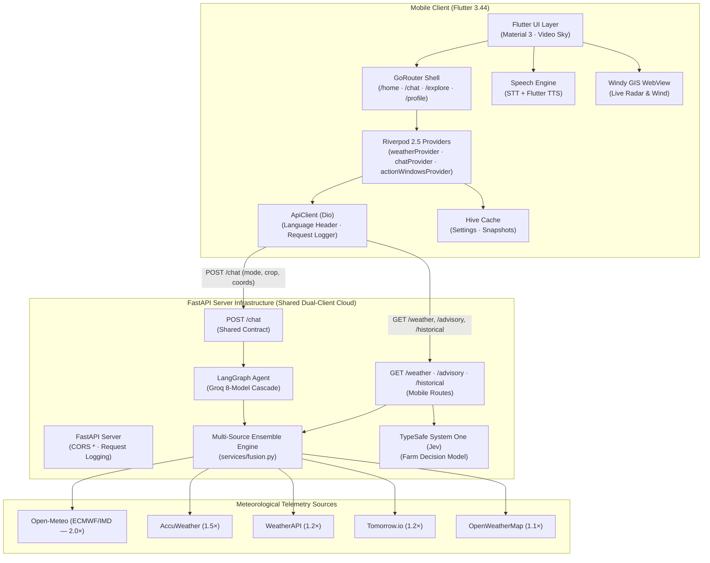

# 🌤️ WeatherGPT Mobile — AI-Powered Weather Intelligence

[](https://www.sih.gov.in/)
[](https://www.sih.gov.in/)
[](https://www.sih.gov.in/)
[](https://flutter.dev)
[](https://fastapi.tiangolo.com)
[](https://langchain-ai.github.io/langgraph/)
[-emerald.svg?style=for-the-badge)](https://docs.typesafe.ai)

> **Smart India Hackathon (SIH 2026)** | Problem Statement **SIH26068**  
> **Theme**: Disaster Management & Meteorological Intelligence  
> **Companion Web Repository**: [`omsenjalia/weathergpt`](https://github.com/omsenjalia/weathergpt)  
> **Full Architecture Specifications**: [**`ARCHITECTURE.md`**](ARCHITECTURE.md)

---

## 📱 Quick Start for Judges & Evaluators: Download & Install App

We have made evaluating WeatherGPT Mobile seamless. Judges can either install the pre-compiled, signed Android APK directly onto any Android phone or tablet, or run the project locally.

### ⚡ Method 1: Download Pre-Built Signed Release APK (Recommended — 2 Minutes)

Every commit and pull request automatically triggers our GitHub Actions CD pipeline (`.github/workflows/ci-build-signed.yml`), building a signed release APK:

1. **Open the GitHub Actions Builds**:  
   👉 [**WeatherGPT GitHub Actions CI Runs**](https://github.com/omsenjalia/weathergpt-app/actions/workflows/ci-build-signed.yml)
2. **Select the Latest Successful Run** (marked with a green checkmark `✓`).
3. **Download the Signed APK Artifact**:  
   Scroll down to the **Artifacts** section at the bottom of the page and click:  
   📦 **`weathergpt-signed-<sha>`** (contains `app-release.apk`)  
   *(Also available: `weathergpt-bundle-<sha>` for Google Play App Bundle).*
4. **Install on Your Android Device**:
   - Transfer or download the `.zip` / `.apk` directly on your Android phone.
   - Extract the zip if needed, tap `app-release.apk`, and tap **Install**.
   - *(If prompted: enable "Install unknown apps" for your browser or file manager).*
   - Open **WeatherGPT** and experience the live app!

---

### 💻 Method 2: Build & Run from Source (Local Machine)

#### Prerequisites
- **Flutter SDK**: `3.44.0` (stable channel)
- **Dart SDK**: `>=3.3.0 <4.0.0`
- **Android Studio** / **VS Code** with Flutter & Dart extensions
- Android device connected via USB with USB debugging enabled, or an Android Emulator

#### Step-by-Step Instructions

1. **Clone the repository with submodules**:
   ```bash
   git clone --recursive https://github.com/omsenjalia/weathergpt-app.git
   cd weathergpt-app
   ```

2. **Configure the Environment**:
   Create a `.env` file in the project root (copied from `.env.example`):
   ```bash
   cp .env.example .env
   ```
   Set your backend URL:
   ```env
   # For Android Emulator:
   BACKEND_URL=http://10.0.2.2:8888

   # For iOS Simulator / Desktop:
   BACKEND_URL=http://localhost:8888

   # For Physical Android Device on same Wi-Fi:
   BACKEND_URL=http://<YOUR_LOCAL_IP>:8888

   # For Live Cloud Backend (actual per backend_config.dart):
   BACKEND_URL=https://weathergpt-backend.vercel.app
   # Legacy docs said https://weathergpt-api.onrender.com — outdated
   ```
   *(Note: API keys for weather providers, Groq LLMs, and TypeSafe Jev are stored securely on the backend server, never inside the mobile app binary).*

3. **Install dependencies**:
   ```bash
   flutter pub get
   ```

4. **Run the App**:
   ```bash
   flutter run
   ```

5. **Build Release APK locally**:
   ```bash
   flutter build apk --release
   # Output binary: build/app/outputs/flutter-apk/app-release.apk
   ```

---

## 🌟 What is WeatherGPT Mobile?

WeatherGPT Mobile transforms complex meteorological telemetry into actionable, hyper-local intelligence rendered in **9 live Indian regional languages (10th Punjabi planned)** — fact-checked 2026-09-21: 9 files in assets/translations/ (bn,en,gu,hi,kn,ml,mr,ta,te), pa.json missing with two-way voice capabilities (Speech-to-Text and neural Text-to-Speech).

Unlike standard weather apps that display rigid, confusing numbers, WeatherGPT empowers citizens, farmers, and disaster managers with:
- **Natural Language Conversational Assistant**: Ask complex weather questions in your regional mother tongue (*"Will it rain on my cotton crop in Rajkot tomorrow?"*).
- **TypeSafe System One (Jev) Agricultural AI**: Calibrated probabilistic farm action windows for pesticide spraying, irrigation scheduling, and harvesting.
- **Authoritative Multi-Source Ensemble Engine**: Current production uses **IMD → WeatherNext → AccuWeather → Open-Meteo** selection policy with per-field supplementation and provenance tracking (see docs/app_data_contracts.md). Legacy weighted fusion (Open-Meteo 2.0× > AccuWeather 1.5× > WeatherAPI 1.2× > Tomorrow.io 1.2× > OpenWeatherMap 1.1×) still exposed via GET /fusion for dev diagnostics — fact-checked 2026-09-21.
- **Dynamic Live Atmospheric Sky**: 11 solar periods and 12 weather conditions driving smooth gradient transitions and looping video skies.
- **Interactive Windy GIS Radar & Maps**: Full-screen radar, satellite, wind stream, and cloud cover layers embedded directly in the app.
- **Strict Null Semantics (Zero Guesswork)**: Missing data is rendered honestly as `—` rather than fabricated `0 °C` or `0 mm` values.

---

## 🎯 3 Adaptive Persona Modes

WeatherGPT dynamically personalizes its UI, insights, and data depth based on the user's role:

```
┌─────────────────────────────────────────────────────────────────────────────┐
│                             WEATHERGPT PERSONAS                             │
├─────────────────────┬───────────────────────────┬───────────────────────────┤
│  👤 Everyone        │  🌾 Farmer Mode (Krishi)   │  🔬 Researcher Mode       │
│  (Citizen / Daily)  │  (TypeSafe System One AI) │  (Climatology & Trends)   │
├─────────────────────┼───────────────────────────┼───────────────────────────┤
│ • Hero weather card │ • Crop vulnerability curve│ • 14-day extended trend   │
│ • 48h hourly strip  │ • Spray & irrigate windows│ • Multi-year rain archive │
│ • 7-day outlook     │ • TypeSafe confidence tag │ • Anomaly trend charts    │
│ • US AQI & solar UV │ • Soil moisture telemetry │ • Multi-station variance  │
│ • Atmospheric video │ • Frost & heat warnings   │ • Exportable data tables  │
└─────────────────────┴───────────────────────────┴───────────────────────────┘
```

---

## 🏛️ System Architecture

WeatherGPT Mobile pairs with a unified FastAPI backend that simultaneously serves the React web client. Both clients share the conversational agent and ensemble fusion engine.



> 📖 **Deep Dive**: For full technical specifications, sequence diagrams, mathematical fusion formulas, and component listings, consult [**`ARCHITECTURE.md`**](ARCHITECTURE.md).

---

## 🌐 9 Live (+1 Planned) Regional Indian Languages & Voice Engine — Fact-Checked

WeatherGPT Mobile breaks language barriers with native script rendering and voice input/output:

| Language | Script | Voice Locale (TTS) | STT Speech Model |
| :--- | :--- | :--- | :--- |
| **English** | English | `en-US` / `en-IN` | `en_IN` |
| **Hindi** | हिंदी | `hi-IN` | `hi_IN` |
| **Gujarati** | ગુજરાતી | `gu-IN` | `gu_IN` |
| **Marathi** | मराठी | `mr-IN` | `mr_IN` |
| **Tamil** | தமிழ் | `ta-IN` | `ta_IN` |
| **Telugu** | తెలుగు | `te-IN` | `te_IN` |
| **Bengali** | বাংলা | `bn-IN` | `bn_IN` |
| **Kannada** | ಕನ್ನಡ | `kn-IN` | `kn_IN` |
| **Malayalam** | മലയാളം | `ml-IN` | `ml_IN` |
| **Punjabi** | ਪੰਜਾਬੀ | `pa-IN` | `pa_IN` | ❌ MISSING pa.json — planned |

---

## 🛠️ On-Device Developer & Diagnostics Suite

Built-in developer tools give judges complete transparency into internal system operations:

1. Open **Settings** (bottom right tab).
2. Scroll to **Developer** and toggle **Enable developer options**.
3. Tap **Debug & state** to open the 5-tab diagnostics view:
   - **Tab 1: Snapshot**: Raw JSON snapshot received from the server.
   - **Tab 2: Sources**: Per-field provider attribution badges (`via Open-Meteo`, `via AccuWeather`).
   - **Tab 3: Providers**: Fallback reasons, skipped providers, and WeatherNext status.
   - **Tab 4: Requests**: Live ring-buffer log of the last 60 HTTP requests with execution latency (ms).
   - **Tab 5: Health**: Direct probe of backend `/v2/weather/health` verifying provider uptime.

---

## 🧪 Testing & Quality Assurance

The codebase enforces strict quality gates:
```bash
# 1. Static Analysis (Zero issues)
flutter analyze

# 2. Automated Test Suite (Unit & widget tests)
flutter test --timeout 30s
```

All tests and release builds run in GitHub Actions on every pull request to ensure stability and zero regressions.

---

## 🔄 Publishing Changes (Submodule Policy)

This repository links the backend as a git submodule at `backend/`. Always publish with the bundled script to push both repositories atomically:

```bash
./scripts/push-all.sh "Your commit message"
```

---

## 👥 Hackathon Team (SIH 2026) — Team visionaries_bvm

**Team Name**: **visionaries_bvm** (updated per fact-check request 2026-09-21)

- **Om Senjalia** — Mobile & Backend Architecture, Ensemble Fusion Engine, LangGraph Agent
- **Om Vaghela** — Frontend & UI Reference Design
- **Chaitanya Ghodasara** — Beta Testing & Mobile QA
- **Nidhi Patel** — Meteorological Data Curation & Multilingual Lexicons
- **Vishrut Gandhi** — Presentations & SIH Compliance
- **Prachi** — Domain Research & Agricultural Use Cases

> **Fact-Check Note (2026-09-21)**: Original ARCHITECTURE.md claimed 10 live languages, production URL https://weathergpt-api.onrender.com, and pure weighted fusion. Verified actual: 9 live translations (bn,en,gu,hi,kn,ml,mr,ta,te — pa.json missing, pa mapping exists in voice_provider), production URL https://weathergpt-backend.vercel.app (per lib/core/constants/backend_config.dart), and current production uses IMD → WeatherNext → AccuWeather → Open-Meteo selection + per-field supplementation (legacy weighted fusion still via GET /fusion dev endpoint). See ARCHITECTURE.md Section 20 for full corrections log.

---

## 📄 License & Compliance

Developed for the **Smart India Hackathon 2026** under the **Disaster Management** Theme (Problem Statement **SIH26068**). Released under the [MIT License](LICENSE).
